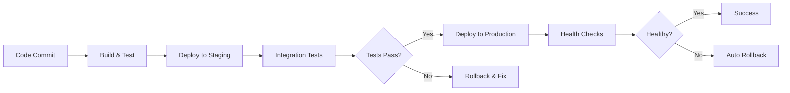
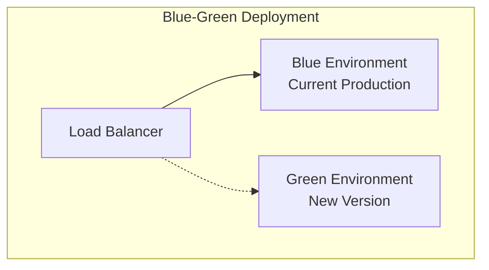
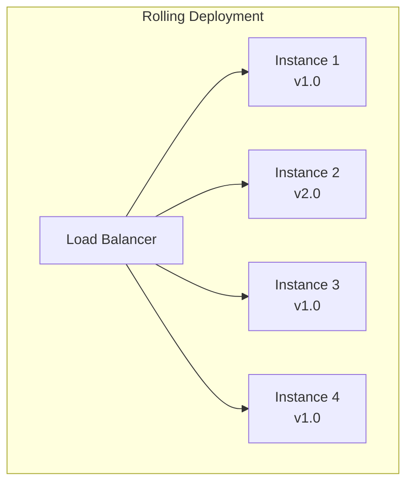
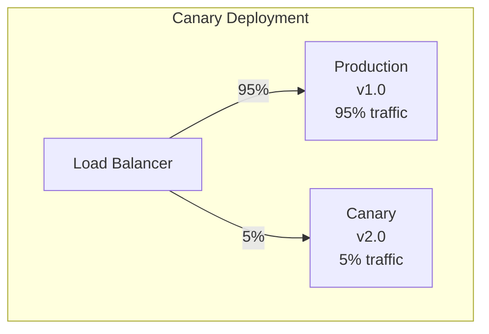

# Module 8: Basic Deployment in CI/CD 🚀

## Learning Objectives 🎯

By the end of this module, you will:
- Understand different deployment strategies and patterns
- Learn how to deploy to staging and production environments
- Implement automated deployment pipelines
- Configure rollback mechanisms for failed deployments
- Set up basic monitoring and health checks
- Handle environment-specific configurations
- Implement blue-green and rolling deployments
- Secure deployment processes

## Table of Contents

1. [Introduction to Deployment](#introduction)
2. [Deployment Strategies](#deployment-strategies)
3. [Environment Management](#environment-management)
4. [Automated Deployment Pipeline](#automated-deployment)
5. [Staging Deployment](#staging-deployment)
6. [Production Deployment](#production-deployment)
7. [Rollback Mechanisms](#rollback)
8. [Health Checks & Monitoring](#monitoring)
9. [Security in Deployment](#security)
10. [Best Practices](#best-practices)
11. [Hands-on Exercises](#exercises)
12. [Troubleshooting](#troubleshooting)

---

## 1. Introduction to Deployment {#introduction}

### What is Deployment?

Deployment is the process of releasing your application code to a target environment where users can access it. In CI/CD, deployment should be:

- **Automated**: No manual intervention required
- **Reliable**: Consistent and predictable outcomes
- **Fast**: Quick deployment with minimal downtime
- **Reversible**: Easy to rollback if issues occur
- **Secure**: Protected against unauthorized access

### Deployment Pipeline Flow



### Key Benefits

- 🚀 **Faster Time to Market**: Rapid feature delivery
- 🔄 **Consistent Deployments**: Same process every time
- 🛡️ **Reduced Risk**: Automated testing and rollbacks
- 📊 **Better Visibility**: Clear deployment status and history
- 🎯 **Improved Quality**: Catch issues before production

---

## 2. Deployment Strategies {#deployment-strategies}

### 1. Blue-Green Deployment

**Concept**: Maintain two identical production environments (Blue and Green)



**Process**:
1. Deploy new version to Green environment
2. Test Green environment thoroughly
3. Switch traffic from Blue to Green
4. Keep Blue as backup for quick rollback

**Pros**:
- ✅ Zero downtime
- ✅ Instant rollback
- ✅ Full testing before switch

**Cons**:
- ❌ Requires double infrastructure
- ❌ Database migration complexity

### 2. Rolling Deployment

**Concept**: Gradually replace instances with new version



**Process**:
1. Update one instance at a time
2. Health check each updated instance
3. Continue until all instances updated
4. Rollback individual instances if needed

**Pros**:
- ✅ No additional infrastructure
- ✅ Gradual risk exposure
- ✅ Can pause/resume deployment

**Cons**:
- ❌ Mixed versions during deployment
- ❌ Slower deployment process

### 3. Canary Deployment

**Concept**: Deploy to small subset of users first



**Process**:
1. Deploy new version to canary servers
2. Route small percentage of traffic to canary
3. Monitor metrics and user feedback
4. Gradually increase traffic or rollback

**Pros**:
- ✅ Real user testing
- ✅ Limited blast radius
- ✅ Data-driven decisions

**Cons**:
- ❌ Complex traffic routing
- ❌ Requires monitoring infrastructure

### 4. Recreate Deployment

**Concept**: Stop old version, deploy new version

**Process**:
1. Stop all instances of current version
2. Deploy new version
3. Start new instances

**Pros**:
- ✅ Simple implementation
- ✅ No version mixing
- ✅ Resource efficient

**Cons**:
- ❌ Downtime during deployment
- ❌ All-or-nothing approach

---

## 3. Environment Management {#environment-management}

### Environment Types

```
Development → Testing → Staging → Production
     ↓           ↓         ↓          ↓
  Feature    Integration  Pre-prod   Live
  Testing     Testing     Testing   Users
```

#### Development Environment
```yaml
# dev.env
ENVIRONMENT=development
DATABASE_URL=postgresql://localhost:5432/myapp_dev
API_URL=http://localhost:3000
LOG_LEVEL=debug
CACHE_ENABLED=false
```

#### Staging Environment
```yaml
# staging.env
ENVIRONMENT=staging
DATABASE_URL=postgresql://staging-db:5432/myapp_staging
API_URL=https://api-staging.myapp.com
LOG_LEVEL=info
CACHE_ENABLED=true
CDN_URL=https://cdn-staging.myapp.com
```

#### Production Environment
```yaml
# production.env
ENVIRONMENT=production
DATABASE_URL=postgresql://prod-db:5432/myapp_prod
API_URL=https://api.myapp.com
LOG_LEVEL=warn
CACHE_ENABLED=true
CDN_URL=https://cdn.myapp.com
MONITORING_ENABLED=true
```

### Configuration Management

#### Using Environment Variables
```javascript
// config.js
module.exports = {
    port: process.env.PORT || 3000,
    database: {
        url: process.env.DATABASE_URL,
        ssl: process.env.NODE_ENV === 'production'
    },
    redis: {
        url: process.env.REDIS_URL,
        ttl: parseInt(process.env.CACHE_TTL) || 3600
    },
    logging: {
        level: process.env.LOG_LEVEL || 'info'
    }
};
```

#### Configuration Validation
```javascript
// config-validator.js
const requiredEnvVars = [
    'DATABASE_URL',
    'API_SECRET_KEY',
    'JWT_SECRET'
];

function validateConfig() {
    const missing = requiredEnvVars.filter(envVar => !process.env[envVar]);
    
    if (missing.length > 0) {
        throw new Error(`Missing required environment variables: ${missing.join(', ')}`);
    }
    
    console.log('✅ Configuration validation passed');
}

module.exports = { validateConfig };
```

---

## 4. Automated Deployment Pipeline {#automated-deployment}

### Basic Deployment Workflow

```yaml
# .github/workflows/deploy.yml
name: Deploy Application

on:
  push:
    branches: [ main ]
  workflow_dispatch:
    inputs:
      environment:
        description: 'Environment to deploy to'
        required: true
        default: 'staging'
        type: choice
        options:
        - staging
        - production

jobs:
  test:
    runs-on: ubuntu-latest
    steps:
    - uses: actions/checkout@v4
    - name: Run tests
      run: |
        npm ci
        npm run test
        npm run test:integration
  
  build:
    needs: test
    runs-on: ubuntu-latest
    steps:
    - uses: actions/checkout@v4
    
    - name: Build application
      run: |
        npm ci
        npm run build
    
    - name: Create deployment artifact
      run: |
        tar -czf app-${{ github.sha }}.tar.gz dist/ package.json package-lock.json
    
    - name: Upload artifact
      uses: actions/upload-artifact@v3
      with:
        name: app-build
        path: app-${{ github.sha }}.tar.gz
  
  deploy-staging:
    needs: build
    runs-on: ubuntu-latest
    environment: staging
    steps:
    - name: Download artifact
      uses: actions/download-artifact@v3
      with:
        name: app-build
    
    - name: Deploy to staging
      run: |
        echo "Deploying to staging environment..."
        # Deployment commands here
    
    - name: Run smoke tests
      run: |
        npm run test:smoke -- --env=staging
  
  deploy-production:
    needs: deploy-staging
    runs-on: ubuntu-latest
    environment: production
    if: github.ref == 'refs/heads/main'
    steps:
    - name: Download artifact
      uses: actions/download-artifact@v3
      with:
        name: app-build
    
    - name: Deploy to production
      run: |
        echo "Deploying to production environment..."
        # Production deployment commands
    
    - name: Verify deployment
      run: |
        npm run test:production-health
```

### Multi-Environment Deployment

```yaml
# .github/workflows/multi-env-deploy.yml
name: Multi-Environment Deployment

on:
  push:
    branches: [ main, develop ]

jobs:
  deploy:
    runs-on: ubuntu-latest
    strategy:
      matrix:
        environment: 
          - ${{ github.ref == 'refs/heads/main' && 'production' || 'staging' }}
    
    environment: ${{ matrix.environment }}
    
    steps:
    - uses: actions/checkout@v4
    
    - name: Set environment variables
      run: |
        if [ "${{ matrix.environment }}" = "production" ]; then
          echo "API_URL=https://api.myapp.com" >> $GITHUB_ENV
          echo "DB_NAME=myapp_prod" >> $GITHUB_ENV
        else
          echo "API_URL=https://api-staging.myapp.com" >> $GITHUB_ENV
          echo "DB_NAME=myapp_staging" >> $GITHUB_ENV
        fi
    
    - name: Deploy application
      run: |
        echo "Deploying to ${{ matrix.environment }}"
        echo "API URL: $API_URL"
        echo "Database: $DB_NAME"
        # Deployment logic here
```

---

## 5. Staging Deployment {#staging-deployment}

### Staging Environment Setup

```yaml
# docker-compose.staging.yml
version: '3.8'

services:
  app:
    image: myapp:${VERSION}
    environment:
      - NODE_ENV=staging
      - DATABASE_URL=${STAGING_DATABASE_URL}
      - REDIS_URL=${STAGING_REDIS_URL}
    ports:
      - "3000:3000"
    depends_on:
      - database
      - redis
  
  database:
    image: postgres:13
    environment:
      - POSTGRES_DB=myapp_staging
      - POSTGRES_USER=${DB_USER}
      - POSTGRES_PASSWORD=${DB_PASSWORD}
    volumes:
      - staging_db_data:/var/lib/postgresql/data
  
  redis:
    image: redis:6-alpine
    volumes:
      - staging_redis_data:/data

volumes:
  staging_db_data:
  staging_redis_data:
```

### Staging Deployment Script

```bash
#!/bin/bash
# deploy-staging.sh

set -e

echo "🚀 Starting staging deployment..."

# Variables
VERSION=${1:-latest}
STAGING_HOST="staging.myapp.com"
DEPLOY_USER="deploy"

# Build and push image
echo "📦 Building application image..."
docker build -t myapp:$VERSION .
docker tag myapp:$VERSION registry.myapp.com/myapp:$VERSION
docker push registry.myapp.com/myapp:$VERSION

# Deploy to staging
echo "🎯 Deploying to staging..."
ssh $DEPLOY_USER@$STAGING_HOST << EOF
    cd /opt/myapp
    
    # Pull latest image
    docker pull registry.myapp.com/myapp:$VERSION
    
    # Update environment file
    export VERSION=$VERSION
    
    # Deploy with zero downtime
    docker-compose -f docker-compose.staging.yml up -d
    
    # Wait for health check
    echo "⏳ Waiting for application to be healthy..."
    timeout 60 bash -c 'until curl -f http://localhost:3000/health; do sleep 2; done'
    
    echo "✅ Staging deployment completed successfully!"
EOF

# Run integration tests
echo "🧪 Running integration tests..."
npm run test:integration -- --baseUrl=https://$STAGING_HOST

echo "🎉 Staging deployment and tests completed!"
```

### Staging Validation

```javascript
// staging-validation.js
const axios = require('axios');

const STAGING_URL = 'https://staging.myapp.com';

async function validateStagingDeployment() {
    const tests = [
        {
            name: 'Health Check',
            test: () => axios.get(`${STAGING_URL}/health`)
        },
        {
            name: 'API Endpoints',
            test: () => axios.get(`${STAGING_URL}/api/status`)
        },
        {
            name: 'Database Connection',
            test: () => axios.get(`${STAGING_URL}/api/db-health`)
        },
        {
            name: 'Authentication',
            test: () => axios.post(`${STAGING_URL}/api/auth/test`, {
                username: 'test',
                password: 'test123'
            })
        }
    ];
    
    console.log('🔍 Validating staging deployment...');
    
    for (const test of tests) {
        try {
            await test.test();
            console.log(`✅ ${test.name}: PASSED`);
        } catch (error) {
            console.log(`❌ ${test.name}: FAILED`);
            console.error(error.message);
            process.exit(1);
        }
    }
    
    console.log('🎉 All staging validations passed!');
}

validateStagingDeployment();
```

---

## 6. Production Deployment {#production-deployment}

### Production Deployment Workflow

```yaml
# .github/workflows/production-deploy.yml
name: Production Deployment

on:
  release:
    types: [published]
  workflow_dispatch:
    inputs:
      version:
        description: 'Version to deploy'
        required: true

jobs:
  pre-deployment-checks:
    runs-on: ubuntu-latest
    steps:
    - name: Verify staging deployment
      run: |
        curl -f https://staging.myapp.com/health
        echo "✅ Staging is healthy"
    
    - name: Check production readiness
      run: |
        # Check if all required secrets are available
        if [ -z "${{ secrets.PROD_DATABASE_URL }}" ]; then
          echo "❌ Production database URL not configured"
          exit 1
        fi
        echo "✅ Production secrets verified"
  
  deploy-production:
    needs: pre-deployment-checks
    runs-on: ubuntu-latest
    environment: 
      name: production
      url: https://myapp.com
    
    steps:
    - uses: actions/checkout@v4
    
    - name: Setup deployment tools
      run: |
        # Install deployment tools
        curl -LO https://storage.googleapis.com/kubernetes-release/release/v1.21.0/bin/linux/amd64/kubectl
        chmod +x kubectl
        sudo mv kubectl /usr/local/bin/
    
    - name: Deploy to production
      run: |
        echo "🚀 Starting production deployment..."
        
        # Set version
        VERSION=${{ github.event.release.tag_name || github.event.inputs.version }}
        
        # Deploy using blue-green strategy
        ./scripts/blue-green-deploy.sh $VERSION
    
    - name: Post-deployment verification
      run: |
        echo "🔍 Verifying production deployment..."
        
        # Health checks
        curl -f https://myapp.com/health
        
        # Performance check
        response_time=$(curl -o /dev/null -s -w '%{time_total}' https://myapp.com)
        if (( $(echo "$response_time > 2.0" | bc -l) )); then
          echo "❌ Response time too slow: ${response_time}s"
          exit 1
        fi
        
        echo "✅ Production deployment verified"
    
    - name: Notify team
      if: always()
      uses: 8398a7/action-slack@v3
      with:
        status: ${{ job.status }}
        text: |
          Production deployment ${{ job.status }}!
          Version: ${{ github.event.release.tag_name || github.event.inputs.version }}
          URL: https://myapp.com
      env:
        SLACK_WEBHOOK_URL: ${{ secrets.SLACK_WEBHOOK }}
```

### Blue-Green Production Deployment

```bash
#!/bin/bash
# blue-green-deploy.sh

set -e

VERSION=$1
if [ -z "$VERSION" ]; then
    echo "❌ Version parameter required"
    exit 1
fi

echo "🔵 Starting blue-green deployment for version $VERSION"

# Determine current and target environments
CURRENT=$(kubectl get service myapp-service -o jsonpath='{.spec.selector.version}')
if [ "$CURRENT" = "blue" ]; then
    TARGET="green"
else
    TARGET="blue"
fi

echo "📊 Current: $CURRENT, Target: $TARGET"

# Deploy to target environment
echo "🚀 Deploying to $TARGET environment..."
kubectl set image deployment/myapp-$TARGET myapp=myapp:$VERSION
kubectl rollout status deployment/myapp-$TARGET

# Wait for deployment to be ready
echo "⏳ Waiting for $TARGET environment to be ready..."
kubectl wait --for=condition=available --timeout=300s deployment/myapp-$TARGET

# Health check on target environment
echo "🔍 Running health checks on $TARGET..."
TARGET_POD=$(kubectl get pods -l app=myapp,version=$TARGET -o jsonpath='{.items[0].metadata.name}')
kubectl exec $TARGET_POD -- curl -f http://localhost:3000/health

# Switch traffic to target environment
echo "🔄 Switching traffic to $TARGET environment..."
kubectl patch service myapp-service -p '{"spec":{"selector":{"version":"'$TARGET'"}}}'

# Verify the switch
echo "✅ Verifying traffic switch..."
sleep 10
curl -f https://myapp.com/health

# Keep old environment for quick rollback
echo "💾 Keeping $CURRENT environment for rollback"

echo "🎉 Blue-green deployment completed successfully!"
echo "   Active: $TARGET"
echo "   Standby: $CURRENT"
```

---

## 7. Rollback Mechanisms {#rollback}

### Automatic Rollback

```yaml
# .github/workflows/auto-rollback.yml
name: Auto Rollback

on:
  workflow_run:
    workflows: ["Production Deployment"]
    types: [completed]

jobs:
  health-check:
    if: ${{ github.event.workflow_run.conclusion == 'success' }}
    runs-on: ubuntu-latest
    steps:
    - name: Wait for deployment to stabilize
      run: sleep 60
    
    - name: Health check
      id: health
      run: |
        for i in {1..5}; do
          if curl -f https://myapp.com/health; then
            echo "healthy=true" >> $GITHUB_OUTPUT
            exit 0
          fi
          sleep 30
        done
        echo "healthy=false" >> $GITHUB_OUTPUT
    
    - name: Trigger rollback
      if: steps.health.outputs.healthy == 'false'
      uses: ./.github/workflows/rollback.yml
      with:
        reason: "Health check failed after deployment"
```

### Manual Rollback Workflow

```yaml
# .github/workflows/rollback.yml
name: Emergency Rollback

on:
  workflow_dispatch:
    inputs:
      reason:
        description: 'Reason for rollback'
        required: true
      target_version:
        description: 'Version to rollback to (leave empty for previous)'
        required: false

jobs:
  rollback:
    runs-on: ubuntu-latest
    environment: production
    
    steps:
    - uses: actions/checkout@v4
    
    - name: Determine rollback target
      id: target
      run: |
        if [ -n "${{ github.event.inputs.target_version }}" ]; then
          echo "version=${{ github.event.inputs.target_version }}" >> $GITHUB_OUTPUT
        else
          # Get previous version from deployment history
          PREVIOUS=$(kubectl rollout history deployment/myapp --revision=1 | grep -o 'myapp:[^\s]*' | head -1)
          echo "version=$PREVIOUS" >> $GITHUB_OUTPUT
        fi
    
    - name: Execute rollback
      run: |
        echo "🔄 Rolling back to ${{ steps.target.outputs.version }}"
        echo "📝 Reason: ${{ github.event.inputs.reason }}"
        
        # Perform rollback
        kubectl set image deployment/myapp myapp=${{ steps.target.outputs.version }}
        kubectl rollout status deployment/myapp
        
        # Verify rollback
        sleep 30
        curl -f https://myapp.com/health
        
        echo "✅ Rollback completed successfully"
    
    - name: Notify team
      uses: 8398a7/action-slack@v3
      with:
        status: 'warning'
        text: |
          🚨 PRODUCTION ROLLBACK EXECUTED
          Reason: ${{ github.event.inputs.reason }}
          Rolled back to: ${{ steps.target.outputs.version }}
          Executed by: ${{ github.actor }}
      env:
        SLACK_WEBHOOK_URL: ${{ secrets.SLACK_WEBHOOK }}
```

### Database Rollback Strategy

```javascript
// db-migration-rollback.js
const { Pool } = require('pg');

class DatabaseRollback {
    constructor(connectionString) {
        this.pool = new Pool({ connectionString });
    }
    
    async createBackup(version) {
        console.log(`📦 Creating database backup for version ${version}`);
        
        const backupName = `backup_${version}_${Date.now()}`;
        
        // Create backup
        await this.pool.query(`
            CREATE TABLE ${backupName} AS 
            SELECT * FROM critical_table
        `);
        
        console.log(`✅ Backup created: ${backupName}`);
        return backupName;
    }
    
    async rollbackDatabase(backupName) {
        console.log(`🔄 Rolling back database to ${backupName}`);
        
        const client = await this.pool.connect();
        
        try {
            await client.query('BEGIN');
            
            // Restore from backup
            await client.query('DELETE FROM critical_table');
            await client.query(`
                INSERT INTO critical_table 
                SELECT * FROM ${backupName}
            `);
            
            await client.query('COMMIT');
            console.log('✅ Database rollback completed');
            
        } catch (error) {
            await client.query('ROLLBACK');
            console.error('❌ Database rollback failed:', error);
            throw error;
        } finally {
            client.release();
        }
    }
}

module.exports = DatabaseRollback;
```

---

## 8. Health Checks & Monitoring {#monitoring}

### Application Health Endpoints

```javascript
// health.js
const express = require('express');
const router = express.Router();

// Basic health check
router.get('/health', (req, res) => {
    res.status(200).json({
        status: 'healthy',
        timestamp: new Date().toISOString(),
        version: process.env.APP_VERSION || 'unknown'
    });
});

// Detailed health check
router.get('/health/detailed', async (req, res) => {
    const checks = {
        database: await checkDatabase(),
        redis: await checkRedis(),
        externalApi: await checkExternalApi(),
        diskSpace: await checkDiskSpace()
    };
    
    const allHealthy = Object.values(checks).every(check => check.healthy);
    
    res.status(allHealthy ? 200 : 503).json({
        status: allHealthy ? 'healthy' : 'unhealthy',
        checks,
        timestamp: new Date().toISOString()
    });
});

// Readiness check (for Kubernetes)
router.get('/ready', async (req, res) => {
    try {
        // Check if app is ready to serve traffic
        await checkDatabase();
        await checkRequiredServices();
        
        res.status(200).json({ status: 'ready' });
    } catch (error) {
        res.status(503).json({ 
            status: 'not ready', 
            error: error.message 
        });
    }
});

// Liveness check (for Kubernetes)
router.get('/live', (req, res) => {
    // Simple check that the process is alive
    res.status(200).json({ status: 'alive' });
});

async function checkDatabase() {
    try {
        await db.query('SELECT 1');
        return { healthy: true, responseTime: Date.now() };
    } catch (error) {
        return { healthy: false, error: error.message };
    }
}

async function checkRedis() {
    try {
        await redis.ping();
        return { healthy: true };
    } catch (error) {
        return { healthy: false, error: error.message };
    }
}

module.exports = router;
```

### Kubernetes Health Checks

```yaml
# k8s-deployment.yml
apiVersion: apps/v1
kind: Deployment
metadata:
  name: myapp
spec:
  replicas: 3
  selector:
    matchLabels:
      app: myapp
  template:
    metadata:
      labels:
        app: myapp
    spec:
      containers:
      - name: myapp
        image: myapp:latest
        ports:
        - containerPort: 3000
        
        # Liveness probe
        livenessProbe:
          httpGet:
            path: /live
            port: 3000
          initialDelaySeconds: 30
          periodSeconds: 10
          timeoutSeconds: 5
          failureThreshold: 3
        
        # Readiness probe
        readinessProbe:
          httpGet:
            path: /ready
            port: 3000
          initialDelaySeconds: 5
          periodSeconds: 5
          timeoutSeconds: 3
          failureThreshold: 3
        
        # Startup probe
        startupProbe:
          httpGet:
            path: /health
            port: 3000
          initialDelaySeconds: 10
          periodSeconds: 10
          timeoutSeconds: 5
          failureThreshold: 30
```

### Monitoring and Alerting

```yaml
# monitoring-setup.yml
apiVersion: v1
kind: ConfigMap
metadata:
  name: prometheus-config
data:
  prometheus.yml: |
    global:
      scrape_interval: 15s
    
    scrape_configs:
    - job_name: 'myapp'
      static_configs:
      - targets: ['myapp-service:3000']
      metrics_path: '/metrics'
      scrape_interval: 10s
    
    rule_files:
    - "alert_rules.yml"
    
    alerting:
      alertmanagers:
      - static_configs:
        - targets: ['alertmanager:9093']
  
  alert_rules.yml: |
    groups:
    - name: myapp_alerts
      rules:
      - alert: HighErrorRate
        expr: rate(http_requests_total{status=~"5.."}[5m]) > 0.1
        for: 5m
        labels:
          severity: critical
        annotations:
          summary: "High error rate detected"
          description: "Error rate is {{ $value }} errors per second"
      
      - alert: HighResponseTime
        expr: histogram_quantile(0.95, rate(http_request_duration_seconds_bucket[5m])) > 2
        for: 5m
        labels:
          severity: warning
        annotations:
          summary: "High response time detected"
          description: "95th percentile response time is {{ $value }} seconds"
```

---

## 9. Security in Deployment {#security}

### Secure Secrets Management

```yaml
# Using GitHub Secrets
- name: Deploy with secrets
  env:
    DATABASE_PASSWORD: ${{ secrets.DATABASE_PASSWORD }}
    API_KEY: ${{ secrets.API_KEY }}
    JWT_SECRET: ${{ secrets.JWT_SECRET }}
  run: |
    # Deploy application with secure environment variables
    docker run -d \
      -e DATABASE_PASSWORD="$DATABASE_PASSWORD" \
      -e API_KEY="$API_KEY" \
      -e JWT_SECRET="$JWT_SECRET" \
      myapp:latest
```

### Kubernetes Secrets

```yaml
# k8s-secrets.yml
apiVersion: v1
kind: Secret
metadata:
  name: myapp-secrets
type: Opaque
data:
  database-password: <base64-encoded-password>
  api-key: <base64-encoded-api-key>
  jwt-secret: <base64-encoded-jwt-secret>

---
apiVersion: apps/v1
kind: Deployment
metadata:
  name: myapp
spec:
  template:
    spec:
      containers:
      - name: myapp
        image: myapp:latest
        env:
        - name: DATABASE_PASSWORD
          valueFrom:
            secretKeyRef:
              name: myapp-secrets
              key: database-password
        - name: API_KEY
          valueFrom:
            secretKeyRef:
              name: myapp-secrets
              key: api-key
```

### Security Scanning

```yaml
# Security scan before deployment
- name: Security scan
  run: |
    # Scan for vulnerabilities
    npm audit --audit-level high
    
    # Scan Docker image
    docker run --rm -v /var/run/docker.sock:/var/run/docker.sock \
      aquasec/trivy image myapp:latest
    
    # Check for secrets in code
    docker run --rm -v "$PWD:/src" \
      trufflesecurity/trufflehog filesystem /src
```

### Network Security

```yaml
# k8s-network-policy.yml
apiVersion: networking.k8s.io/v1
kind: NetworkPolicy
metadata:
  name: myapp-network-policy
spec:
  podSelector:
    matchLabels:
      app: myapp
  policyTypes:
  - Ingress
  - Egress
  ingress:
  - from:
    - podSelector:
        matchLabels:
          app: nginx-ingress
    ports:
    - protocol: TCP
      port: 3000
  egress:
  - to:
    - podSelector:
        matchLabels:
          app: database
    ports:
    - protocol: TCP
      port: 5432
```

---

## 10. Best Practices {#best-practices}

### ✅ Deployment Best Practices

1. **Immutable Deployments**
   ```dockerfile
   # Build immutable images
   FROM node:18-alpine
   WORKDIR /app
   COPY package*.json ./
   RUN npm ci --only=production
   COPY . .
   RUN npm run build
   EXPOSE 3000
   CMD ["npm", "start"]
   ```

2. **Version Everything**
   ```bash
   # Tag images with version
   docker build -t myapp:v1.2.3 .
   docker build -t myapp:latest .
   
   # Use semantic versioning
   git tag v1.2.3
   git push origin v1.2.3
   ```

3. **Environment Parity**
   ```yaml
   # Use same base configuration
   # docker-compose.base.yml
   version: '3.8'
   services:
     app:
       image: myapp:${VERSION}
       environment:
         - NODE_ENV=${ENVIRONMENT}
       volumes:
         - ./config/${ENVIRONMENT}.env:/app/.env
   ```

4. **Gradual Rollouts**
   ```yaml
   # Kubernetes rolling update
   spec:
     strategy:
       type: RollingUpdate
       rollingUpdate:
         maxUnavailable: 1
         maxSurge: 1
   ```

### ❌ Common Pitfalls to Avoid

1. **Don't Deploy Directly to Production**
   ```yaml
   # Bad: Direct production deployment
   on:
     push:
       branches: [ main ]
   jobs:
     deploy-prod:
       # Dangerous!
   
   # Good: Staging first
   jobs:
     deploy-staging:
       # Deploy to staging first
     deploy-prod:
       needs: deploy-staging
       # Only after staging validation
   ```

2. **Don't Ignore Health Checks**
   ```yaml
   # Bad: Deploy without verification
   - name: Deploy
     run: kubectl apply -f deployment.yml
   
   # Good: Verify deployment
   - name: Deploy and verify
     run: |
       kubectl apply -f deployment.yml
       kubectl rollout status deployment/myapp
       curl -f https://myapp.com/health
   ```

3. **Don't Hardcode Configuration**
   ```javascript
   // Bad: Hardcoded values
   const config = {
       database: 'postgresql://localhost:5432/myapp',
       apiKey: 'hardcoded-key'
   };
   
   // Good: Environment-based
   const config = {
       database: process.env.DATABASE_URL,
       apiKey: process.env.API_KEY
   };
   ```

---

## 11. Hands-on Exercises {#exercises}

### Exercise 1: Basic Deployment Pipeline

**Task**: Create a deployment pipeline for a Node.js application

**Requirements**:
- Deploy to staging on every push to `develop`
- Deploy to production on release creation
- Include health checks
- Implement rollback capability

<details>
<summary>Solution</summary>

```yaml
# .github/workflows/deploy.yml
name: Deploy Application

on:
  push:
    branches: [ develop ]
  release:
    types: [ published ]

jobs:
  test:
    runs-on: ubuntu-latest
    steps:
    - uses: actions/checkout@v4
    - uses: actions/setup-node@v4
      with:
        node-version: '18'
    - run: |
        npm ci
        npm test
  
  deploy-staging:
    if: github.ref == 'refs/heads/develop'
    needs: test
    runs-on: ubuntu-latest
    environment: staging
    steps:
    - uses: actions/checkout@v4
    - name: Deploy to staging
      run: |
        echo "Deploying to staging..."
        # Add your staging deployment commands
    - name: Health check
      run: |
        sleep 30
        curl -f https://staging.myapp.com/health
  
  deploy-production:
    if: github.event_name == 'release'
    needs: test
    runs-on: ubuntu-latest
    environment: production
    steps:
    - uses: actions/checkout@v4
    - name: Deploy to production
      run: |
        echo "Deploying to production..."
        # Add your production deployment commands
    - name: Health check
      run: |
        sleep 30
        curl -f https://myapp.com/health
```
</details>

### Exercise 2: Blue-Green Deployment

**Task**: Implement a blue-green deployment strategy

**Requirements**:
- Two identical environments (blue and green)
- Traffic switching mechanism
- Rollback capability
- Health verification

<details>
<summary>Solution</summary>

```bash
#!/bin/bash
# blue-green-deploy.sh

set -e

VERSION=$1
CURRENT_ENV=$(curl -s https://myapp.com/api/environment)

if [ "$CURRENT_ENV" = "blue" ]; then
    TARGET_ENV="green"
else
    TARGET_ENV="blue"
fi

echo "Deploying version $VERSION to $TARGET_ENV environment"

# Deploy to target environment
docker-compose -f docker-compose.$TARGET_ENV.yml down
docker-compose -f docker-compose.$TARGET_ENV.yml up -d

# Wait for health check
echo "Waiting for $TARGET_ENV to be healthy..."
for i in {1..30}; do
    if curl -f https://$TARGET_ENV.myapp.com/health; then
        echo "$TARGET_ENV is healthy"
        break
    fi
    sleep 10
done

# Switch traffic
echo "Switching traffic to $TARGET_ENV"
# Update load balancer configuration
# This would be specific to your load balancer

echo "Deployment completed. Active: $TARGET_ENV, Standby: $CURRENT_ENV"
```
</details>

### Exercise 3: Rollback Mechanism

**Task**: Create an automated rollback system

**Requirements**:
- Monitor deployment health
- Automatic rollback on failure
- Manual rollback trigger
- Notification system

<details>
<summary>Solution</summary>

```yaml
# .github/workflows/rollback.yml
name: Rollback System

on:
  workflow_dispatch:
    inputs:
      reason:
        description: 'Rollback reason'
        required: true
      target_version:
        description: 'Target version (optional)'
        required: false

jobs:
  rollback:
    runs-on: ubuntu-latest
    environment: production
    steps:
    - uses: actions/checkout@v4
    
    - name: Get rollback target
      id: target
      run: |
        if [ -n "${{ github.event.inputs.target_version }}" ]; then
          echo "version=${{ github.event.inputs.target_version }}" >> $GITHUB_OUTPUT
        else
          # Get previous stable version
          PREVIOUS=$(git describe --tags --abbrev=0 HEAD~1)
          echo "version=$PREVIOUS" >> $GITHUB_OUTPUT
        fi
    
    - name: Execute rollback
      run: |
        echo "Rolling back to ${{ steps.target.outputs.version }}"
        # Rollback commands here
        kubectl set image deployment/myapp myapp=myapp:${{ steps.target.outputs.version }}
        kubectl rollout status deployment/myapp
    
    - name: Verify rollback
      run: |
        sleep 30
        curl -f https://myapp.com/health
        echo "Rollback verified successfully"
    
    - name: Notify team
      uses: 8398a7/action-slack@v3
      with:
        status: 'warning'
        text: |
          🚨 ROLLBACK EXECUTED
          Reason: ${{ github.event.inputs.reason }}
          Version: ${{ steps.target.outputs.version }}
          By: ${{ github.actor }}
      env:
        SLACK_WEBHOOK_URL: ${{ secrets.SLACK_WEBHOOK }}
```
</details>

---

## 12. Troubleshooting {#troubleshooting}

### Common Deployment Issues

#### 1. Deployment Timeouts

**Problem**: Deployment takes too long or times out

**Solutions**:
```yaml
# Increase timeout values
- name: Deploy with extended timeout
  run: |
    kubectl apply -f deployment.yml
    kubectl rollout status deployment/myapp --timeout=600s

# Optimize image size
FROM node:18-alpine  # Use smaller base images
RUN npm ci --only=production  # Install only production deps
```

#### 2. Health Check Failures

**Problem**: Application fails health checks after deployment

**Solutions**:
```javascript
// Add detailed health check logging
app.get('/health', async (req, res) => {
    const checks = {
        database: await checkDatabase(),
        memory: process.memoryUsage(),
        uptime: process.uptime()
    };
    
    console.log('Health check results:', checks);
    
    if (checks.database.healthy) {
        res.status(200).json(checks);
    } else {
        res.status(503).json(checks);
    }
});
```

#### 3. Configuration Issues

**Problem**: Environment variables not properly set

**Solutions**:
```javascript
// Validate configuration on startup
function validateConfig() {
    const required = ['DATABASE_URL', 'API_KEY', 'JWT_SECRET'];
    const missing = required.filter(key => !process.env[key]);
    
    if (missing.length > 0) {
        console.error('Missing required environment variables:', missing);
        process.exit(1);
    }
}

validateConfig();
```

#### 4. Database Migration Issues

**Problem**: Database migrations fail during deployment

**Solutions**:
```bash
# Run migrations in separate step
- name: Run database migrations
  run: |
    # Backup database first
    pg_dump $DATABASE_URL > backup_$(date +%Y%m%d_%H%M%S).sql
    
    # Run migrations
    npm run migrate
    
    # Verify migrations
    npm run migrate:status
```

### Debugging Deployment Failures

```bash
# Check deployment status
kubectl get deployments
kubectl describe deployment myapp

# Check pod logs
kubectl logs -l app=myapp --tail=100

# Check events
kubectl get events --sort-by=.metadata.creationTimestamp

# Debug pod issues
kubectl describe pod <pod-name>
kubectl exec -it <pod-name> -- /bin/sh
```

---

## Summary 📋

In this module, you learned:

✅ **Deployment Fundamentals**
- Different deployment strategies (blue-green, rolling, canary)
- Environment management and configuration
- Automated deployment pipelines

✅ **Implementation Skills**
- Setting up staging and production deployments
- Creating deployment workflows in GitHub Actions
- Implementing health checks and monitoring

✅ **Risk Management**
- Rollback mechanisms and strategies
- Security best practices in deployment
- Error handling and troubleshooting

✅ **Advanced Techniques**
- Blue-green deployment implementation
- Automated rollback systems
- Production monitoring and alerting

### Next Steps 🚀

1. **Practice**: Implement deployment pipelines for your projects
2. **Experiment**: Try different deployment strategies
3. **Monitor**: Set up comprehensive monitoring and alerting
4. **Optimize**: Focus on deployment speed and reliability
5. **Phase 3**: Move on to Intermediate Concepts (Docker & Containers)

### Key Takeaways 💡

- **Automate Everything**: Manual deployments are error-prone
- **Test in Staging**: Always validate before production
- **Plan for Failure**: Have rollback strategies ready
- **Monitor Continuously**: Know when things go wrong
- **Security First**: Protect secrets and access

---

**Congratulations! 🎉** You've mastered basic deployment strategies and can now safely and reliably deploy applications to production!

**Next Phase**: [Docker Fundamentals →](../03-intermediate/01-docker-basics.md)