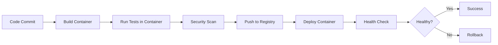

# Module 10: Container-based CI/CD 🐳

## Learning Objectives 🎯

By the end of this module, you will:
- Integrate Docker containers into CI/CD pipelines
- Build and manage container images in automated workflows
- Implement container security scanning and vulnerability management
- Deploy containerized applications across different environments
- Optimize container builds for CI/CD performance
- Manage container registries and image versioning
- Implement multi-stage builds and layer caching
- Handle container secrets and configuration management

## Table of Contents

1. [Introduction to Container-based CI/CD](#introduction)
2. [Docker in CI/CD Pipelines](#docker-pipelines)
3. [Container Image Building](#image-building)
4. [Container Registries](#registries)
5. [Image Scanning & Security](#image-scanning)
6. [Container Deployment Strategies](#deployment)
7. [Multi-stage Builds](#multi-stage)
8. [Caching and Optimization](#optimization)
9. [Container Configuration Management](#configuration)
10. [Best Practices](#best-practices)
11. [Hands-on Exercises](#exercises)
12. [Troubleshooting](#troubleshooting)

---

## 1. Introduction to Container-based CI/CD {#introduction}

### Why Containers in CI/CD?

Containers revolutionize CI/CD by providing:

- **Consistency**: "Works on my machine" becomes "works everywhere"
- **Isolation**: Clean, reproducible build environments
- **Portability**: Same container runs in dev, staging, and production
- **Scalability**: Easy horizontal scaling and orchestration
- **Efficiency**: Faster builds and deployments

### Container CI/CD Flow



### Benefits of Containerized CI/CD

- 🚀 **Faster Builds**: Parallel builds and layer caching
- 🔒 **Security**: Isolated execution environments
- 📦 **Artifact Management**: Images as deployable artifacts
- 🔄 **Reproducibility**: Consistent environments across stages
- 🎯 **Resource Efficiency**: Optimal resource utilization

---

## 2. Docker in CI/CD Pipelines {#docker-pipelines}

### Basic Docker Integration

```yaml
# .github/workflows/docker-ci.yml
name: Docker CI/CD Pipeline

on:
  push:
    branches: [ main, develop ]
  pull_request:
    branches: [ main ]

env:
  REGISTRY: ghcr.io
  IMAGE_NAME: ${{ github.repository }}

jobs:
  build-and-test:
    runs-on: ubuntu-latest
    
    steps:
    - name: Checkout repository
      uses: actions/checkout@v4
    
    - name: Set up Docker Buildx
      uses: docker/setup-buildx-action@v3
    
    - name: Log in to Container Registry
      uses: docker/login-action@v3
      with:
        registry: ${{ env.REGISTRY }}
        username: ${{ github.actor }}
        password: ${{ secrets.GITHUB_TOKEN }}
    
    - name: Extract metadata
      id: meta
      uses: docker/metadata-action@v5
      with:
        images: ${{ env.REGISTRY }}/${{ env.IMAGE_NAME }}
        tags: |
          type=ref,event=branch
          type=ref,event=pr
          type=sha,prefix={{branch}}-
          type=raw,value=latest,enable={{is_default_branch}}
    
    - name: Build and push Docker image
      uses: docker/build-push-action@v5
      with:
        context: .
        platforms: linux/amd64,linux/arm64
        push: true
        tags: ${{ steps.meta.outputs.tags }}
        labels: ${{ steps.meta.outputs.labels }}
        cache-from: type=gha
        cache-to: type=gha,mode=max
    
    - name: Run tests in container
      run: |
        docker run --rm \
          -v ${{ github.workspace }}:/workspace \
          -w /workspace \
          ${{ env.REGISTRY }}/${{ env.IMAGE_NAME }}:${{ github.sha }} \
          npm test
```

### Multi-Service Pipeline

```yaml
# .github/workflows/microservices-ci.yml
name: Microservices CI/CD

on:
  push:
    branches: [ main ]

jobs:
  detect-changes:
    runs-on: ubuntu-latest
    outputs:
      frontend: ${{ steps.changes.outputs.frontend }}
      backend: ${{ steps.changes.outputs.backend }}
      api: ${{ steps.changes.outputs.api }}
    steps:
    - uses: actions/checkout@v4
    - uses: dorny/paths-filter@v2
      id: changes
      with:
        filters: |
          frontend:
            - 'frontend/**'
          backend:
            - 'backend/**'
          api:
            - 'api/**'
  
  build-frontend:
    needs: detect-changes
    if: ${{ needs.detect-changes.outputs.frontend == 'true' }}
    runs-on: ubuntu-latest
    steps:
    - uses: actions/checkout@v4
    - name: Build frontend container
      run: |
        cd frontend
        docker build -t frontend:${{ github.sha }} .
        docker tag frontend:${{ github.sha }} ghcr.io/${{ github.repository }}/frontend:latest
        docker push ghcr.io/${{ github.repository }}/frontend:latest
  
  build-backend:
    needs: detect-changes
    if: ${{ needs.detect-changes.outputs.backend == 'true' }}
    runs-on: ubuntu-latest
    steps:
    - uses: actions/checkout@v4
    - name: Build backend container
      run: |
        cd backend
        docker build -t backend:${{ github.sha }} .
        docker tag backend:${{ github.sha }} ghcr.io/${{ github.repository }}/backend:latest
        docker push ghcr.io/${{ github.repository }}/backend:latest
  
  integration-tests:
    needs: [build-frontend, build-backend]
    if: always() && (needs.build-frontend.result == 'success' || needs.build-backend.result == 'success')
    runs-on: ubuntu-latest
    steps:
    - uses: actions/checkout@v4
    - name: Run integration tests
      run: |
        docker-compose -f docker-compose.test.yml up --build --abort-on-container-exit
        docker-compose -f docker-compose.test.yml down
```

### Docker Compose in CI

```yaml
# docker-compose.test.yml
version: '3.8'

services:
  frontend:
    build: ./frontend
    ports:
      - "3000:3000"
    environment:
      - NODE_ENV=test
      - API_URL=http://backend:8000
    depends_on:
      - backend
  
  backend:
    build: ./backend
    ports:
      - "8000:8000"
    environment:
      - DATABASE_URL=postgresql://postgres:password@db:5432/testdb
      - REDIS_URL=redis://redis:6379
    depends_on:
      - db
      - redis
  
  db:
    image: postgres:13
    environment:
      - POSTGRES_DB=testdb
      - POSTGRES_USER=postgres
      - POSTGRES_PASSWORD=password
    volumes:
      - ./init.sql:/docker-entrypoint-initdb.d/init.sql
  
  redis:
    image: redis:6-alpine
  
  test-runner:
    build:
      context: .
      dockerfile: Dockerfile.test
    depends_on:
      - frontend
      - backend
    command: |
      sh -c '
        echo "Waiting for services to be ready..."
        sleep 30
        npm run test:integration
      '
    environment:
      - FRONTEND_URL=http://frontend:3000
      - BACKEND_URL=http://backend:8000
```

---

## 3. Container Image Building {#image-building}

### Optimized Dockerfile for CI/CD

```dockerfile
# Dockerfile
# Multi-stage build for optimal CI/CD
FROM node:18-alpine AS base
WORKDIR /app

# Install dependencies stage
FROM base AS deps
COPY package*.json ./
RUN npm ci --only=production && npm cache clean --force

# Build stage
FROM base AS build
COPY package*.json ./
RUN npm ci
COPY . .
RUN npm run build
RUN npm run test

# Production stage
FROM base AS production
ENV NODE_ENV=production
RUN addgroup -g 1001 -S nodejs
RUN adduser -S nextjs -u 1001

# Copy built application
COPY --from=build --chown=nextjs:nodejs /app/dist ./dist
COPY --from=deps --chown=nextjs:nodejs /app/node_modules ./node_modules
COPY --chown=nextjs:nodejs package*.json ./

USER nextjs
EXPOSE 3000
HEALTHCHECK --interval=30s --timeout=3s --start-period=5s --retries=3 \
  CMD curl -f http://localhost:3000/health || exit 1

CMD ["npm", "start"]
```

### Dynamic Dockerfile Generation

```bash
#!/bin/bash
# generate-dockerfile.sh

ENVIRONMENT=${1:-production}
NODE_VERSION=${2:-18}

cat > Dockerfile.generated << EOF
FROM node:${NODE_VERSION}-alpine

WORKDIR /app

# Install dependencies
COPY package*.json ./
RUN npm ci $([ "$ENVIRONMENT" = "production" ] && echo "--only=production")

# Copy source code
COPY . .

# Build application
$([ "$ENVIRONMENT" != "production" ] && echo "RUN npm run build")

# Set environment
ENV NODE_ENV=$ENVIRONMENT

# Create non-root user
RUN addgroup -g 1001 -S appgroup && \
    adduser -S appuser -u 1001 -G appgroup

USER appuser

EXPOSE 3000

CMD ["npm", "start"]
EOF

echo "Generated Dockerfile for $ENVIRONMENT environment"
```

### Build Arguments and Secrets

```dockerfile
# Dockerfile with build args
FROM node:18-alpine

# Build arguments
ARG NODE_ENV=production
ARG BUILD_VERSION
ARG BUILD_DATE
ARG VCS_REF

# Labels for metadata
LABEL maintainer="team@company.com" \
      version="$BUILD_VERSION" \
      build-date="$BUILD_DATE" \
      vcs-ref="$VCS_REF" \
      description="My Application"

WORKDIR /app

# Install dependencies
COPY package*.json ./
RUN npm ci --only=production

# Copy application
COPY . .

# Build application
RUN npm run build

# Set runtime environment
ENV NODE_ENV=$NODE_ENV
ENV BUILD_VERSION=$BUILD_VERSION

EXPOSE 3000
CMD ["npm", "start"]
```

```yaml
# Build with arguments
- name: Build Docker image with metadata
  uses: docker/build-push-action@v5
  with:
    context: .
    push: true
    tags: ${{ steps.meta.outputs.tags }}
    build-args: |
      NODE_ENV=production
      BUILD_VERSION=${{ github.ref_name }}
      BUILD_DATE=${{ steps.date.outputs.date }}
      VCS_REF=${{ github.sha }}
    secrets: |
      "npm_token=${{ secrets.NPM_TOKEN }}"
```

---

## 4. Container Registries {#registries}

### GitHub Container Registry

```yaml
# .github/workflows/ghcr.yml
name: Build and Push to GHCR

on:
  push:
    branches: [ main ]
    tags: [ 'v*' ]

env:
  REGISTRY: ghcr.io
  IMAGE_NAME: ${{ github.repository }}

jobs:
  build-and-push:
    runs-on: ubuntu-latest
    permissions:
      contents: read
      packages: write
    
    steps:
    - name: Checkout repository
      uses: actions/checkout@v4
    
    - name: Log in to Container Registry
      uses: docker/login-action@v3
      with:
        registry: ${{ env.REGISTRY }}
        username: ${{ github.actor }}
        password: ${{ secrets.GITHUB_TOKEN }}
    
    - name: Extract metadata
      id: meta
      uses: docker/metadata-action@v5
      with:
        images: ${{ env.REGISTRY }}/${{ env.IMAGE_NAME }}
        tags: |
          type=ref,event=branch
          type=ref,event=tag
          type=sha,prefix={{branch}}-
          type=raw,value=latest,enable={{is_default_branch}}
    
    - name: Build and push
      uses: docker/build-push-action@v5
      with:
        context: .
        push: true
        tags: ${{ steps.meta.outputs.tags }}
        labels: ${{ steps.meta.outputs.labels }}
```

### Docker Hub Integration

```yaml
# .github/workflows/dockerhub.yml
name: Build and Push to Docker Hub

on:
  release:
    types: [published]

jobs:
  build-and-push:
    runs-on: ubuntu-latest
    
    steps:
    - name: Checkout
      uses: actions/checkout@v4
    
    - name: Set up Docker Buildx
      uses: docker/setup-buildx-action@v3
    
    - name: Log in to Docker Hub
      uses: docker/login-action@v3
      with:
        username: ${{ secrets.DOCKERHUB_USERNAME }}
        password: ${{ secrets.DOCKERHUB_TOKEN }}
    
    - name: Build and push
      uses: docker/build-push-action@v5
      with:
        context: .
        platforms: linux/amd64,linux/arm64
        push: true
        tags: |
          ${{ secrets.DOCKERHUB_USERNAME }}/myapp:latest
          ${{ secrets.DOCKERHUB_USERNAME }}/myapp:${{ github.event.release.tag_name }}
```

### Private Registry Setup

```yaml
# .github/workflows/private-registry.yml
name: Private Registry Deployment

jobs:
  build-and-push:
    runs-on: ubuntu-latest
    
    steps:
    - name: Configure AWS credentials
      uses: aws-actions/configure-aws-credentials@v4
      with:
        aws-access-key-id: ${{ secrets.AWS_ACCESS_KEY_ID }}
        aws-secret-access-key: ${{ secrets.AWS_SECRET_ACCESS_KEY }}
        aws-region: us-west-2
    
    - name: Login to Amazon ECR
      id: login-ecr
      uses: aws-actions/amazon-ecr-login@v2
    
    - name: Build and push to ECR
      env:
        ECR_REGISTRY: ${{ steps.login-ecr.outputs.registry }}
        ECR_REPOSITORY: my-app
        IMAGE_TAG: ${{ github.sha }}
      run: |
        docker build -t $ECR_REGISTRY/$ECR_REPOSITORY:$IMAGE_TAG .
        docker push $ECR_REGISTRY/$ECR_REPOSITORY:$IMAGE_TAG
        docker tag $ECR_REGISTRY/$ECR_REPOSITORY:$IMAGE_TAG $ECR_REGISTRY/$ECR_REPOSITORY:latest
        docker push $ECR_REGISTRY/$ECR_REPOSITORY:latest
```

### Registry Cleanup

```yaml
# .github/workflows/cleanup-registry.yml
name: Cleanup Old Images

on:
  schedule:
    - cron: '0 2 * * 0'  # Weekly cleanup
  workflow_dispatch:

jobs:
  cleanup:
    runs-on: ubuntu-latest
    steps:
    - name: Delete old container images
      uses: actions/delete-package-versions@v4
      with:
        package-name: 'my-app'
        package-type: 'container'
        min-versions-to-keep: 10
        delete-only-untagged-versions: true
```

---

## 5. Image Scanning & Security {#image-scanning}

### Vulnerability Scanning with Trivy

```yaml
# .github/workflows/security-scan.yml
name: Container Security Scan

on:
  push:
    branches: [ main ]
  pull_request:
    branches: [ main ]

jobs:
  security-scan:
    runs-on: ubuntu-latest
    
    steps:
    - name: Checkout code
      uses: actions/checkout@v4
    
    - name: Build Docker image
      run: |
        docker build -t myapp:${{ github.sha }} .
    
    - name: Run Trivy vulnerability scanner
      uses: aquasecurity/trivy-action@master
      with:
        image-ref: 'myapp:${{ github.sha }}'
        format: 'sarif'
        output: 'trivy-results.sarif'
    
    - name: Upload Trivy scan results to GitHub Security tab
      uses: github/codeql-action/upload-sarif@v2
      if: always()
      with:
        sarif_file: 'trivy-results.sarif'
    
    - name: Run Trivy scanner for critical vulnerabilities
      uses: aquasecurity/trivy-action@master
      with:
        image-ref: 'myapp:${{ github.sha }}'
        format: 'table'
        severity: 'CRITICAL,HIGH'
        exit-code: '1'
```

### Advanced Security Scanning

```yaml
# .github/workflows/advanced-security.yml
name: Advanced Security Scanning

jobs:
  security-scan:
    runs-on: ubuntu-latest
    
    steps:
    - uses: actions/checkout@v4
    
    # Build image
    - name: Build image
      run: docker build -t myapp:scan .
    
    # Scan for vulnerabilities
    - name: Vulnerability scan
      run: |
        docker run --rm -v /var/run/docker.sock:/var/run/docker.sock \
          aquasec/trivy image --severity HIGH,CRITICAL myapp:scan
    
    # Scan for secrets
    - name: Secret scan
      run: |
        docker run --rm -v "$PWD:/src" \
          trufflesecurity/trufflehog filesystem /src --json > secrets-report.json
    
    # Scan for misconfigurations
    - name: Configuration scan
      run: |
        docker run --rm -v "$PWD:/src" \
          aquasec/trivy config /src
    
    # License compliance
    - name: License scan
      run: |
        docker run --rm -v "$PWD:/src" \
          licensefinder/license_finder
    
    # SBOM generation
    - name: Generate SBOM
      run: |
        docker run --rm -v "$PWD:/src" \
          anchore/syft /src -o spdx-json > sbom.json
    
    - name: Upload security artifacts
      uses: actions/upload-artifact@v3
      with:
        name: security-reports
        path: |
          secrets-report.json
          sbom.json
```

### Security Policy Enforcement

```yaml
# .github/workflows/security-policy.yml
name: Security Policy Enforcement

jobs:
  policy-check:
    runs-on: ubuntu-latest
    
    steps:
    - uses: actions/checkout@v4
    
    - name: Build image
      run: docker build -t myapp:policy .
    
    - name: Install Conftest
      run: |
        wget https://github.com/open-policy-agent/conftest/releases/download/v0.46.0/conftest_0.46.0_Linux_x86_64.tar.gz
        tar xzf conftest_0.46.0_Linux_x86_64.tar.gz
        sudo mv conftest /usr/local/bin
    
    - name: Test Dockerfile against security policies
      run: |
        conftest test --policy security-policies/ Dockerfile
    
    - name: Test image against runtime policies
      run: |
        docker save myapp:policy | conftest test --policy runtime-policies/ -
```

```rego
# security-policies/dockerfile.rego
package dockerfile.security

# Deny running as root
deny[msg] {
    input[i].Cmd == "user"
    val := input[i].Value
    val[0] == "root"
    msg := "Container should not run as root user"
}

# Require health check
deny[msg] {
    not has_healthcheck
    msg := "Dockerfile must include HEALTHCHECK instruction"
}

has_healthcheck {
    input[_].Cmd == "healthcheck"
}

# Deny ADD instruction (prefer COPY)
deny[msg] {
    input[i].Cmd == "add"
    msg := "Use COPY instead of ADD instruction"
}
```

---

## 6. Container Deployment Strategies {#deployment}

### Kubernetes Deployment

```yaml
# k8s/deployment.yml
apiVersion: apps/v1
kind: Deployment
metadata:
  name: myapp
  labels:
    app: myapp
spec:
  replicas: 3
  strategy:
    type: RollingUpdate
    rollingUpdate:
      maxUnavailable: 1
      maxSurge: 1
  selector:
    matchLabels:
      app: myapp
  template:
    metadata:
      labels:
        app: myapp
    spec:
      containers:
      - name: myapp
        image: ghcr.io/myorg/myapp:latest
        ports:
        - containerPort: 3000
        env:
        - name: NODE_ENV
          value: "production"
        - name: DATABASE_URL
          valueFrom:
            secretKeyRef:
              name: myapp-secrets
              key: database-url
        resources:
          requests:
            memory: "128Mi"
            cpu: "100m"
          limits:
            memory: "256Mi"
            cpu: "200m"
        livenessProbe:
          httpGet:
            path: /health
            port: 3000
          initialDelaySeconds: 30
          periodSeconds: 10
        readinessProbe:
          httpGet:
            path: /ready
            port: 3000
          initialDelaySeconds: 5
          periodSeconds: 5
```

### Docker Swarm Deployment

```yaml
# docker-stack.yml
version: '3.8'

services:
  app:
    image: myapp:${VERSION:-latest}
    deploy:
      replicas: 3
      update_config:
        parallelism: 1
        delay: 10s
        failure_action: rollback
        order: start-first
      rollback_config:
        parallelism: 1
        delay: 10s
      restart_policy:
        condition: on-failure
        delay: 5s
        max_attempts: 3
      resources:
        limits:
          memory: 256M
          cpus: '0.2'
        reservations:
          memory: 128M
          cpus: '0.1'
    ports:
      - "3000:3000"
    environment:
      - NODE_ENV=production
    secrets:
      - database_url
    networks:
      - app-network
    healthcheck:
      test: ["CMD", "curl", "-f", "http://localhost:3000/health"]
      interval: 30s
      timeout: 10s
      retries: 3
      start_period: 40s

secrets:
  database_url:
    external: true

networks:
  app-network:
    driver: overlay
    attachable: true
```

### Container Deployment Pipeline

```yaml
# .github/workflows/container-deploy.yml
name: Container Deployment

on:
  push:
    branches: [ main ]
    tags: [ 'v*' ]

env:
  REGISTRY: ghcr.io
  IMAGE_NAME: ${{ github.repository }}

jobs:
  build:
    runs-on: ubuntu-latest
    outputs:
      image: ${{ steps.image.outputs.image }}
      digest: ${{ steps.build.outputs.digest }}
    
    steps:
    - name: Checkout
      uses: actions/checkout@v4
    
    - name: Set up Docker Buildx
      uses: docker/setup-buildx-action@v3
    
    - name: Log in to registry
      uses: docker/login-action@v3
      with:
        registry: ${{ env.REGISTRY }}
        username: ${{ github.actor }}
        password: ${{ secrets.GITHUB_TOKEN }}
    
    - name: Extract metadata
      id: meta
      uses: docker/metadata-action@v5
      with:
        images: ${{ env.REGISTRY }}/${{ env.IMAGE_NAME }}
    
    - name: Build and push
      id: build
      uses: docker/build-push-action@v5
      with:
        context: .
        push: true
        tags: ${{ steps.meta.outputs.tags }}
        labels: ${{ steps.meta.outputs.labels }}
        cache-from: type=gha
        cache-to: type=gha,mode=max
    
    - name: Output image
      id: image
      run: |
        echo "image=${{ env.REGISTRY }}/${{ env.IMAGE_NAME }}@${{ steps.build.outputs.digest }}" >> $GITHUB_OUTPUT
  
  deploy-staging:
    needs: build
    runs-on: ubuntu-latest
    environment: staging
    
    steps:
    - name: Deploy to staging
      run: |
        echo "Deploying ${{ needs.build.outputs.image }} to staging"
        # Update Kubernetes deployment
        kubectl set image deployment/myapp-staging myapp=${{ needs.build.outputs.image }}
        kubectl rollout status deployment/myapp-staging
    
    - name: Run smoke tests
      run: |
        # Wait for deployment
        sleep 30
        # Run smoke tests
        curl -f https://staging.myapp.com/health
  
  deploy-production:
    needs: [build, deploy-staging]
    runs-on: ubuntu-latest
    environment: production
    if: github.ref == 'refs/heads/main' || startsWith(github.ref, 'refs/tags/v')
    
    steps:
    - name: Deploy to production
      run: |
        echo "Deploying ${{ needs.build.outputs.image }} to production"
        # Blue-green deployment
        kubectl set image deployment/myapp-green myapp=${{ needs.build.outputs.image }}
        kubectl rollout status deployment/myapp-green
        
        # Switch traffic
        kubectl patch service myapp-service -p '{"spec":{"selector":{"version":"green"}}}'
    
    - name: Verify production deployment
      run: |
        sleep 30
        curl -f https://myapp.com/health
        echo "Production deployment successful"
```

---

## 7. Multi-stage Builds {#multi-stage}

### Advanced Multi-stage Dockerfile

```dockerfile
# Dockerfile.multistage
# Build stage for dependencies
FROM node:18-alpine AS deps
WORKDIR /app
COPY package*.json ./
RUN npm ci --only=production && npm cache clean --force

# Build stage for development dependencies and build
FROM node:18-alpine AS build
WORKDIR /app
COPY package*.json ./
RUN npm ci
COPY . .
RUN npm run build
RUN npm run test

# Security scanning stage
FROM build AS security
RUN npm audit --audit-level high
RUN npm run lint
RUN npm run test:security

# Production stage
FROM node:18-alpine AS production
WORKDIR /app

# Install dumb-init for proper signal handling
RUN apk add --no-cache dumb-init

# Create non-root user
RUN addgroup -g 1001 -S nodejs && \
    adduser -S nextjs -u 1001 -G nodejs

# Copy production dependencies
COPY --from=deps --chown=nextjs:nodejs /app/node_modules ./node_modules

# Copy built application
COPY --from=build --chown=nextjs:nodejs /app/dist ./dist
COPY --from=build --chown=nextjs:nodejs /app/package*.json ./

# Set environment
ENV NODE_ENV=production
ENV PORT=3000

USER nextjs
EXPOSE 3000

# Health check
HEALTHCHECK --interval=30s --timeout=3s --start-period=5s --retries=3 \
  CMD wget --no-verbose --tries=1 --spider http://localhost:3000/health || exit 1

ENTRYPOINT ["dumb-init", "--"]
CMD ["npm", "start"]
```

### Language-specific Multi-stage Builds

#### Python Multi-stage
```dockerfile
# Dockerfile.python
FROM python:3.11-slim AS base
WORKDIR /app
ENV PYTHONUNBUFFERED=1
ENV PYTHONDONTWRITEBYTECODE=1

# Build stage
FROM base AS build
RUN apt-get update && apt-get install -y \
    build-essential \
    && rm -rf /var/lib/apt/lists/*

COPY requirements.txt .
RUN pip install --user --no-cache-dir -r requirements.txt

# Test stage
FROM build AS test
COPY requirements-dev.txt .
RUN pip install --user --no-cache-dir -r requirements-dev.txt
COPY . .
RUN python -m pytest
RUN python -m flake8
RUN python -m mypy .

# Production stage
FROM base AS production
RUN groupadd -r appuser && useradd -r -g appuser appuser

COPY --from=build /root/.local /home/appuser/.local
COPY --chown=appuser:appuser . .

USER appuser
ENV PATH=/home/appuser/.local/bin:$PATH

EXPOSE 8000
CMD ["gunicorn", "--bind", "0.0.0.0:8000", "app:app"]
```

#### Go Multi-stage
```dockerfile
# Dockerfile.go
FROM golang:1.21-alpine AS base
WORKDIR /app
RUN apk add --no-cache git

# Dependencies stage
FROM base AS deps
COPY go.mod go.sum ./
RUN go mod download

# Build stage
FROM deps AS build
COPY . .
RUN CGO_ENABLED=0 GOOS=linux go build -a -installsuffix cgo -o main .

# Test stage
FROM build AS test
RUN go test -v ./...
RUN go vet ./...
RUN golangci-lint run

# Production stage
FROM alpine:latest AS production
RUN apk --no-cache add ca-certificates
WORKDIR /root/

# Create non-root user
RUN adduser -D -s /bin/sh appuser

COPY --from=build /app/main .
RUN chown appuser:appuser main

USER appuser
EXPOSE 8080
CMD ["./main"]
```

---

## 8. Caching and Optimization {#optimization}

### Docker Layer Caching

```dockerfile
# Optimized Dockerfile with layer caching
FROM node:18-alpine

WORKDIR /app

# Copy package files first (for better caching)
COPY package*.json ./

# Install dependencies (this layer will be cached)
RUN npm ci --only=production

# Copy source code (this layer changes frequently)
COPY . .

# Build application
RUN npm run build

EXPOSE 3000
CMD ["npm", "start"]
```

### GitHub Actions Cache

```yaml
# .github/workflows/optimized-build.yml
name: Optimized Container Build

jobs:
  build:
    runs-on: ubuntu-latest
    
    steps:
    - uses: actions/checkout@v4
    
    - name: Set up Docker Buildx
      uses: docker/setup-buildx-action@v3
    
    - name: Cache Docker layers
      uses: actions/cache@v3
      with:
        path: /tmp/.buildx-cache
        key: ${{ runner.os }}-buildx-${{ github.sha }}
        restore-keys: |
          ${{ runner.os }}-buildx-
    
    - name: Build with cache
      uses: docker/build-push-action@v5
      with:
        context: .
        push: false
        cache-from: |
          type=local,src=/tmp/.buildx-cache
          type=gha
        cache-to: |
          type=local,dest=/tmp/.buildx-cache-new,mode=max
          type=gha,mode=max
    
    # Temp fix for cache growth
    - name: Move cache
      run: |
        rm -rf /tmp/.buildx-cache
        mv /tmp/.buildx-cache-new /tmp/.buildx-cache
```

### Build Optimization Techniques

```dockerfile
# Dockerfile.optimized
# Use specific version tags
FROM node:18.17.0-alpine3.18

# Install system dependencies in one layer
RUN apk add --no-cache \
    dumb-init \
    curl \
    && rm -rf /var/cache/apk/*

WORKDIR /app

# Copy and install dependencies first
COPY package*.json ./
RUN npm ci --only=production \
    && npm cache clean --force \
    && rm -rf /tmp/*

# Copy source code
COPY . .

# Build in one layer
RUN npm run build \
    && rm -rf src/ \
    && rm -rf node_modules/@types \
    && npm prune --production

# Use non-root user
RUN addgroup -g 1001 -S nodejs \
    && adduser -S nextjs -u 1001 -G nodejs \
    && chown -R nextjs:nodejs /app

USER nextjs

EXPOSE 3000

ENTRYPOINT ["dumb-init", "--"]
CMD ["npm", "start"]
```

### Parallel Builds

```yaml
# .github/workflows/parallel-builds.yml
name: Parallel Container Builds

jobs:
  build:
    runs-on: ubuntu-latest
    strategy:
      matrix:
        platform: [linux/amd64, linux/arm64]
        service: [frontend, backend, api]
    
    steps:
    - uses: actions/checkout@v4
    
    - name: Set up QEMU
      uses: docker/setup-qemu-action@v3
    
    - name: Set up Docker Buildx
      uses: docker/setup-buildx-action@v3
    
    - name: Build ${{ matrix.service }} for ${{ matrix.platform }}
      uses: docker/build-push-action@v5
      with:
        context: ./${{ matrix.service }}
        platforms: ${{ matrix.platform }}
        push: false
        tags: ${{ matrix.service }}:${{ github.sha }}-${{ matrix.platform }}
        cache-from: type=gha,scope=${{ matrix.service }}-${{ matrix.platform }}
        cache-to: type=gha,mode=max,scope=${{ matrix.service }}-${{ matrix.platform }}
```

---

## 9. Container Configuration Management {#configuration}

### Environment-based Configuration

```yaml
# docker-compose.override.yml (for development)
version: '3.8'

services:
  app:
    build:
      context: .
      target: development
    volumes:
      - .:/app
      - /app/node_modules
    environment:
      - NODE_ENV=development
      - DEBUG=app:*
      - HOT_RELOAD=true
    ports:
      - "3000:3000"
      - "9229:9229"  # Debug port
```

```yaml
# docker-compose.prod.yml
version: '3.8'

services:
  app:
    image: myapp:${VERSION}
    environment:
      - NODE_ENV=production
      - LOG_LEVEL=warn
    deploy:
      replicas: 3
      resources:
        limits:
          memory: 512M
          cpus: '0.5'
    healthcheck:
      test: ["CMD", "curl", "-f", "http://localhost:3000/health"]
      interval: 30s
      timeout: 10s
      retries: 3
```

### Secrets Management

```yaml
# .github/workflows/secrets-management.yml
name: Secure Container Deployment

jobs:
  deploy:
    runs-on: ubuntu-latest
    
    steps:
    - name: Configure AWS credentials
      uses: aws-actions/configure-aws-credentials@v4
      with:
        aws-access-key-id: ${{ secrets.AWS_ACCESS_KEY_ID }}
        aws-secret-access-key: ${{ secrets.AWS_SECRET_ACCESS_KEY }}
        aws-region: us-west-2
    
    - name: Retrieve secrets from AWS Secrets Manager
      run: |
        DATABASE_URL=$(aws secretsmanager get-secret-value \
          --secret-id prod/myapp/database-url \
          --query SecretString --output text)
        echo "::add-mask::$DATABASE_URL"
        echo "DATABASE_URL=$DATABASE_URL" >> $GITHUB_ENV
    
    - name: Deploy with secrets
      run: |
        docker run -d \
          --name myapp \
          -e DATABASE_URL="$DATABASE_URL" \
          -e API_KEY="${{ secrets.API_KEY }}" \
          myapp:latest
```

### Configuration Validation

```javascript
// config-validator.js
const Joi = require('joi');

const configSchema = Joi.object({
  NODE_ENV: Joi.string().valid('development', 'staging', 'production').required(),
  PORT: Joi.number().port().default(3000),
  DATABASE_URL: Joi.string().uri().required(),
  REDIS_URL: Joi.string().uri().required(),
  JWT_SECRET: Joi.string().min(32).required(),
  LOG_LEVEL: Joi.string().valid('debug', 'info', 'warn', 'error').default('info'),
  API_RATE_LIMIT: Joi.number().positive().default(100)
});

function validateConfig() {
  const { error, value } = configSchema.validate(process.env, {
    allowUnknown: true,
    stripUnknown: true
  });
  
  if (error) {
    console.error('Configuration validation failed:');
    error.details.forEach(detail => {
      console.error(`- ${detail.message}`);
    });
    process.exit(1);
  }
  
  console.log('✅ Configuration validation passed');
  return value;
}

module.exports = { validateConfig };
```

---

## 10. Best Practices {#best-practices}

### ✅ Container CI/CD Best Practices

1. **Use Multi-stage Builds**
   ```dockerfile
   # Separate build and runtime stages
   FROM node:18 AS build
   # Build steps here
   
   FROM node:18-alpine AS production
   COPY --from=build /app/dist ./dist
   ```

2. **Minimize Image Size**
   ```dockerfile
   # Use alpine images
   FROM node:18-alpine
   
   # Remove unnecessary files
   RUN npm ci --only=production \
       && npm cache clean --force \
       && rm -rf /tmp/*
   ```

3. **Security First**
   ```dockerfile
   # Don't run as root
   RUN adduser -D appuser
   USER appuser
   
   # Scan for vulnerabilities
   RUN npm audit --audit-level high
   ```

4. **Proper Health Checks**
   ```dockerfile
   HEALTHCHECK --interval=30s --timeout=3s --start-period=5s --retries=3 \
     CMD curl -f http://localhost:3000/health || exit 1
   ```

5. **Version Everything**
   ```yaml
   # Tag images with version
   tags: |
     myapp:latest
     myapp:${{ github.sha }}
     myapp:v${{ github.ref_name }}
   ```

### ❌ Common Pitfalls to Avoid

1. **Don't Use Latest Tags in Production**
   ```yaml
   # Bad
   image: myapp:latest
   
   # Good
   image: myapp:v1.2.3
   ```

2. **Don't Ignore .dockerignore**
   ```dockerignore
   # .dockerignore
   node_modules
   .git
   .env
   *.log
   coverage/
   .nyc_output
   ```

3. **Don't Store Secrets in Images**
   ```dockerfile
   # Bad
   ENV API_KEY=secret123
   
   # Good
   # Use runtime environment variables
   ```

4. **Don't Skip Security Scanning**
   ```yaml
   # Always include security scanning
   - name: Security scan
     uses: aquasecurity/trivy-action@master
     with:
       image-ref: myapp:${{ github.sha }}
   ```

---

## 11. Hands-on Exercises {#exercises}

### Exercise 1: Multi-stage Container Build

**Task**: Create a multi-stage Dockerfile for a Node.js application with security scanning

**Requirements**:
- Separate build and production stages
- Include security scanning
- Optimize for size and security
- Add health checks

<details>
<summary>Solution</summary>

```dockerfile
# Dockerfile
FROM node:18-alpine AS base
WORKDIR /app
RUN apk add --no-cache dumb-init

# Dependencies stage
FROM base AS deps
COPY package*.json ./
RUN npm ci --only=production && npm cache clean --force

# Build stage
FROM base AS build
COPY package*.json ./
RUN npm ci
COPY . .
RUN npm run build
RUN npm run test

# Security stage
FROM build AS security
RUN npm audit --audit-level high
RUN npm run lint

# Production stage
FROM base AS production
RUN addgroup -g 1001 -S nodejs && \
    adduser -S nextjs -u 1001 -G nodejs

COPY --from=deps --chown=nextjs:nodejs /app/node_modules ./node_modules
COPY --from=build --chown=nextjs:nodejs /app/dist ./dist
COPY --from=build --chown=nextjs:nodejs /app/package*.json ./

USER nextjs
EXPOSE 3000

HEALTHCHECK --interval=30s --timeout=3s --start-period=5s --retries=3 \
  CMD wget --no-verbose --tries=1 --spider http://localhost:3000/health || exit 1

ENTRYPOINT ["dumb-init", "--"]
CMD ["npm", "start"]
```

```yaml
# .github/workflows/multi-stage-build.yml
name: Multi-stage Container Build

on: [push, pull_request]

jobs:
  build:
    runs-on: ubuntu-latest
    
    steps:
    - uses: actions/checkout@v4
    
    - name: Set up Docker Buildx
      uses: docker/setup-buildx-action@v3
    
    - name: Build and test
      uses: docker/build-push-action@v5
      with:
        context: .
        target: security
        push: false
        cache-from: type=gha
        cache-to: type=gha,mode=max
    
    - name: Build production image
      uses: docker/build-push-action@v5
      with:
        context: .
        target: production
        push: false
        tags: myapp:${{ github.sha }}
    
    - name: Security scan
      uses: aquasecurity/trivy-action@master
      with:
        image-ref: myapp:${{ github.sha }}
        format: 'table'
        severity: 'CRITICAL,HIGH'
```
</details>

### Exercise 2: Container Registry Pipeline

**Task**: Create a complete pipeline that builds, scans, and pushes to multiple registries

**Requirements**:
- Build for multiple platforms
- Security scanning
- Push to GitHub Container Registry and Docker Hub
- Proper tagging strategy

<details>
<summary>Solution</summary>

```yaml
# .github/workflows/registry-pipeline.yml
name: Multi-Registry Pipeline

on:
  push:
    branches: [ main ]
    tags: [ 'v*' ]

env:
  IMAGE_NAME: myapp

jobs:
  build-and-push:
    runs-on: ubuntu-latest
    permissions:
      contents: read
      packages: write
    
    steps:
    - name: Checkout
      uses: actions/checkout@v4
    
    - name: Set up QEMU
      uses: docker/setup-qemu-action@v3
    
    - name: Set up Docker Buildx
      uses: docker/setup-buildx-action@v3
    
    - name: Log in to GitHub Container Registry
      uses: docker/login-action@v3
      with:
        registry: ghcr.io
        username: ${{ github.actor }}
        password: ${{ secrets.GITHUB_TOKEN }}
    
    - name: Log in to Docker Hub
      uses: docker/login-action@v3
      with:
        username: ${{ secrets.DOCKERHUB_USERNAME }}
        password: ${{ secrets.DOCKERHUB_TOKEN }}
    
    - name: Extract metadata
      id: meta
      uses: docker/metadata-action@v5
      with:
        images: |
          ghcr.io/${{ github.repository }}
          ${{ secrets.DOCKERHUB_USERNAME }}/${{ env.IMAGE_NAME }}
        tags: |
          type=ref,event=branch
          type=ref,event=tag
          type=sha,prefix={{branch}}-
          type=raw,value=latest,enable={{is_default_branch}}
    
    - name: Build and push
      id: build
      uses: docker/build-push-action@v5
      with:
        context: .
        platforms: linux/amd64,linux/arm64
        push: true
        tags: ${{ steps.meta.outputs.tags }}
        labels: ${{ steps.meta.outputs.labels }}
        cache-from: type=gha
        cache-to: type=gha,mode=max
    
    - name: Security scan
      uses: aquasecurity/trivy-action@master
      with:
        image-ref: ghcr.io/${{ github.repository }}@${{ steps.build.outputs.digest }}
        format: 'sarif'
        output: 'trivy-results.sarif'
    
    - name: Upload scan results
      uses: github/codeql-action/upload-sarif@v2
      if: always()
      with:
        sarif_file: 'trivy-results.sarif'
```
</details>

### Exercise 3: Container Deployment with Rollback

**Task**: Implement a container deployment pipeline with automatic rollback

**Requirements**:
- Deploy to Kubernetes
- Health checks after deployment
- Automatic rollback on failure
- Notification system

<details>
<summary>Solution</summary>

```yaml
# .github/workflows/container-deploy-rollback.yml
name: Container Deploy with Rollback

on:
  push:
    branches: [ main ]

jobs:
  deploy:
    runs-on: ubuntu-latest
    environment: production
    
    steps:
    - uses: actions/checkout@v4
    
    - name: Configure kubectl
      run: |
        echo "${{ secrets.KUBECONFIG }}" | base64 -d > kubeconfig
        export KUBECONFIG=kubeconfig
    
    - name: Record current deployment
      id: current
      run: |
        CURRENT_IMAGE=$(kubectl get deployment myapp -o jsonpath='{.spec.template.spec.containers[0].image}')
        echo "current_image=$CURRENT_IMAGE" >> $GITHUB_OUTPUT
    
    - name: Deploy new version
      run: |
        kubectl set image deployment/myapp myapp=ghcr.io/${{ github.repository }}:${{ github.sha }}
        kubectl rollout status deployment/myapp --timeout=300s
    
    - name: Health check
      id: health
      run: |
        sleep 30
        for i in {1..5}; do
          if curl -f https://myapp.com/health; then
            echo "healthy=true" >> $GITHUB_OUTPUT
            exit 0
          fi
          sleep 30
        done
        echo "healthy=false" >> $GITHUB_OUTPUT
    
    - name: Rollback on failure
      if: steps.health.outputs.healthy == 'false'
      run: |
        echo "Health check failed, rolling back..."
        kubectl set image deployment/myapp myapp=${{ steps.current.outputs.current_image }}
        kubectl rollout status deployment/myapp
        exit 1
    
    - name: Notify success
      if: steps.health.outputs.healthy == 'true'
      uses: 8398a7/action-slack@v3
      with:
        status: success
        text: |
          ✅ Deployment successful!
          Image: ghcr.io/${{ github.repository }}:${{ github.sha }}
          URL: https://myapp.com
      env:
        SLACK_WEBHOOK_URL: ${{ secrets.SLACK_WEBHOOK }}
    
    - name: Notify failure
      if: failure()
      uses: 8398a7/action-slack@v3
      with:
        status: failure
        text: |
          🚨 Deployment failed and rolled back!
          Failed image: ghcr.io/${{ github.repository }}:${{ github.sha }}
          Rolled back to: ${{ steps.current.outputs.current_image }}
      env:
        SLACK_WEBHOOK_URL: ${{ secrets.SLACK_WEBHOOK }}
```
</details>

---

## 12. Troubleshooting {#troubleshooting}

### Common Container CI/CD Issues

#### 1. Build Failures

**Problem**: Docker build fails in CI but works locally

**Solutions**:
```yaml
# Debug build issues
- name: Debug build
  run: |
    docker build --progress=plain --no-cache .
    docker system df
    docker images
```

#### 2. Image Size Issues

**Problem**: Container images are too large

**Solutions**:
```dockerfile
# Use alpine images
FROM node:18-alpine

# Multi-stage builds
FROM node:18 AS build
# Build steps
FROM node:18-alpine AS production
COPY --from=build /app/dist ./dist

# Clean up in same layer
RUN npm ci --only=production \
    && npm cache clean --force \
    && rm -rf /tmp/*
```

#### 3. Registry Push Failures

**Problem**: Cannot push to container registry

**Solutions**:
```yaml
# Check authentication
- name: Debug registry auth
  run: |
    echo "${{ secrets.GITHUB_TOKEN }}" | docker login ghcr.io -u ${{ github.actor }} --password-stdin
    docker push ghcr.io/${{ github.repository }}:test || echo "Push failed"
```

#### 4. Security Scan Failures

**Problem**: Security scans block deployment

**Solutions**:
```yaml
# Allow specific vulnerabilities
- name: Security scan with exceptions
  uses: aquasecurity/trivy-action@master
  with:
    image-ref: myapp:${{ github.sha }}
    severity: 'CRITICAL,HIGH'
    ignore-unfixed: true
    trivyignores: '.trivyignore'
```

```
# .trivyignore
# Ignore specific CVEs
CVE-2023-12345
# Ignore by package
npm:lodash
```

### Performance Optimization

```yaml
# Optimize build performance
- name: Optimized build
  uses: docker/build-push-action@v5
  with:
    context: .
    push: true
    tags: myapp:latest
    cache-from: |
      type=gha
      type=registry,ref=myapp:cache
    cache-to: |
      type=gha,mode=max
      type=registry,ref=myapp:cache,mode=max
    build-args: |
      BUILDKIT_INLINE_CACHE=1
```

---

## Summary 📋

In this module, you learned:

✅ **Container Integration**
- Docker in CI/CD pipelines
- Multi-service container builds
- Container orchestration in workflows

✅ **Image Management**
- Container registry integration
- Image tagging and versioning
- Multi-platform builds

✅ **Security & Scanning**
- Vulnerability scanning with Trivy
- Security policy enforcement
- SBOM generation and compliance

✅ **Deployment Strategies**
- Kubernetes container deployment
- Docker Swarm orchestration
- Blue-green container deployments

✅ **Optimization Techniques**
- Multi-stage builds
- Layer caching strategies
- Build performance optimization

### Next Steps 🚀

1. **Practice**: Implement container-based CI/CD for your projects
2. **Experiment**: Try different deployment strategies
3. **Optimize**: Focus on build speed and image size
4. **Secure**: Implement comprehensive security scanning
5. **Module 11**: Move on to Environment Management

### Key Takeaways 💡

- **Containers Everywhere**: Use containers for consistent environments
- **Security First**: Always scan images for vulnerabilities
- **Optimize Builds**: Use multi-stage builds and caching
- **Automate Deployment**: Implement automated container deployment
- **Monitor & Rollback**: Have rollback strategies ready

---

**Congratulations! 🎉** You've mastered container-based CI/CD and can now build, secure, and deploy containerized applications at scale!

**Next Module**: [Environment Management →](./03-environments.md)