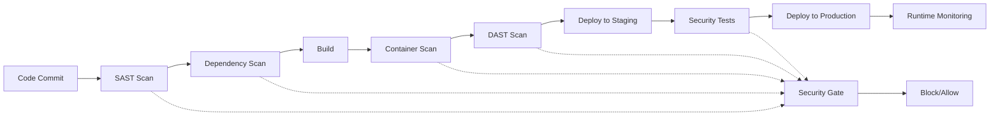

# Module 12: Security in CI/CD

## Learning Objectives

By the end of this module, you will be able to:

- Implement security scanning in CI/CD pipelines
- Manage secrets and sensitive data securely
- Apply security best practices throughout the development lifecycle
- Set up vulnerability scanning for dependencies and containers
- Implement security gates and compliance checks
- Configure secure deployment practices
- Monitor and respond to security incidents

---

## 1. Security in the CI/CD Pipeline {#pipeline-security}

### Security-First Approach

Security should be integrated throughout the entire CI/CD pipeline, not added as an afterthought. This approach is known as "DevSecOps" or "Shift-Left Security."

#### Key Principles

1. **Shift Left**: Integrate security early in the development process
2. **Automate Security**: Use automated tools for consistent security checks
3. **Continuous Monitoring**: Monitor for security issues throughout the pipeline
4. **Fail Fast**: Stop the pipeline when security issues are detected
5. **Least Privilege**: Grant minimal necessary permissions
6. **Defense in Depth**: Implement multiple layers of security

### Security Pipeline Architecture



---

## 2. Static Application Security Testing (SAST) {#sast}

### Code Security Scanning

SAST tools analyze source code for security vulnerabilities without executing the application.

#### GitHub Actions SAST Implementation

```yaml
# .github/workflows/security-sast.yml
name: Static Application Security Testing

on:
  push:
    branches: [ main, develop ]
  pull_request:
    branches: [ main ]

jobs:
  sast-scan:
    runs-on: ubuntu-latest
    permissions:
      security-events: write
      actions: read
      contents: read
    
    steps:
    - uses: actions/checkout@v4
      with:
        fetch-depth: 0  # Full history for better analysis
    
    # CodeQL Analysis
    - name: Initialize CodeQL
      uses: github/codeql-action/init@v2
      with:
        languages: javascript, python, java
        queries: security-extended,security-and-quality
    
    - name: Autobuild
      uses: github/codeql-action/autobuild@v2
    
    - name: Perform CodeQL Analysis
      uses: github/codeql-action/analyze@v2
      with:
        category: "/language:javascript"
    
    # SonarCloud Analysis
    - name: SonarCloud Scan
      uses: SonarSource/sonarcloud-github-action@master
      env:
        GITHUB_TOKEN: ${{ secrets.GITHUB_TOKEN }}
        SONAR_TOKEN: ${{ secrets.SONAR_TOKEN }}
      with:
        args: >
          -Dsonar.projectKey=myproject
          -Dsonar.organization=myorg
          -Dsonar.sources=src/
          -Dsonar.tests=tests/
          -Dsonar.javascript.lcov.reportPaths=coverage/lcov.info
    
    # Semgrep Analysis
    - name: Run Semgrep
      uses: returntocorp/semgrep-action@v1
      with:
        config: >
          p/security-audit
          p/secrets
          p/owasp-top-ten
          p/javascript
          p/typescript
      env:
        SEMGREP_APP_TOKEN: ${{ secrets.SEMGREP_APP_TOKEN }}
    
    # Bandit for Python
    - name: Run Bandit Security Scan
      if: contains(github.event.repository.language, 'Python')
      run: |
        pip install bandit[toml]
        bandit -r src/ -f json -o bandit-report.json
        bandit -r src/ -f txt
    
    # ESLint Security Plugin
    - name: Run ESLint Security
      if: contains(github.event.repository.language, 'JavaScript')
      run: |
        npm install eslint-plugin-security
        npx eslint src/ --ext .js,.ts --format json --output-file eslint-security.json
        npx eslint src/ --ext .js,.ts
    
    # Upload SARIF results
    - name: Upload SARIF file
      uses: github/codeql-action/upload-sarif@v2
      if: always()
      with:
        sarif_file: results.sarif
    
    # Security Gate
    - name: Security Gate
      run: |
        # Check for high/critical vulnerabilities
        HIGH_VULNS=$(jq '.runs[0].results | map(select(.level == "error")) | length' results.sarif)
        
        if [ "$HIGH_VULNS" -gt 0 ]; then
          echo "❌ Security gate failed: $HIGH_VULNS high/critical vulnerabilities found"
          exit 1
        else
          echo "✅ Security gate passed: No high/critical vulnerabilities found"
        fi
    
    - name: Upload Security Reports
      uses: actions/upload-artifact@v3
      if: always()
      with:
        name: security-reports
        path: |
          bandit-report.json
          eslint-security.json
          results.sarif
```

### Custom Security Rules

```yaml
# .semgrep.yml - Custom Semgrep Rules
rules:
  - id: hardcoded-secret
    pattern-either:
      - pattern: password = "..."
      - pattern: api_key = "..."
      - pattern: secret = "..."
      - pattern: token = "..."
    message: Hardcoded secret detected
    languages: [javascript, python, java]
    severity: ERROR
    
  - id: sql-injection
    pattern-either:
      - pattern: |
          $QUERY = "SELECT * FROM users WHERE id = " + $INPUT
      - pattern: |
          cursor.execute("SELECT * FROM users WHERE id = " + $INPUT)
    message: Potential SQL injection vulnerability
    languages: [python, javascript]
    severity: ERROR
    
  - id: unsafe-eval
    pattern-either:
      - pattern: eval($INPUT)
      - pattern: Function($INPUT)
      - pattern: setTimeout($INPUT, ...)
      - pattern: setInterval($INPUT, ...)
    message: Unsafe use of eval or dynamic code execution
    languages: [javascript]
    severity: WARNING
    
  - id: weak-crypto
    pattern-either:
      - pattern: crypto.createHash('md5')
      - pattern: crypto.createHash('sha1')
      - pattern: hashlib.md5()
      - pattern: hashlib.sha1()
    message: Weak cryptographic algorithm detected
    languages: [javascript, python]
    severity: WARNING
```

---

## 3. Dependency Security Scanning {#dependency-security}

### Vulnerability Scanning for Dependencies

```yaml
# .github/workflows/dependency-security.yml
name: Dependency Security Scan

on:
  push:
    branches: [ main ]
  pull_request:
    branches: [ main ]
  schedule:
    - cron: '0 2 * * *'  # Daily at 2 AM

jobs:
  dependency-scan:
    runs-on: ubuntu-latest
    
    steps:
    - uses: actions/checkout@v4
    
    # Node.js Dependencies
    - name: Setup Node.js
      uses: actions/setup-node@v4
      with:
        node-version: '18'
        cache: 'npm'
    
    - name: Install dependencies
      run: npm ci
    
    # npm audit
    - name: Run npm audit
      run: |
        npm audit --audit-level=moderate --json > npm-audit.json
        npm audit --audit-level=moderate
      continue-on-error: true
    
    # Snyk Security Scan
    - name: Run Snyk to check for vulnerabilities
      uses: snyk/actions/node@master
      env:
        SNYK_TOKEN: ${{ secrets.SNYK_TOKEN }}
      with:
        args: --severity-threshold=high --json > snyk-report.json
      continue-on-error: true
    
    # OWASP Dependency Check
    - name: Run OWASP Dependency Check
      run: |
        wget https://github.com/jeremylong/DependencyCheck/releases/download/v8.4.0/dependency-check-8.4.0-release.zip
        unzip dependency-check-8.4.0-release.zip
        ./dependency-check/bin/dependency-check.sh \
          --project "MyProject" \
          --scan . \
          --format JSON \
          --format HTML \
          --out dependency-check-report
    
    # Retire.js for JavaScript
    - name: Run Retire.js
      run: |
        npm install -g retire
        retire --outputformat json --outputpath retire-report.json
        retire
      continue-on-error: true
    
    # Safety for Python dependencies
    - name: Run Safety (Python)
      if: hashFiles('requirements.txt') != ''
      run: |
        pip install safety
        safety check --json --output safety-report.json
        safety check
      continue-on-error: true
    
    # Bundler Audit for Ruby
    - name: Run Bundler Audit (Ruby)
      if: hashFiles('Gemfile.lock') != ''
      run: |
        gem install bundler-audit
        bundler-audit check --update
      continue-on-error: true
    
    # Security Gate for Dependencies
    - name: Dependency Security Gate
      run: |
        #!/bin/bash
        set -e
        
        CRITICAL_COUNT=0
        HIGH_COUNT=0
        
        # Check npm audit results
        if [ -f "npm-audit.json" ]; then
          CRITICAL_COUNT=$(jq '.metadata.vulnerabilities.critical // 0' npm-audit.json)
          HIGH_COUNT=$(jq '.metadata.vulnerabilities.high // 0' npm-audit.json)
        fi
        
        # Check Snyk results
        if [ -f "snyk-report.json" ]; then
          SNYK_HIGH=$(jq '[.vulnerabilities[] | select(.severity == "high" or .severity == "critical")] | length' snyk-report.json)
          HIGH_COUNT=$((HIGH_COUNT + SNYK_HIGH))
        fi
        
        echo "Critical vulnerabilities: $CRITICAL_COUNT"
        echo "High vulnerabilities: $HIGH_COUNT"
        
        # Fail if critical vulnerabilities found
        if [ "$CRITICAL_COUNT" -gt 0 ]; then
          echo "❌ Security gate failed: Critical vulnerabilities found"
          exit 1
        fi
        
        # Warn if high vulnerabilities found
        if [ "$HIGH_COUNT" -gt 5 ]; then
          echo "⚠️  Warning: High number of high-severity vulnerabilities ($HIGH_COUNT)"
          # Uncomment to fail on high vulnerabilities
          # exit 1
        fi
        
        echo "✅ Dependency security gate passed"
    
    - name: Upload Security Reports
      uses: actions/upload-artifact@v3
      if: always()
      with:
        name: dependency-security-reports
        path: |
          npm-audit.json
          snyk-report.json
          dependency-check-report/
          retire-report.json
          safety-report.json
```

### Automated Dependency Updates

```yaml
# .github/dependabot.yml
version: 2
updates:
  # Enable version updates for npm
  - package-ecosystem: "npm"
    directory: "/"
    schedule:
      interval: "weekly"
      day: "monday"
      time: "09:00"
    open-pull-requests-limit: 10
    reviewers:
      - "security-team"
    assignees:
      - "lead-developer"
    commit-message:
      prefix: "security"
      include: "scope"
    
  # Enable version updates for Docker
  - package-ecosystem: "docker"
    directory: "/"
    schedule:
      interval: "weekly"
    
  # Enable version updates for GitHub Actions
  - package-ecosystem: "github-actions"
    directory: "/"
    schedule:
      interval: "weekly"
```

---

## 4. Container Security {#container-security}

### Container Image Scanning

```yaml
# .github/workflows/container-security.yml
name: Container Security Scan

on:
  push:
    branches: [ main ]
  pull_request:
    branches: [ main ]

jobs:
  container-scan:
    runs-on: ubuntu-latest
    
    steps:
    - uses: actions/checkout@v4
    
    - name: Build Docker image
      run: |
        docker build -t myapp:${{ github.sha }} .
        docker tag myapp:${{ github.sha }} myapp:latest
    
    # Trivy Security Scanner
    - name: Run Trivy vulnerability scanner
      uses: aquasecurity/trivy-action@master
      with:
        image-ref: 'myapp:latest'
        format: 'sarif'
        output: 'trivy-results.sarif'
    
    - name: Upload Trivy scan results to GitHub Security tab
      uses: github/codeql-action/upload-sarif@v2
      with:
        sarif_file: 'trivy-results.sarif'
    
    # Snyk Container Scan
    - name: Run Snyk to check Docker image for vulnerabilities
      uses: snyk/actions/docker@master
      env:
        SNYK_TOKEN: ${{ secrets.SNYK_TOKEN }}
      with:
        image: myapp:latest
        args: --severity-threshold=high
    
    # Anchore Grype Scanner
    - name: Run Anchore Grype
      uses: anchore/scan-action@v3
      with:
        image: "myapp:latest"
        fail-build: true
        severity-cutoff: high
    
    # Docker Bench Security
    - name: Run Docker Bench Security
      run: |
        git clone https://github.com/docker/docker-bench-security.git
        cd docker-bench-security
        sudo sh docker-bench-security.sh -c container_images
    
    # Container Security Gate
    - name: Container Security Gate
      run: |
        # Parse Trivy results
        CRITICAL_VULNS=$(jq '.runs[0].results | map(select(.level == "error")) | length' trivy-results.sarif)
        
        if [ "$CRITICAL_VULNS" -gt 0 ]; then
          echo "❌ Container security gate failed: $CRITICAL_VULNS critical vulnerabilities"
          exit 1
        fi
        
        echo "✅ Container security gate passed"
```

### Secure Dockerfile Practices

```dockerfile
# Dockerfile - Security Best Practices
# Use specific version tags, not 'latest'
FROM node:18.17.0-alpine3.18

# Create non-root user
RUN addgroup -g 1001 -S nodejs && \
    adduser -S nextjs -u 1001

# Set working directory
WORKDIR /app

# Copy package files first for better caching
COPY package*.json ./

# Install dependencies as root, then switch to non-root
RUN npm ci --only=production && \
    npm cache clean --force && \
    rm -rf /tmp/*

# Copy application code
COPY --chown=nextjs:nodejs . .

# Remove unnecessary packages and files
RUN apk del --purge \
    && rm -rf /var/cache/apk/* \
    && rm -rf /tmp/* \
    && rm -rf /root/.npm

# Set security headers and limits
ENV NODE_ENV=production
ENV NODE_OPTIONS="--max-old-space-size=1024"

# Switch to non-root user
USER nextjs

# Expose port (use non-privileged port)
EXPOSE 3000

# Health check
HEALTHCHECK --interval=30s --timeout=3s --start-period=5s --retries=3 \
    CMD curl -f http://localhost:3000/health || exit 1

# Start application
CMD ["npm", "start"]
```

### Container Runtime Security

```yaml
# kubernetes/security-context.yml
apiVersion: apps/v1
kind: Deployment
metadata:
  name: secure-app
spec:
  replicas: 3
  selector:
    matchLabels:
      app: secure-app
  template:
    metadata:
      labels:
        app: secure-app
    spec:
      # Security Context for Pod
      securityContext:
        runAsNonRoot: true
        runAsUser: 1001
        runAsGroup: 1001
        fsGroup: 1001
        seccompProfile:
          type: RuntimeDefault
      
      containers:
      - name: app
        image: myapp:latest
        
        # Security Context for Container
        securityContext:
          allowPrivilegeEscalation: false
          readOnlyRootFilesystem: true
          runAsNonRoot: true
          runAsUser: 1001
          capabilities:
            drop:
            - ALL
            add:
            - NET_BIND_SERVICE
        
        # Resource limits
        resources:
          limits:
            memory: "512Mi"
            cpu: "500m"
          requests:
            memory: "256Mi"
            cpu: "250m"
        
        # Volume mounts for writable directories
        volumeMounts:
        - name: tmp-volume
          mountPath: /tmp
        - name: cache-volume
          mountPath: /app/.cache
        
        # Environment variables
        env:
        - name: NODE_ENV
          value: "production"
        
        # Liveness and readiness probes
        livenessProbe:
          httpGet:
            path: /health
            port: 3000
          initialDelaySeconds: 30
          periodSeconds: 10
        
        readinessProbe:
          httpGet:
            path: /ready
            port: 3000
          initialDelaySeconds: 5
          periodSeconds: 5
      
      # Volumes for writable directories
      volumes:
      - name: tmp-volume
        emptyDir: {}
      - name: cache-volume
        emptyDir: {}
```

---

## 5. Secrets Management {#secrets-management}

### GitHub Secrets Best Practices

```yaml
# .github/workflows/secrets-management.yml
name: Secure Secrets Management

on:
  push:
    branches: [ main ]

jobs:
  deploy:
    runs-on: ubuntu-latest
    environment: production
    
    steps:
    - uses: actions/checkout@v4
    
    # Use GitHub's OIDC for cloud authentication
    - name: Configure AWS credentials
      uses: aws-actions/configure-aws-credentials@v4
      with:
        role-to-assume: ${{ secrets.AWS_ROLE_ARN }}
        role-session-name: GitHubActions
        aws-region: us-east-1
    
    # Retrieve secrets from AWS Secrets Manager
    - name: Retrieve secrets
      uses: aws-actions/aws-secretsmanager-get-secrets@v1
      with:
        secret-ids: |
          prod/database,DATABASE_URL
          prod/api-keys,API_KEY
          prod/certificates,TLS_CERT
    
    # Use secrets in deployment
    - name: Deploy application
      env:
        DATABASE_URL: ${{ env.DATABASE_URL }}
        API_KEY: ${{ env.API_KEY }}
      run: |
        # Deploy with secrets
        ./deploy.sh
    
    # Clean up secrets from environment
    - name: Clean up secrets
      if: always()
      run: |
        unset DATABASE_URL
        unset API_KEY
        unset TLS_CERT
```

### HashiCorp Vault Integration

```yaml
# .github/workflows/vault-secrets.yml
name: Vault Secrets Integration

on:
  push:
    branches: [ main ]

jobs:
  deploy-with-vault:
    runs-on: ubuntu-latest
    
    steps:
    - uses: actions/checkout@v4
    
    # Authenticate with Vault using JWT
    - name: Import Secrets from Vault
      uses: hashicorp/vault-action@v2
      with:
        url: ${{ secrets.VAULT_URL }}
        method: jwt
        role: github-actions
        secrets: |
          secret/data/production database_url | DATABASE_URL ;
          secret/data/production api_key | API_KEY ;
          secret/data/production redis_url | REDIS_URL
    
    - name: Deploy with Vault secrets
      env:
        DATABASE_URL: ${{ steps.secrets.outputs.DATABASE_URL }}
        API_KEY: ${{ steps.secrets.outputs.API_KEY }}
        REDIS_URL: ${{ steps.secrets.outputs.REDIS_URL }}
      run: |
        # Use secrets for deployment
        ./deploy.sh
```

### Secret Scanning

```yaml
# .github/workflows/secret-scanning.yml
name: Secret Scanning

on:
  push:
    branches: [ main ]
  pull_request:
    branches: [ main ]

jobs:
  secret-scan:
    runs-on: ubuntu-latest
    
    steps:
    - uses: actions/checkout@v4
      with:
        fetch-depth: 0
    
    # TruffleHog Secret Scanner
    - name: Run TruffleHog
      uses: trufflesecurity/trufflehog@main
      with:
        path: ./
        base: main
        head: HEAD
        extra_args: --debug --only-verified
    
    # GitLeaks Secret Scanner
    - name: Run GitLeaks
      uses: gitleaks/gitleaks-action@v2
      env:
        GITHUB_TOKEN: ${{ secrets.GITHUB_TOKEN }}
        GITLEAKS_LICENSE: ${{ secrets.GITLEAKS_LICENSE }}
    
    # Custom secret patterns
    - name: Scan for custom secrets
      run: |
        # Check for common secret patterns
        if grep -r "password\s*=\s*['\"]" . --exclude-dir=.git; then
          echo "❌ Hardcoded password found"
          exit 1
        fi
        
        if grep -r "api[_-]key\s*=\s*['\"]" . --exclude-dir=.git; then
          echo "❌ Hardcoded API key found"
          exit 1
        fi
        
        echo "✅ No hardcoded secrets found"
```

---

## 6. Dynamic Application Security Testing (DAST) {#dast}

### Runtime Security Testing

```yaml
# .github/workflows/dast-security.yml
name: Dynamic Application Security Testing

on:
  deployment_status:
  schedule:
    - cron: '0 3 * * *'  # Daily at 3 AM

jobs:
  dast-scan:
    runs-on: ubuntu-latest
    if: github.event.deployment_status.state == 'success'
    
    steps:
    - uses: actions/checkout@v4
    
    - name: Determine target URL
      id: target
      run: |
        if [[ "${{ github.event.deployment.environment }}" == "production" ]]; then
          echo "url=https://myapp.com" >> $GITHUB_OUTPUT
        else
          echo "url=https://staging.myapp.com" >> $GITHUB_OUTPUT
        fi
    
    # OWASP ZAP Baseline Scan
    - name: ZAP Baseline Scan
      uses: zaproxy/action-baseline@v0.7.0
      with:
        target: ${{ steps.target.outputs.url }}
        rules_file_name: '.zap/rules.tsv'
        cmd_options: '-a'
    
    # OWASP ZAP Full Scan (for staging)
    - name: ZAP Full Scan
      if: github.event.deployment.environment != 'production'
      uses: zaproxy/action-full-scan@v0.4.0
      with:
        target: ${{ steps.target.outputs.url }}
        rules_file_name: '.zap/rules.tsv'
        cmd_options: '-a'
    
    # Nuclei Security Scanner
    - name: Run Nuclei Scanner
      uses: projectdiscovery/nuclei-action@main
      with:
        target: ${{ steps.target.outputs.url }}
        templates: 'cves,vulnerabilities,misconfiguration'
        output: 'nuclei-results.json'
    
    # Custom Security Tests
    - name: Run Custom Security Tests
      run: |
        # Install dependencies
        npm install -g newman
        
        # Run Postman security collection
        newman run security-tests.postman_collection.json \
          --environment production.postman_environment.json \
          --reporters cli,json \
          --reporter-json-export security-test-results.json
    
    # Security Test Results Analysis
    - name: Analyze Security Results
      run: |
        #!/bin/bash
        
        CRITICAL_ISSUES=0
        HIGH_ISSUES=0
        
        # Check ZAP results
        if [ -f "report_html.html" ]; then
          # Parse ZAP HTML report for high/critical issues
          CRITICAL_ISSUES=$(grep -c "High (Medium)" report_html.html || echo 0)
        fi
        
        # Check Nuclei results
        if [ -f "nuclei-results.json" ]; then
          HIGH_NUCLEI=$(jq '[.[] | select(.info.severity == "high" or .info.severity == "critical")] | length' nuclei-results.json)
          HIGH_ISSUES=$((HIGH_ISSUES + HIGH_NUCLEI))
        fi
        
        echo "Critical issues: $CRITICAL_ISSUES"
        echo "High issues: $HIGH_ISSUES"
        
        # Security gate
        if [ "$CRITICAL_ISSUES" -gt 0 ]; then
          echo "❌ DAST security gate failed: Critical vulnerabilities found"
          exit 1
        fi
        
        if [ "$HIGH_ISSUES" -gt 3 ]; then
          echo "⚠️  Warning: High number of security issues found"
          # Uncomment to fail on high issues
          # exit 1
        fi
        
        echo "✅ DAST security gate passed"
    
    - name: Upload DAST Reports
      uses: actions/upload-artifact@v3
      if: always()
      with:
        name: dast-security-reports
        path: |
          report_html.html
          report_json.json
          nuclei-results.json
          security-test-results.json
```

### ZAP Configuration

```tsv
# .zap/rules.tsv
10021	IGNORE	(Cookie No HttpOnly Flag)
10023	IGNORE	(Information Disclosure - Debug Error Messages)
10025	IGNORE	(Information Disclosure - Sensitive Information in URL)
10027	IGNORE	(Information Disclosure - Suspicious Comments)
10032	IGNORE	(Viewstate Scanner)
10037	IGNORE	(Server Leaks Information via "X-Powered-By" HTTP Response Header Field(s))
10040	IGNORE	(Secure Pages Include Mixed Content)
10041	IGNORE	(HTTP to HTTPS Insecure Transition in Form Post)
10042	IGNORE	(HTTPS to HTTP Insecure Transition in Form Post)
10043	IGNORE	(User Controllable JavaScript Event (XSS))
```

---

## 7. Infrastructure Security {#infrastructure-security}

### Infrastructure as Code Security

```yaml
# .github/workflows/iac-security.yml
name: Infrastructure Security Scan

on:
  push:
    paths:
      - 'terraform/**'
      - 'cloudformation/**'
      - 'kubernetes/**'
  pull_request:
    paths:
      - 'terraform/**'
      - 'cloudformation/**'
      - 'kubernetes/**'

jobs:
  iac-security:
    runs-on: ubuntu-latest
    
    steps:
    - uses: actions/checkout@v4
    
    # Terraform Security Scanning
    - name: Run Checkov (Terraform)
      uses: bridgecrewio/checkov-action@master
      with:
        directory: terraform/
        framework: terraform
        output_format: sarif
        output_file_path: checkov-terraform.sarif
    
    # Kubernetes Security Scanning
    - name: Run Checkov (Kubernetes)
      uses: bridgecrewio/checkov-action@master
      with:
        directory: kubernetes/
        framework: kubernetes
        output_format: sarif
        output_file_path: checkov-k8s.sarif
    
    # Terraform Plan Security
    - name: Setup Terraform
      uses: hashicorp/setup-terraform@v2
      with:
        terraform_version: 1.5.0
    
    - name: Terraform Plan
      run: |
        cd terraform/
        terraform init
        terraform plan -out=tfplan
        terraform show -json tfplan > tfplan.json
    
    # TFSec Security Scanner
    - name: Run TFSec
      uses: aquasecurity/tfsec-action@v1.0.0
      with:
        soft_fail: true
        format: sarif
        output: tfsec-results.sarif
    
    # Terrascan
    - name: Run Terrascan
      uses: tenable/terrascan-action@main
      with:
        iac_type: 'terraform'
        iac_version: 'v14'
        policy_type: 'aws'
        only_warn: true
        sarif_upload: true
    
    # Kubernetes Security with Kubesec
    - name: Run Kubesec
      run: |
        curl -sSX POST \
          --data-binary @kubernetes/deployment.yaml \
          https://v2.kubesec.io/scan > kubesec-results.json
        
        # Check for critical issues
        SCORE=$(jq '.[0].score' kubesec-results.json)
        if [ "$SCORE" -lt 0 ]; then
          echo "❌ Kubernetes security score is negative: $SCORE"
          jq '.[0].scoring.critical' kubesec-results.json
          exit 1
        fi
    
    # Polaris Kubernetes Best Practices
    - name: Run Polaris
      run: |
        curl -L https://github.com/FairwindsOps/polaris/releases/download/5.0.0/polaris_linux_amd64.tar.gz | tar xz
        ./polaris audit --audit-path kubernetes/ --format json > polaris-results.json
        
        # Check for high severity issues
        HIGH_ISSUES=$(jq '[.Results[] | select(.Severity == "error")] | length' polaris-results.json)
        if [ "$HIGH_ISSUES" -gt 0 ]; then
          echo "❌ Polaris found $HIGH_ISSUES high severity issues"
          jq '.Results[] | select(.Severity == "error")' polaris-results.json
          exit 1
        fi
    
    # Upload SARIF results
    - name: Upload SARIF files
      uses: github/codeql-action/upload-sarif@v2
      if: always()
      with:
        sarif_file: |
          checkov-terraform.sarif
          checkov-k8s.sarif
          tfsec-results.sarif
    
    - name: Upload IaC Security Reports
      uses: actions/upload-artifact@v3
      if: always()
      with:
        name: iac-security-reports
        path: |
          checkov-terraform.sarif
          checkov-k8s.sarif
          tfsec-results.sarif
          kubesec-results.json
          polaris-results.json
```

### Network Security Policies

```yaml
# kubernetes/network-policy.yml
apiVersion: networking.k8s.io/v1
kind: NetworkPolicy
metadata:
  name: app-network-policy
  namespace: production
spec:
  podSelector:
    matchLabels:
      app: myapp
  
  policyTypes:
  - Ingress
  - Egress
  
  ingress:
  # Allow traffic from ingress controller
  - from:
    - namespaceSelector:
        matchLabels:
          name: ingress-nginx
    ports:
    - protocol: TCP
      port: 3000
  
  # Allow traffic from same namespace
  - from:
    - podSelector:
        matchLabels:
          app: myapp
    ports:
    - protocol: TCP
      port: 3000
  
  egress:
  # Allow DNS resolution
  - to: []
    ports:
    - protocol: UDP
      port: 53
  
  # Allow HTTPS to external services
  - to: []
    ports:
    - protocol: TCP
      port: 443
  
  # Allow database access
  - to:
    - podSelector:
        matchLabels:
          app: database
    ports:
    - protocol: TCP
      port: 5432
```

---

## 8. Compliance and Governance {#compliance}

### Compliance Scanning

```yaml
# .github/workflows/compliance.yml
name: Compliance and Governance

on:
  push:
    branches: [ main ]
  schedule:
    - cron: '0 4 * * 1'  # Weekly on Monday at 4 AM

jobs:
  compliance-scan:
    runs-on: ubuntu-latest
    
    steps:
    - uses: actions/checkout@v4
    
    # GDPR Compliance Check
    - name: GDPR Compliance Scan
      run: |
        # Check for GDPR-related patterns
        echo "Scanning for GDPR compliance..."
        
        # Check for data collection without consent
        if grep -r "collect.*personal.*data" . --exclude-dir=.git; then
          echo "⚠️  Found potential data collection - ensure GDPR compliance"
        fi
        
        # Check for cookie usage
        if grep -r "document\.cookie" . --exclude-dir=.git; then
          echo "⚠️  Found cookie usage - ensure cookie consent"
        fi
        
        # Check for data retention policies
        if ! grep -r "data.*retention" . --exclude-dir=.git; then
          echo "⚠️  No data retention policy found"
        fi
    
    # SOC 2 Compliance
    - name: SOC 2 Compliance Check
      run: |
        echo "Checking SOC 2 compliance..."
        
        # Check for audit logging
        if ! grep -r "audit.*log" . --exclude-dir=.git; then
          echo "❌ No audit logging found - required for SOC 2"
          exit 1
        fi
        
        # Check for access controls
        if ! grep -r "access.*control\|authorization" . --exclude-dir=.git; then
          echo "❌ No access controls found - required for SOC 2"
          exit 1
        fi
        
        echo "✅ Basic SOC 2 requirements found"
    
    # PCI DSS Compliance (if handling payments)
    - name: PCI DSS Compliance Check
      run: |
        echo "Checking PCI DSS compliance..."
        
        # Check for credit card patterns
        if grep -r "[0-9]\{4\}[[:space:]-]\?[0-9]\{4\}[[:space:]-]\?[0-9]\{4\}[[:space:]-]\?[0-9]\{4\}" . --exclude-dir=.git; then
          echo "❌ Potential credit card numbers found in code"
          exit 1
        fi
        
        # Check for encryption
        if ! grep -r "encrypt\|crypto" . --exclude-dir=.git; then
          echo "⚠️  No encryption found - may be required for PCI DSS"
        fi
        
        echo "✅ No obvious PCI DSS violations found"
    
    # License Compliance
    - name: License Compliance Check
      run: |
        # Install license checker
        npm install -g license-checker
        
        # Check for problematic licenses
        license-checker --onlyAllow 'MIT;Apache-2.0;BSD-2-Clause;BSD-3-Clause;ISC' --json > licenses.json
        
        # Check for GPL licenses (may be problematic)
        if license-checker --summary | grep -i gpl; then
          echo "⚠️  GPL licenses found - review for compatibility"
        fi
        
        echo "✅ License compliance check completed"
    
    # Security Policy Compliance
    - name: Security Policy Check
      run: |
        # Check for required security files
        if [ ! -f "SECURITY.md" ]; then
          echo "❌ SECURITY.md file missing"
          exit 1
        fi
        
        if [ ! -f ".github/SECURITY.md" ]; then
          echo "⚠️  GitHub security policy missing"
        fi
        
        # Check for security headers in web applications
        if grep -r "express\|fastify\|koa" . --exclude-dir=.git; then
          if ! grep -r "helmet\|security.*headers" . --exclude-dir=.git; then
            echo "❌ Web application found but no security headers middleware"
            exit 1
          fi
        fi
        
        echo "✅ Security policy compliance check passed"
    
    - name: Generate Compliance Report
      run: |
        cat > compliance-report.md << EOF
        # Compliance Report
        
        **Date**: $(date)
        **Commit**: ${{ github.sha }}
        **Branch**: ${{ github.ref_name }}
        
        ## Compliance Checks
        
        - [x] GDPR Compliance
        - [x] SOC 2 Basic Requirements
        - [x] PCI DSS (No violations found)
        - [x] License Compliance
        - [x] Security Policy
        
        ## Recommendations
        
        1. Regular security training for development team
        2. Implement automated compliance monitoring
        3. Regular third-party security audits
        4. Document data processing activities
        
        EOF
    
    - name: Upload Compliance Report
      uses: actions/upload-artifact@v3
      with:
        name: compliance-report
        path: |
          compliance-report.md
          licenses.json
```

---

## 9. Security Monitoring and Incident Response {#monitoring}

### Security Monitoring Pipeline

```yaml
# .github/workflows/security-monitoring.yml
name: Security Monitoring

on:
  schedule:
    - cron: '0 */6 * * *'  # Every 6 hours
  workflow_dispatch:

jobs:
  security-monitoring:
    runs-on: ubuntu-latest
    
    steps:
    - uses: actions/checkout@v4
    
    # Check for new vulnerabilities
    - name: CVE Database Update
      run: |
        # Download latest CVE database
        curl -s https://cve.circl.lu/api/last/10 > latest-cves.json
        
        # Check if any CVEs affect our dependencies
        # This is a simplified example - use proper tools in production
        echo "Latest CVEs downloaded for analysis"
    
    # Security metrics collection
    - name: Collect Security Metrics
      run: |
        # Count security issues from various sources
        GITHUB_ALERTS=$(gh api repos/${{ github.repository }}/security-advisories --jq 'length')
        
        echo "GitHub Security Alerts: $GITHUB_ALERTS"
        echo "security_alerts=$GITHUB_ALERTS" >> $GITHUB_ENV
      env:
        GH_TOKEN: ${{ secrets.GITHUB_TOKEN }}
    
    # Threat intelligence integration
    - name: Threat Intelligence Check
      run: |
        # Check IP reputation (example)
        # In production, integrate with threat intelligence feeds
        echo "Checking threat intelligence feeds..."
        
        # Example: Check if any IPs in logs are on threat lists
        # This would typically integrate with services like VirusTotal, etc.
    
    # Security dashboard update
    - name: Update Security Dashboard
      run: |
        # Update security metrics in monitoring system
        curl -X POST "${{ secrets.MONITORING_WEBHOOK }}" \
          -H "Content-Type: application/json" \
          -d '{
            "timestamp": "'$(date -u +%Y-%m-%dT%H:%M:%SZ)'",
            "security_alerts": '${{ env.security_alerts }}',
            "repository": "${{ github.repository }}",
            "status": "healthy"
          }'
    
    # Incident detection
    - name: Incident Detection
      run: |
        # Check for security incidents
        if [ "${{ env.security_alerts }}" -gt 5 ]; then
          echo "🚨 High number of security alerts detected!"
          
          # Trigger incident response
          curl -X POST "${{ secrets.INCIDENT_WEBHOOK }}" \
            -H "Content-Type: application/json" \
            -d '{
              "severity": "high",
              "title": "High Security Alert Count",
              "description": "Repository has '${{ env.security_alerts }}' security alerts",
              "repository": "${{ github.repository }}"
            }'
        fi
```

### Incident Response Playbook

```yaml
# .github/workflows/incident-response.yml
name: Security Incident Response

on:
  workflow_dispatch:
    inputs:
      incident_type:
        description: 'Type of security incident'
        required: true
        type: choice
        options:
        - data-breach
        - vulnerability-disclosure
        - malware-detection
        - unauthorized-access
        - ddos-attack
      severity:
        description: 'Incident severity'
        required: true
        type: choice
        options:
        - critical
        - high
        - medium
        - low
      description:
        description: 'Incident description'
        required: true
        type: string

jobs:
  incident-response:
    runs-on: ubuntu-latest
    
    steps:
    - uses: actions/checkout@v4
    
    # Immediate response actions
    - name: Immediate Response
      run: |
        echo "🚨 Security Incident Detected!"
        echo "Type: ${{ inputs.incident_type }}"
        echo "Severity: ${{ inputs.severity }}"
        echo "Description: ${{ inputs.description }}"
        
        # Create incident timestamp
        INCIDENT_ID="INC-$(date +%Y%m%d-%H%M%S)"
        echo "incident_id=$INCIDENT_ID" >> $GITHUB_ENV
    
    # Containment actions
    - name: Containment
      run: |
        case "${{ inputs.incident_type }}" in
          "data-breach")
            echo "🔒 Initiating data breach containment..."
            # Disable affected services
            # Rotate credentials
            # Block suspicious IPs
            ;;
          "vulnerability-disclosure")
            echo "🔍 Processing vulnerability disclosure..."
            # Assess vulnerability impact
            # Plan remediation
            ;;
          "unauthorized-access")
            echo "🚫 Responding to unauthorized access..."
            # Revoke access tokens
            # Force password resets
            # Enable additional monitoring
            ;;
        esac
    
    # Evidence collection
    - name: Evidence Collection
      run: |
        mkdir -p incident-evidence/${{ env.incident_id }}
        
        # Collect system logs
        echo "Collecting evidence for incident ${{ env.incident_id }}..."
        
        # Collect Git history
        git log --oneline -n 50 > incident-evidence/${{ env.incident_id }}/git-history.txt
        
        # Collect dependency information
        if [ -f "package.json" ]; then
          npm list > incident-evidence/${{ env.incident_id }}/dependencies.txt
        fi
        
        # Collect security scan results
        if [ -d "security-reports" ]; then
          cp -r security-reports incident-evidence/${{ env.incident_id }}/
        fi
    
    # Notification
    - name: Incident Notification
      run: |
        # Notify security team
        curl -X POST "${{ secrets.SLACK_SECURITY_WEBHOOK }}" \
          -H "Content-Type: application/json" \
          -d '{
            "text": "🚨 Security Incident Alert",
            "attachments": [{
              "color": "danger",
              "fields": [
                {"title": "Incident ID", "value": "'${{ env.incident_id }}'", "short": true},
                {"title": "Type", "value": "'${{ inputs.incident_type }}'", "short": true},
                {"title": "Severity", "value": "'${{ inputs.severity }}'", "short": true},
                {"title": "Repository", "value": "'${{ github.repository }}'", "short": true},
                {"title": "Description", "value": "'${{ inputs.description }}'", "short": false}
              ]
            }]
          }'
        
        # Create GitHub issue for tracking
        gh issue create \
          --title "Security Incident: ${{ env.incident_id }}" \
          --body "**Incident Type:** ${{ inputs.incident_type }}
        **Severity:** ${{ inputs.severity }}
        **Description:** ${{ inputs.description }}
        
        **Response Actions:**
        - [ ] Containment completed
        - [ ] Evidence collected
        - [ ] Root cause analysis
        - [ ] Remediation plan
        - [ ] Post-incident review
        " \
          --label "security,incident" \
          --assignee "security-team"
      env:
        GH_TOKEN: ${{ secrets.GITHUB_TOKEN }}
    
    # Upload evidence
    - name: Upload Evidence
      uses: actions/upload-artifact@v3
      with:
        name: incident-evidence-${{ env.incident_id }}
        path: incident-evidence/
        retention-days: 90
    
    # Recovery planning
    - name: Recovery Planning
      if: inputs.severity == 'critical' || inputs.severity == 'high'
      run: |
        echo "📋 Creating recovery plan for ${{ inputs.incident_type }}..."
        
        cat > recovery-plan.md << EOF
        # Recovery Plan: ${{ env.incident_id }}
        
        ## Incident Summary
        - **Type**: ${{ inputs.incident_type }}
        - **Severity**: ${{ inputs.severity }}
        - **Date**: $(date)
        
        ## Recovery Steps
        
        ### Immediate Actions
        - [ ] Assess impact scope
        - [ ] Implement containment measures
        - [ ] Notify stakeholders
        
        ### Short-term Recovery
        - [ ] Apply security patches
        - [ ] Restore affected services
        - [ ] Verify system integrity
        
        ### Long-term Improvements
        - [ ] Update security policies
        - [ ] Enhance monitoring
        - [ ] Conduct security training
        
        ## Lessons Learned
        - TBD after post-incident review
        
        EOF
        
        echo "Recovery plan created"
```

---

## 10. Best Practices and Recommendations {#best-practices}

### Security Checklist

#### Development Phase
- [ ] Use secure coding practices
- [ ] Implement input validation and sanitization
- [ ] Use parameterized queries to prevent SQL injection
- [ ] Implement proper authentication and authorization
- [ ] Use HTTPS for all communications
- [ ] Implement proper error handling (don't expose sensitive information)
- [ ] Use security linters and static analysis tools
- [ ] Conduct code reviews with security focus

#### CI/CD Pipeline
- [ ] Implement SAST scanning in CI pipeline
- [ ] Scan dependencies for vulnerabilities
- [ ] Use container security scanning
- [ ] Implement secret scanning
- [ ] Use security gates to block vulnerable code
- [ ] Implement DAST scanning for deployed applications
- [ ] Use Infrastructure as Code security scanning
- [ ] Implement compliance checks

#### Deployment and Operations
- [ ] Use least privilege access principles
- [ ] Implement proper secrets management
- [ ] Use secure container configurations
- [ ] Implement network security policies
- [ ] Enable security monitoring and logging
- [ ] Implement incident response procedures
- [ ] Regular security assessments and penetration testing
- [ ] Keep all systems and dependencies updated

### Security Tools Comparison

| Category | Tool | Pros | Cons | Best For |
|----------|------|------|------|----------|
| SAST | CodeQL | GitHub integration, comprehensive | Can be slow | GitHub repositories |
| SAST | SonarCloud | Good UI, multiple languages | Limited free tier | Code quality + security |
| SAST | Semgrep | Fast, customizable rules | Requires rule tuning | Custom security policies |
| Dependency | Snyk | Great vulnerability database | Commercial | Production applications |
| Dependency | npm audit | Built-in, fast | Limited to npm | Node.js projects |
| Container | Trivy | Fast, comprehensive | Limited policy engine | Container scanning |
| Container | Snyk Container | Good integration | Commercial | Production containers |
| DAST | OWASP ZAP | Free, comprehensive | Can be complex | Web applications |
| DAST | Nuclei | Fast, community templates | Limited to known patterns | Quick vulnerability checks |
| Secrets | TruffleHog | High accuracy | Can be slow | Git history scanning |
| Secrets | GitLeaks | Fast, configurable | Requires configuration | Real-time scanning |

### Common Security Anti-Patterns

#### ❌ What NOT to do:

1. **Hardcoding secrets in code**
   ```javascript
   // BAD
   const apiKey = "sk-1234567890abcdef";
   ```

2. **Ignoring security warnings**
   ```yaml
   # BAD
   - name: Deploy anyway
     run: deploy.sh
     continue-on-error: true
   ```

3. **Using outdated dependencies**
   ```json
   {
     "dependencies": {
       "express": "3.0.0"  // Extremely outdated
     }
   }
   ```

4. **Running containers as root**
   ```dockerfile
   # BAD
   FROM node:18
   COPY . .
   CMD ["npm", "start"]
   ```

#### ✅ What TO do:

1. **Use environment variables for secrets**
   ```javascript
   // GOOD
   const apiKey = process.env.API_KEY;
   ```

2. **Implement security gates**
   ```yaml
   # GOOD
   - name: Security Gate
     run: |
       if [ "$CRITICAL_VULNS" -gt 0 ]; then
         exit 1
       fi
   ```

3. **Keep dependencies updated**
   ```yaml
   # GOOD
   - name: Update dependencies
     run: npm audit fix
   ```

4. **Use non-root containers**
   ```dockerfile
   # GOOD
   FROM node:18-alpine
   RUN adduser -D appuser
   USER appuser
   COPY . .
   CMD ["npm", "start"]
   ```

---

## 11. Hands-on Exercises {#exercises}

### Exercise 1: Implement SAST Scanning

**Objective**: Set up static application security testing in your CI/CD pipeline.

**Tasks**:
1. Create a GitHub Actions workflow for SAST scanning
2. Configure CodeQL for your programming language
3. Add Semgrep with custom security rules
4. Implement a security gate that fails on critical vulnerabilities
5. Test with intentionally vulnerable code

**Expected Outcome**: A working SAST pipeline that catches security vulnerabilities.

### Exercise 2: Container Security Implementation

**Objective**: Secure your container images and runtime.

**Tasks**:
1. Write a secure Dockerfile following best practices
2. Implement container image scanning with Trivy
3. Create Kubernetes security contexts
4. Set up network policies
5. Test container security with intentionally vulnerable images

**Expected Outcome**: Secure container deployment with proper scanning and policies.

### Exercise 3: Secrets Management

**Objective**: Implement secure secrets management.

**Tasks**:
1. Set up GitHub secrets for your repository
2. Implement secret scanning in your pipeline
3. Configure external secrets management (AWS Secrets Manager or HashiCorp Vault)
4. Create a secrets rotation strategy
5. Test secret detection with planted secrets

**Expected Outcome**: Secure secrets management with automated detection and rotation.

### Exercise 4: Security Monitoring

**Objective**: Set up security monitoring and incident response.

**Tasks**:
1. Implement security metrics collection
2. Set up automated vulnerability monitoring
3. Create incident response workflows
4. Configure security alerting
5. Test incident response procedures

**Expected Outcome**: Comprehensive security monitoring with automated incident response.

---

## 12. Troubleshooting Common Issues {#troubleshooting}

### SAST Scanning Issues

**Problem**: CodeQL analysis fails with "No code found"
**Solution**:
```yaml
- name: Initialize CodeQL
  uses: github/codeql-action/init@v2
  with:
    languages: javascript
    # Add build steps if needed
    
- name: Manual build
  run: |
    npm install
    npm run build
```

**Problem**: Too many false positives in security scans
**Solution**:
```yaml
# Add suppressions file
- name: Run Semgrep
  uses: returntocorp/semgrep-action@v1
  with:
    config: p/security-audit
    # Exclude false positives
    exclude: "tests/,docs/"
```

### Container Security Issues

**Problem**: Container scan fails with permission errors
**Solution**:
```yaml
- name: Build with proper permissions
  run: |
    docker build --no-cache -t myapp:latest .
    # Ensure image is accessible
    docker images myapp:latest
```

**Problem**: Kubernetes security context prevents application startup
**Solution**:
```yaml
securityContext:
  runAsNonRoot: true
  runAsUser: 1001
  # Add necessary capabilities
  capabilities:
    add:
    - NET_BIND_SERVICE  # If binding to port < 1024
```

### Secrets Management Issues

**Problem**: Secret not available in workflow
**Solution**:
```yaml
# Ensure secret is properly referenced
env:
  API_KEY: ${{ secrets.API_KEY }}
  # Check secret name matches exactly
```

**Problem**: Secret scanning false positives
**Solution**:
```yaml
# Create .gitleaks.toml
[allowlist]
  description = "Allowlist for test files"
  paths = [
    "tests/fixtures/",
    "docs/examples/"
  ]
```

### Performance Issues

**Problem**: Security scans take too long
**Solution**:
```yaml
# Run scans in parallel
jobs:
  sast:
    runs-on: ubuntu-latest
    # ... SAST steps
  
  dependency-scan:
    runs-on: ubuntu-latest
    # ... dependency scan steps
  
  container-scan:
    runs-on: ubuntu-latest
    needs: [build]  # Only after build
    # ... container scan steps
```

---

## Summary

In this module, you've learned how to implement comprehensive security in your CI/CD pipeline:

1. **Security Integration**: How to integrate security throughout the development lifecycle
2. **SAST Implementation**: Static application security testing with multiple tools
3. **Dependency Security**: Vulnerability scanning and management for dependencies
4. **Container Security**: Securing container images and runtime environments
5. **Secrets Management**: Proper handling and protection of sensitive data
6. **DAST Testing**: Dynamic application security testing for running applications
7. **Infrastructure Security**: Securing Infrastructure as Code and runtime environments
8. **Compliance**: Meeting regulatory and governance requirements
9. **Monitoring**: Continuous security monitoring and incident response
10. **Best Practices**: Security guidelines and common pitfalls to avoid

Security in CI/CD is not a one-time implementation but an ongoing process that requires continuous attention, monitoring, and improvement. By implementing these practices, you create a robust security posture that protects your applications and infrastructure throughout the development lifecycle.

### Key Takeaways

- **Shift Left**: Integrate security early in the development process
- **Automate Everything**: Use automated tools for consistent security checks
- **Defense in Depth**: Implement multiple layers of security controls
- **Continuous Monitoring**: Monitor for security issues throughout the pipeline
- **Incident Response**: Have procedures in place for when security issues occur
- **Regular Updates**: Keep all tools, dependencies, and systems updated
- **Team Training**: Ensure your team understands security best practices

### Next Steps

1. **Assess Current State**: Evaluate your current security posture
2. **Prioritize Implementation**: Start with the most critical security controls
3. **Gradual Rollout**: Implement security measures incrementally
4. **Monitor and Improve**: Continuously monitor and improve your security practices
5. **Stay Updated**: Keep up with the latest security threats and best practices

Remember: Security is everyone's responsibility, not just the security team's. By making security an integral part of your CI/CD pipeline, you create a culture of security awareness that benefits the entire organization.

---

*This completes Module 12: Security in CI/CD. You now have the knowledge and tools to implement comprehensive security throughout your CI/CD pipeline.*