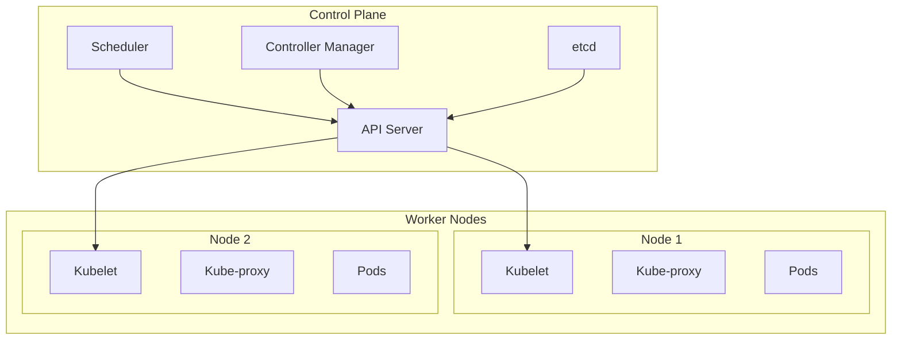

# Module 13: Kubernetes & Container Orchestration

## Learning Objectives

By the end of this module, you will be able to:

- Understand Kubernetes architecture and core concepts
- Deploy applications to Kubernetes clusters
- Implement Kubernetes-native CI/CD pipelines
- Configure service mesh for microservices communication
- Implement horizontal and vertical scaling strategies
- Manage Kubernetes resources using GitOps principles
- Monitor and troubleshoot Kubernetes deployments
- Implement advanced deployment strategies (Blue-Green, Canary, Rolling)

---

## 1. Kubernetes Fundamentals {#fundamentals}

### Kubernetes Architecture Overview

Kubernetes is a container orchestration platform that automates the deployment, scaling, and management of containerized applications.

#### Core Components



### Essential Kubernetes Resources

#### 1. Pods

```yaml
# pod.yaml
apiVersion: v1
kind: Pod
metadata:
  name: web-app
  labels:
    app: web-app
    version: v1.0.0
spec:
  containers:
  - name: web-container
    image: nginx:1.21
    ports:
    - containerPort: 80
    resources:
      requests:
        memory: "64Mi"
        cpu: "250m"
      limits:
        memory: "128Mi"
        cpu: "500m"
    env:
    - name: ENV
      value: "production"
    livenessProbe:
      httpGet:
        path: /health
        port: 80
      initialDelaySeconds: 30
      periodSeconds: 10
    readinessProbe:
      httpGet:
        path: /ready
        port: 80
      initialDelaySeconds: 5
      periodSeconds: 5
```

#### 2. Deployments

```yaml
# deployment.yaml
apiVersion: apps/v1
kind: Deployment
metadata:
  name: web-app-deployment
  labels:
    app: web-app
spec:
  replicas: 3
  strategy:
    type: RollingUpdate
    rollingUpdate:
      maxSurge: 1
      maxUnavailable: 1
  selector:
    matchLabels:
      app: web-app
  template:
    metadata:
      labels:
        app: web-app
        version: v1.0.0
    spec:
      containers:
      - name: web-container
        image: myregistry/web-app:v1.0.0
        ports:
        - containerPort: 3000
        env:
        - name: NODE_ENV
          value: "production"
        - name: DATABASE_URL
          valueFrom:
            secretKeyRef:
              name: app-secrets
              key: database-url
        resources:
          requests:
            memory: "256Mi"
            cpu: "250m"
          limits:
            memory: "512Mi"
            cpu: "500m"
        livenessProbe:
          httpGet:
            path: /health
            port: 3000
          initialDelaySeconds: 30
          periodSeconds: 10
        readinessProbe:
          httpGet:
            path: /ready
            port: 3000
          initialDelaySeconds: 5
          periodSeconds: 5
```

#### 3. Services

```yaml
# service.yaml
apiVersion: v1
kind: Service
metadata:
  name: web-app-service
  labels:
    app: web-app
spec:
  type: ClusterIP
  ports:
  - port: 80
    targetPort: 3000
    protocol: TCP
  selector:
    app: web-app

---
# Load Balancer Service
apiVersion: v1
kind: Service
metadata:
  name: web-app-lb
  labels:
    app: web-app
spec:
  type: LoadBalancer
  ports:
  - port: 80
    targetPort: 3000
    protocol: TCP
  selector:
    app: web-app
```

#### 4. ConfigMaps and Secrets

```yaml
# configmap.yaml
apiVersion: v1
kind: ConfigMap
metadata:
  name: app-config
data:
  app.properties: |
    server.port=3000
    logging.level=INFO
    feature.flags=true
  nginx.conf: |
    server {
        listen 80;
        location / {
            proxy_pass http://backend:3000;
        }
    }

---
# secret.yaml
apiVersion: v1
kind: Secret
metadata:
  name: app-secrets
type: Opaque
data:
  database-url: cG9zdGdyZXNxbDovL3VzZXI6cGFzc0BkYi5leGFtcGxlLmNvbS9teWRi
  api-key: YWJjZGVmZ2hpams=
  jwt-secret: c3VwZXJzZWNyZXRqd3RrZXk=
```

---

## 2. Kubernetes CI/CD Integration {#cicd-integration}

### GitHub Actions with Kubernetes

```yaml
# .github/workflows/k8s-deployment.yml
name: Kubernetes Deployment

on:
  push:
    branches: [ main ]
  pull_request:
    branches: [ main ]

env:
  REGISTRY: ghcr.io
  IMAGE_NAME: ${{ github.repository }}

jobs:
  build-and-test:
    runs-on: ubuntu-latest
    
    steps:
    - uses: actions/checkout@v4
    
    - name: Setup Node.js
      uses: actions/setup-node@v4
      with:
        node-version: '18'
        cache: 'npm'
    
    - name: Install dependencies
      run: npm ci
    
    - name: Run tests
      run: npm test
    
    - name: Build application
      run: npm run build
    
    # Build and push Docker image
    - name: Log in to Container Registry
      uses: docker/login-action@v3
      with:
        registry: ${{ env.REGISTRY }}
        username: ${{ github.actor }}
        password: ${{ secrets.GITHUB_TOKEN }}
    
    - name: Extract metadata
      id: meta
      uses: docker/metadata-action@v5
      with:
        images: ${{ env.REGISTRY }}/${{ env.IMAGE_NAME }}
        tags: |
          type=ref,event=branch
          type=ref,event=pr
          type=sha,prefix={{branch}}-
          type=raw,value=latest,enable={{is_default_branch}}
    
    - name: Build and push Docker image
      uses: docker/build-push-action@v5
      with:
        context: .
        push: true
        tags: ${{ steps.meta.outputs.tags }}
        labels: ${{ steps.meta.outputs.labels }}
    
    outputs:
      image: ${{ steps.meta.outputs.tags }}
      digest: ${{ steps.build.outputs.digest }}

  deploy-staging:
    needs: build-and-test
    runs-on: ubuntu-latest
    if: github.ref == 'refs/heads/main'
    environment: staging
    
    steps:
    - uses: actions/checkout@v4
    
    # Configure kubectl
    - name: Configure kubectl
      uses: azure/k8s-set-context@v3
      with:
        method: kubeconfig
        kubeconfig: ${{ secrets.KUBE_CONFIG_STAGING }}
    
    # Deploy to staging
    - name: Deploy to staging
      run: |
        # Update image in deployment
        kubectl set image deployment/web-app-deployment \
          web-container=${{ needs.build-and-test.outputs.image }} \
          -n staging
        
        # Wait for rollout to complete
        kubectl rollout status deployment/web-app-deployment -n staging --timeout=300s
        
        # Verify deployment
        kubectl get pods -n staging -l app=web-app
    
    # Run smoke tests
    - name: Run smoke tests
      run: |
        # Get service URL
        SERVICE_URL=$(kubectl get service web-app-service -n staging -o jsonpath='{.status.loadBalancer.ingress[0].ip}')
        
        # Wait for service to be ready
        timeout 300 bash -c 'until curl -f http://'$SERVICE_URL'/health; do sleep 5; done'
        
        # Run smoke tests
        curl -f http://$SERVICE_URL/health
        curl -f http://$SERVICE_URL/api/version

  deploy-production:
    needs: [build-and-test, deploy-staging]
    runs-on: ubuntu-latest
    if: github.ref == 'refs/heads/main'
    environment: production
    
    steps:
    - uses: actions/checkout@v4
    
    - name: Configure kubectl
      uses: azure/k8s-set-context@v3
      with:
        method: kubeconfig
        kubeconfig: ${{ secrets.KUBE_CONFIG_PRODUCTION }}
    
    # Blue-Green Deployment
    - name: Blue-Green Deployment
      run: |
        # Get current deployment color
        CURRENT_COLOR=$(kubectl get service web-app-service -n production -o jsonpath='{.spec.selector.color}' || echo "blue")
        
        if [ "$CURRENT_COLOR" = "blue" ]; then
          NEW_COLOR="green"
        else
          NEW_COLOR="blue"
        fi
        
        echo "Deploying to $NEW_COLOR environment"
        
        # Update deployment with new color
        kubectl patch deployment web-app-deployment-$NEW_COLOR -n production -p '{
          "spec": {
            "template": {
              "spec": {
                "containers": [{
                  "name": "web-container",
                  "image": "'${{ needs.build-and-test.outputs.image }}'"
                }]
              }
            }
          }
        }'
        
        # Wait for new deployment
        kubectl rollout status deployment/web-app-deployment-$NEW_COLOR -n production --timeout=300s
        
        # Test new deployment
        kubectl port-forward service/web-app-service-$NEW_COLOR 8080:80 -n production &
        sleep 10
        
        # Run health checks
        if curl -f http://localhost:8080/health; then
          echo "Health check passed, switching traffic"
          
          # Switch service to new deployment
          kubectl patch service web-app-service -n production -p '{
            "spec": {
              "selector": {
                "color": "'$NEW_COLOR'"
              }
            }
          }'
          
          echo "Traffic switched to $NEW_COLOR"
        else
          echo "Health check failed, rolling back"
          exit 1
        fi
```

### Kubernetes Deployment Manifests

```yaml
# k8s/namespace.yaml
apiVersion: v1
kind: Namespace
metadata:
  name: production
  labels:
    name: production
    environment: production

---
apiVersion: v1
kind: Namespace
metadata:
  name: staging
  labels:
    name: staging
    environment: staging
```

```yaml
# k8s/deployment-blue.yaml
apiVersion: apps/v1
kind: Deployment
metadata:
  name: web-app-deployment-blue
  namespace: production
  labels:
    app: web-app
    color: blue
spec:
  replicas: 3
  strategy:
    type: RollingUpdate
    rollingUpdate:
      maxSurge: 1
      maxUnavailable: 0
  selector:
    matchLabels:
      app: web-app
      color: blue
  template:
    metadata:
      labels:
        app: web-app
        color: blue
        version: v1.0.0
    spec:
      containers:
      - name: web-container
        image: ghcr.io/myorg/web-app:latest
        ports:
        - containerPort: 3000
        env:
        - name: NODE_ENV
          value: "production"
        - name: COLOR
          value: "blue"
        resources:
          requests:
            memory: "256Mi"
            cpu: "250m"
          limits:
            memory: "512Mi"
            cpu: "500m"
        livenessProbe:
          httpGet:
            path: /health
            port: 3000
          initialDelaySeconds: 30
          periodSeconds: 10
        readinessProbe:
          httpGet:
            path: /ready
            port: 3000
          initialDelaySeconds: 5
          periodSeconds: 5

---
# k8s/deployment-green.yaml
apiVersion: apps/v1
kind: Deployment
metadata:
  name: web-app-deployment-green
  namespace: production
  labels:
    app: web-app
    color: green
spec:
  replicas: 3
  strategy:
    type: RollingUpdate
    rollingUpdate:
      maxSurge: 1
      maxUnavailable: 0
  selector:
    matchLabels:
      app: web-app
      color: green
  template:
    metadata:
      labels:
        app: web-app
        color: green
        version: v1.0.0
    spec:
      containers:
      - name: web-container
        image: ghcr.io/myorg/web-app:latest
        ports:
        - containerPort: 3000
        env:
        - name: NODE_ENV
          value: "production"
        - name: COLOR
          value: "green"
        resources:
          requests:
            memory: "256Mi"
            cpu: "250m"
          limits:
            memory: "512Mi"
            cpu: "500m"
        livenessProbe:
          httpGet:
            path: /health
            port: 3000
          initialDelaySeconds: 30
          periodSeconds: 10
        readinessProbe:
          httpGet:
            path: /ready
            port: 3000
          initialDelaySeconds: 5
          periodSeconds: 5
```

---

## 3. Service Mesh with Istio {#service-mesh}

### Istio Installation and Configuration

```bash
# Install Istio
curl -L https://istio.io/downloadIstio | sh -
cd istio-*
export PATH=$PWD/bin:$PATH

# Install Istio on cluster
istioctl install --set values.defaultRevision=default

# Enable sidecar injection
kubectl label namespace production istio-injection=enabled
kubectl label namespace staging istio-injection=enabled
```

### Service Mesh Configuration

```yaml
# istio/gateway.yaml
apiVersion: networking.istio.io/v1beta1
kind: Gateway
metadata:
  name: web-app-gateway
  namespace: production
spec:
  selector:
    istio: ingressgateway
  servers:
  - port:
      number: 80
      name: http
      protocol: HTTP
    hosts:
    - "myapp.example.com"
  - port:
      number: 443
      name: https
      protocol: HTTPS
    tls:
      mode: SIMPLE
      credentialName: myapp-tls
    hosts:
    - "myapp.example.com"

---
# istio/virtual-service.yaml
apiVersion: networking.istio.io/v1beta1
kind: VirtualService
metadata:
  name: web-app-vs
  namespace: production
spec:
  hosts:
  - "myapp.example.com"
  gateways:
  - web-app-gateway
  http:
  - match:
    - headers:
        canary:
          exact: "true"
    route:
    - destination:
        host: web-app-service
        subset: canary
      weight: 100
  - route:
    - destination:
        host: web-app-service
        subset: stable
      weight: 90
    - destination:
        host: web-app-service
        subset: canary
      weight: 10

---
# istio/destination-rule.yaml
apiVersion: networking.istio.io/v1beta1
kind: DestinationRule
metadata:
  name: web-app-dr
  namespace: production
spec:
  host: web-app-service
  trafficPolicy:
    connectionPool:
      tcp:
        maxConnections: 100
      http:
        http1MaxPendingRequests: 50
        maxRequestsPerConnection: 10
    loadBalancer:
      simple: LEAST_CONN
    outlierDetection:
      consecutiveErrors: 3
      interval: 30s
      baseEjectionTime: 30s
  subsets:
  - name: stable
    labels:
      version: stable
    trafficPolicy:
      circuitBreaker:
        maxConnections: 50
        maxPendingRequests: 25
  - name: canary
    labels:
      version: canary
    trafficPolicy:
      circuitBreaker:
        maxConnections: 25
        maxPendingRequests: 10
```

### Canary Deployment with Istio

```yaml
# .github/workflows/canary-deployment.yml
name: Canary Deployment with Istio

on:
  push:
    branches: [ main ]

jobs:
  canary-deploy:
    runs-on: ubuntu-latest
    environment: production
    
    steps:
    - uses: actions/checkout@v4
    
    - name: Configure kubectl
      uses: azure/k8s-set-context@v3
      with:
        method: kubeconfig
        kubeconfig: ${{ secrets.KUBE_CONFIG }}
    
    # Deploy canary version
    - name: Deploy Canary
      run: |
        # Update canary deployment
        kubectl set image deployment/web-app-deployment-canary \
          web-container=${{ github.sha }} \
          -n production
        
        # Wait for canary rollout
        kubectl rollout status deployment/web-app-deployment-canary -n production
        
        # Start with 10% traffic to canary
        kubectl apply -f - <<EOF
        apiVersion: networking.istio.io/v1beta1
        kind: VirtualService
        metadata:
          name: web-app-vs
          namespace: production
        spec:
          hosts:
          - "myapp.example.com"
          gateways:
          - web-app-gateway
          http:
          - route:
            - destination:
                host: web-app-service
                subset: stable
              weight: 90
            - destination:
                host: web-app-service
                subset: canary
              weight: 10
        EOF
    
    # Monitor canary metrics
    - name: Monitor Canary
      run: |
        echo "Monitoring canary deployment for 5 minutes..."
        
        for i in {1..30}; do
          # Check error rate
          ERROR_RATE=$(kubectl exec -n istio-system deployment/prometheus -- \
            promtool query instant 'rate(istio_request_total{destination_service_name="web-app-service",destination_version="canary",response_code!~"2.."}[1m]) / rate(istio_request_total{destination_service_name="web-app-service",destination_version="canary"}[1m])' | \
            grep -o '[0-9]\+\.[0-9]\+' || echo "0")
          
          # Check response time
          RESPONSE_TIME=$(kubectl exec -n istio-system deployment/prometheus -- \
            promtool query instant 'histogram_quantile(0.95, rate(istio_request_duration_milliseconds_bucket{destination_service_name="web-app-service",destination_version="canary"}[1m]))' | \
            grep -o '[0-9]\+\.[0-9]\+' || echo "0")
          
          echo "Iteration $i: Error Rate: $ERROR_RATE, P95 Response Time: ${RESPONSE_TIME}ms"
          
          # Check if metrics are acceptable
          if (( $(echo "$ERROR_RATE > 0.01" | bc -l) )); then
            echo "❌ Error rate too high: $ERROR_RATE"
            exit 1
          fi
          
          if (( $(echo "$RESPONSE_TIME > 1000" | bc -l) )); then
            echo "❌ Response time too high: ${RESPONSE_TIME}ms"
            exit 1
          fi
          
          sleep 10
        done
        
        echo "✅ Canary metrics look good!"
    
    # Gradually increase traffic
    - name: Increase Canary Traffic
      run: |
        # Increase to 50%
        kubectl apply -f - <<EOF
        apiVersion: networking.istio.io/v1beta1
        kind: VirtualService
        metadata:
          name: web-app-vs
          namespace: production
        spec:
          hosts:
          - "myapp.example.com"
          gateways:
          - web-app-gateway
          http:
          - route:
            - destination:
                host: web-app-service
                subset: stable
              weight: 50
            - destination:
                host: web-app-service
                subset: canary
              weight: 50
        EOF
        
        sleep 120  # Wait 2 minutes
        
        # Final promotion to 100%
        kubectl apply -f - <<EOF
        apiVersion: networking.istio.io/v1beta1
        kind: VirtualService
        metadata:
          name: web-app-vs
          namespace: production
        spec:
          hosts:
          - "myapp.example.com"
          gateways:
          - web-app-gateway
          http:
          - route:
            - destination:
                host: web-app-service
                subset: canary
              weight: 100
        EOF
        
        # Update stable deployment
        kubectl set image deployment/web-app-deployment-stable \
          web-container=${{ github.sha }} \
          -n production
        
        # Switch back to stable
        kubectl apply -f - <<EOF
        apiVersion: networking.istio.io/v1beta1
        kind: VirtualService
        metadata:
          name: web-app-vs
          namespace: production
        spec:
          hosts:
          - "myapp.example.com"
          gateways:
          - web-app-gateway
          http:
          - route:
            - destination:
                host: web-app-service
                subset: stable
              weight: 100
        EOF
```

---

## 4. Scaling Strategies {#scaling}

### Horizontal Pod Autoscaler (HPA)

```yaml
# k8s/hpa.yaml
apiVersion: autoscaling/v2
kind: HorizontalPodAutoscaler
metadata:
  name: web-app-hpa
  namespace: production
spec:
  scaleTargetRef:
    apiVersion: apps/v1
    kind: Deployment
    name: web-app-deployment
  minReplicas: 3
  maxReplicas: 20
  metrics:
  - type: Resource
    resource:
      name: cpu
      target:
        type: Utilization
        averageUtilization: 70
  - type: Resource
    resource:
      name: memory
      target:
        type: Utilization
        averageUtilization: 80
  - type: Pods
    pods:
      metric:
        name: http_requests_per_second
      target:
        type: AverageValue
        averageValue: "100"
  behavior:
    scaleDown:
      stabilizationWindowSeconds: 300
      policies:
      - type: Percent
        value: 10
        periodSeconds: 60
    scaleUp:
      stabilizationWindowSeconds: 60
      policies:
      - type: Percent
        value: 50
        periodSeconds: 60
      - type: Pods
        value: 2
        periodSeconds: 60
      selectPolicy: Max
```

### Vertical Pod Autoscaler (VPA)

```yaml
# k8s/vpa.yaml
apiVersion: autoscaling.k8s.io/v1
kind: VerticalPodAutoscaler
metadata:
  name: web-app-vpa
  namespace: production
spec:
  targetRef:
    apiVersion: apps/v1
    kind: Deployment
    name: web-app-deployment
  updatePolicy:
    updateMode: "Auto"
  resourcePolicy:
    containerPolicies:
    - containerName: web-container
      minAllowed:
        cpu: 100m
        memory: 128Mi
      maxAllowed:
        cpu: 2
        memory: 2Gi
      controlledResources: ["cpu", "memory"]
      controlledValues: RequestsAndLimits
```

### Cluster Autoscaler

```yaml
# k8s/cluster-autoscaler.yaml
apiVersion: apps/v1
kind: Deployment
metadata:
  name: cluster-autoscaler
  namespace: kube-system
  labels:
    app: cluster-autoscaler
spec:
  selector:
    matchLabels:
      app: cluster-autoscaler
  template:
    metadata:
      labels:
        app: cluster-autoscaler
    spec:
      serviceAccountName: cluster-autoscaler
      containers:
      - image: k8s.gcr.io/autoscaling/cluster-autoscaler:v1.21.0
        name: cluster-autoscaler
        resources:
          limits:
            cpu: 100m
            memory: 300Mi
          requests:
            cpu: 100m
            memory: 300Mi
        command:
        - ./cluster-autoscaler
        - --v=4
        - --stderrthreshold=info
        - --cloud-provider=aws
        - --skip-nodes-with-local-storage=false
        - --expander=least-waste
        - --node-group-auto-discovery=asg:tag=k8s.io/cluster-autoscaler/enabled,k8s.io/cluster-autoscaler/my-cluster
        - --balance-similar-node-groups
        - --skip-nodes-with-system-pods=false
        env:
        - name: AWS_REGION
          value: us-west-2
```

### Custom Metrics Scaling

```yaml
# k8s/custom-metrics-hpa.yaml
apiVersion: autoscaling/v2
kind: HorizontalPodAutoscaler
metadata:
  name: web-app-custom-hpa
  namespace: production
spec:
  scaleTargetRef:
    apiVersion: apps/v1
    kind: Deployment
    name: web-app-deployment
  minReplicas: 2
  maxReplicas: 50
  metrics:
  # Scale based on queue length
  - type: External
    external:
      metric:
        name: sqs_queue_length
        selector:
          matchLabels:
            queue: "work-queue"
      target:
        type: AverageValue
        averageValue: "10"
  
  # Scale based on custom application metrics
  - type: Object
    object:
      metric:
        name: active_connections
      describedObject:
        apiVersion: v1
        kind: Service
        name: web-app-service
      target:
        type: Value
        value: "100"
  
  # Scale based on ingress requests per second
  - type: Object
    object:
      metric:
        name: requests_per_second
      describedObject:
        apiVersion: networking.k8s.io/v1
        kind: Ingress
        name: web-app-ingress
      target:
        type: Value
        value: "1000"
```

---

## 5. Advanced Deployment Strategies {#deployment-strategies}

### Rolling Updates

```yaml
# k8s/rolling-update.yaml
apiVersion: apps/v1
kind: Deployment
metadata:
  name: web-app-rolling
  namespace: production
spec:
  replicas: 10
  strategy:
    type: RollingUpdate
    rollingUpdate:
      maxSurge: 25%        # Can have 25% more pods during update
      maxUnavailable: 25%  # Can have 25% fewer pods during update
  selector:
    matchLabels:
      app: web-app
  template:
    metadata:
      labels:
        app: web-app
    spec:
      containers:
      - name: web-container
        image: myapp:v2.0.0
        ports:
        - containerPort: 3000
        readinessProbe:
          httpGet:
            path: /ready
            port: 3000
          initialDelaySeconds: 5
          periodSeconds: 5
        livenessProbe:
          httpGet:
            path: /health
            port: 3000
          initialDelaySeconds: 30
          periodSeconds: 10
```

### Blue-Green Deployment Script

```bash
#!/bin/bash
# scripts/blue-green-deploy.sh

set -e

NAMESPACE="production"
APP_NAME="web-app"
NEW_IMAGE="$1"

if [ -z "$NEW_IMAGE" ]; then
    echo "Usage: $0 <new-image>"
    exit 1
fi

# Determine current active environment
CURRENT_COLOR=$(kubectl get service $APP_NAME-service -n $NAMESPACE -o jsonpath='{.spec.selector.color}' 2>/dev/null || echo "blue")

if [ "$CURRENT_COLOR" = "blue" ]; then
    NEW_COLOR="green"
    OLD_COLOR="blue"
else
    NEW_COLOR="blue"
    OLD_COLOR="green"
fi

echo "Current active: $OLD_COLOR"
echo "Deploying to: $NEW_COLOR"
echo "New image: $NEW_IMAGE"

# Update the inactive environment
echo "Updating $NEW_COLOR deployment..."
kubectl set image deployment/$APP_NAME-deployment-$NEW_COLOR \
    web-container=$NEW_IMAGE \
    -n $NAMESPACE

# Wait for rollout to complete
echo "Waiting for $NEW_COLOR deployment to be ready..."
kubectl rollout status deployment/$APP_NAME-deployment-$NEW_COLOR -n $NAMESPACE --timeout=300s

# Health check on new environment
echo "Performing health check on $NEW_COLOR environment..."
kubectl port-forward service/$APP_NAME-service-$NEW_COLOR 8080:80 -n $NAMESPACE &
PORT_FORWARD_PID=$!
sleep 5

# Run health checks
HEALTH_CHECK_PASSED=false
for i in {1..10}; do
    if curl -f http://localhost:8080/health >/dev/null 2>&1; then
        echo "Health check passed on attempt $i"
        HEALTH_CHECK_PASSED=true
        break
    fi
    echo "Health check failed on attempt $i, retrying..."
    sleep 5
done

# Clean up port forward
kill $PORT_FORWARD_PID 2>/dev/null || true

if [ "$HEALTH_CHECK_PASSED" = "false" ]; then
    echo "❌ Health check failed, aborting deployment"
    exit 1
fi

# Switch traffic to new environment
echo "Switching traffic to $NEW_COLOR environment..."
kubectl patch service $APP_NAME-service -n $NAMESPACE -p '{
    "spec": {
        "selector": {
            "color": "'$NEW_COLOR'"
        }
    }
}'

echo "✅ Blue-Green deployment completed successfully!"
echo "Active environment: $NEW_COLOR"
echo "Standby environment: $OLD_COLOR"

# Optional: Scale down old environment after successful switch
read -p "Scale down $OLD_COLOR environment? (y/N): " -n 1 -r
echo
if [[ $REPLY =~ ^[Yy]$ ]]; then
    kubectl scale deployment/$APP_NAME-deployment-$OLD_COLOR --replicas=0 -n $NAMESPACE
    echo "Scaled down $OLD_COLOR environment"
fi
```

### Canary Deployment with Flagger

```yaml
# k8s/flagger-canary.yaml
apiVersion: flagger.app/v1beta1
kind: Canary
metadata:
  name: web-app-canary
  namespace: production
spec:
  # Deployment reference
  targetRef:
    apiVersion: apps/v1
    kind: Deployment
    name: web-app-deployment
  
  # Service configuration
  service:
    port: 80
    targetPort: 3000
    gateways:
    - web-app-gateway
    hosts:
    - myapp.example.com
  
  # Canary analysis
  analysis:
    # Schedule interval
    interval: 1m
    # Max number of failed metric checks before rollback
    threshold: 5
    # Max traffic percentage routed to canary
    maxWeight: 50
    # Canary increment step
    stepWeight: 5
    # Prometheus metrics
    metrics:
    - name: request-success-rate
      thresholdRange:
        min: 99
      interval: 1m
    - name: request-duration
      thresholdRange:
        max: 500
      interval: 1m
    # Load testing
    webhooks:
    - name: load-test
      url: http://flagger-loadtester.test/
      timeout: 5s
      metadata:
        cmd: "hey -z 1m -q 10 -c 2 http://myapp.example.com/"
  
  # Rollback configuration
  rollback:
    enable: true
```

---

## 6. Monitoring and Observability {#monitoring}

### Prometheus and Grafana Setup

```yaml
# k8s/prometheus.yaml
apiVersion: v1
kind: ConfigMap
metadata:
  name: prometheus-config
  namespace: monitoring
data:
  prometheus.yml: |
    global:
      scrape_interval: 15s
      evaluation_interval: 15s
    
    rule_files:
    - "/etc/prometheus/rules/*.yml"
    
    scrape_configs:
    - job_name: 'kubernetes-pods'
      kubernetes_sd_configs:
      - role: pod
      relabel_configs:
      - source_labels: [__meta_kubernetes_pod_annotation_prometheus_io_scrape]
        action: keep
        regex: true
      - source_labels: [__meta_kubernetes_pod_annotation_prometheus_io_path]
        action: replace
        target_label: __metrics_path__
        regex: (.+)
    
    - job_name: 'kubernetes-services'
      kubernetes_sd_configs:
      - role: service
      relabel_configs:
      - source_labels: [__meta_kubernetes_service_annotation_prometheus_io_scrape]
        action: keep
        regex: true
    
    - job_name: 'istio-mesh'
      kubernetes_sd_configs:
      - role: endpoints
        namespaces:
          names:
          - istio-system
      relabel_configs:
      - source_labels: [__meta_kubernetes_service_name, __meta_kubernetes_endpoint_port_name]
        action: keep
        regex: istio-telemetry;prometheus

---
apiVersion: apps/v1
kind: Deployment
metadata:
  name: prometheus
  namespace: monitoring
spec:
  replicas: 1
  selector:
    matchLabels:
      app: prometheus
  template:
    metadata:
      labels:
        app: prometheus
    spec:
      containers:
      - name: prometheus
        image: prom/prometheus:v2.40.0
        ports:
        - containerPort: 9090
        volumeMounts:
        - name: config
          mountPath: /etc/prometheus
        - name: storage
          mountPath: /prometheus
        args:
        - '--config.file=/etc/prometheus/prometheus.yml'
        - '--storage.tsdb.path=/prometheus'
        - '--web.console.libraries=/etc/prometheus/console_libraries'
        - '--web.console.templates=/etc/prometheus/consoles'
        - '--storage.tsdb.retention.time=15d'
        - '--web.enable-lifecycle'
      volumes:
      - name: config
        configMap:
          name: prometheus-config
      - name: storage
        persistentVolumeClaim:
          claimName: prometheus-storage
```

### Application Metrics

```javascript
// app/metrics.js
const promClient = require('prom-client');

// Create a Registry
const register = new promClient.Registry();

// Add default metrics
promClient.collectDefaultMetrics({ register });

// Custom metrics
const httpRequestDuration = new promClient.Histogram({
  name: 'http_request_duration_seconds',
  help: 'Duration of HTTP requests in seconds',
  labelNames: ['method', 'route', 'status'],
  buckets: [0.1, 0.5, 1, 2, 5]
});

const httpRequestTotal = new promClient.Counter({
  name: 'http_requests_total',
  help: 'Total number of HTTP requests',
  labelNames: ['method', 'route', 'status']
});

const activeConnections = new promClient.Gauge({
  name: 'active_connections',
  help: 'Number of active connections'
});

const queueLength = new promClient.Gauge({
  name: 'queue_length',
  help: 'Current queue length'
});

// Register metrics
register.registerMetric(httpRequestDuration);
register.registerMetric(httpRequestTotal);
register.registerMetric(activeConnections);
register.registerMetric(queueLength);

// Middleware to track HTTP metrics
function metricsMiddleware(req, res, next) {
  const start = Date.now();
  
  res.on('finish', () => {
    const duration = (Date.now() - start) / 1000;
    const route = req.route ? req.route.path : req.path;
    
    httpRequestDuration
      .labels(req.method, route, res.statusCode)
      .observe(duration);
    
    httpRequestTotal
      .labels(req.method, route, res.statusCode)
      .inc();
  });
  
  next();
}

// Health check endpoint
function healthCheck(req, res) {
  res.status(200).json({
    status: 'healthy',
    timestamp: new Date().toISOString(),
    uptime: process.uptime()
  });
}

// Metrics endpoint
function metricsEndpoint(req, res) {
  res.set('Content-Type', register.contentType);
  res.end(register.metrics());
}

module.exports = {
  register,
  metricsMiddleware,
  healthCheck,
  metricsEndpoint,
  activeConnections,
  queueLength
};
```

### Grafana Dashboard

```json
{
  "dashboard": {
    "id": null,
    "title": "Kubernetes Application Dashboard",
    "tags": ["kubernetes", "application"],
    "timezone": "browser",
    "panels": [
      {
        "id": 1,
        "title": "Request Rate",
        "type": "graph",
        "targets": [
          {
            "expr": "rate(http_requests_total[5m])",
            "legendFormat": "{{method}} {{route}}"
          }
        ],
        "yAxes": [
          {
            "label": "Requests/sec"
          }
        ]
      },
      {
        "id": 2,
        "title": "Response Time",
        "type": "graph",
        "targets": [
          {
            "expr": "histogram_quantile(0.95, rate(http_request_duration_seconds_bucket[5m]))",
            "legendFormat": "95th percentile"
          },
          {
            "expr": "histogram_quantile(0.50, rate(http_request_duration_seconds_bucket[5m]))",
            "legendFormat": "50th percentile"
          }
        ],
        "yAxes": [
          {
            "label": "Seconds"
          }
        ]
      },
      {
        "id": 3,
        "title": "Error Rate",
        "type": "singlestat",
        "targets": [
          {
            "expr": "rate(http_requests_total{status=~\"5..\"}[5m]) / rate(http_requests_total[5m]) * 100",
            "legendFormat": "Error Rate %"
          }
        ]
      },
      {
        "id": 4,
        "title": "Pod Status",
        "type": "table",
        "targets": [
          {
            "expr": "kube_pod_status_phase{namespace=\"production\"}",
            "format": "table"
          }
        ]
      }
    ],
    "time": {
      "from": "now-1h",
      "to": "now"
    },
    "refresh": "5s"
  }
}
```

---

## 7. Troubleshooting and Debugging {#troubleshooting}

### Common Kubernetes Issues

#### Pod Startup Issues

```bash
# Check pod status
kubectl get pods -n production

# Describe pod for events
kubectl describe pod <pod-name> -n production

# Check pod logs
kubectl logs <pod-name> -n production

# Check previous container logs
kubectl logs <pod-name> -n production --previous

# Debug with interactive shell
kubectl exec -it <pod-name> -n production -- /bin/bash
```

#### Service Discovery Issues

```bash
# Check service endpoints
kubectl get endpoints -n production

# Test service connectivity
kubectl run debug --image=busybox -it --rm --restart=Never -- nslookup web-app-service.production.svc.cluster.local

# Check service configuration
kubectl describe service web-app-service -n production
```

#### Resource Issues

```bash
# Check node resources
kubectl top nodes

# Check pod resources
kubectl top pods -n production

# Check resource quotas
kubectl describe resourcequota -n production

# Check limit ranges
kubectl describe limitrange -n production
```

### Debugging Deployment Issues

```yaml
# k8s/debug-pod.yaml
apiVersion: v1
kind: Pod
metadata:
  name: debug-pod
  namespace: production
spec:
  containers:
  - name: debug
    image: nicolaka/netshoot
    command: ["sleep", "3600"]
    securityContext:
      capabilities:
        add: ["NET_ADMIN"]
```

```bash
# Deploy debug pod
kubectl apply -f k8s/debug-pod.yaml

# Use debug pod for network troubleshooting
kubectl exec -it debug-pod -n production -- bash

# Inside debug pod:
# Test DNS resolution
nslookup web-app-service.production.svc.cluster.local

# Test connectivity
curl http://web-app-service.production.svc.cluster.local/health

# Check network policies
netstat -rn

# Test external connectivity
curl https://api.external-service.com
```

### Performance Troubleshooting

```bash
# Check cluster performance
kubectl top nodes
kubectl top pods --all-namespaces

# Check resource utilization over time
kubectl get --raw /apis/metrics.k8s.io/v1beta1/nodes | jq .

# Check HPA status
kubectl get hpa -n production
kubectl describe hpa web-app-hpa -n production

# Check VPA recommendations
kubectl get vpa -n production
kubectl describe vpa web-app-vpa -n production
```

---

## 8. Best Practices {#best-practices}

### Resource Management

1. **Always set resource requests and limits**
2. **Use namespaces for environment isolation**
3. **Implement proper health checks**
4. **Use multi-stage Docker builds**
5. **Implement proper logging and monitoring**

### Security Best Practices

1. **Use non-root containers**
2. **Implement network policies**
3. **Scan images for vulnerabilities**
4. **Use secrets for sensitive data**
5. **Implement RBAC**

### Deployment Best Practices

1. **Use rolling updates for zero-downtime deployments**
2. **Implement proper readiness and liveness probes**
3. **Use blue-green or canary deployments for critical applications**
4. **Implement proper rollback strategies**
5. **Monitor deployment metrics**

---

## 9. Hands-on Exercises {#exercises}

### Exercise 1: Basic Kubernetes Deployment

**Objective**: Deploy a web application to Kubernetes with proper configuration.

**Tasks**:
1. Create a Dockerfile for a simple web application
2. Build and push the image to a container registry
3. Create Kubernetes manifests (Deployment, Service, ConfigMap, Secret)
4. Deploy the application to a Kubernetes cluster
5. Verify the deployment and test the application

### Exercise 2: Implement Blue-Green Deployment

**Objective**: Set up blue-green deployment for zero-downtime updates.

**Tasks**:
1. Create blue and green deployments
2. Set up services for both environments
3. Implement a deployment script
4. Test the blue-green deployment process
5. Implement rollback functionality

### Exercise 3: Set up Horizontal Pod Autoscaling

**Objective**: Configure automatic scaling based on metrics.

**Tasks**:
1. Deploy metrics server
2. Configure HPA for your application
3. Generate load to trigger scaling
4. Monitor scaling behavior
5. Implement custom metrics scaling

### Exercise 4: Implement Service Mesh

**Objective**: Set up Istio service mesh for traffic management.

**Tasks**:
1. Install Istio on your cluster
2. Enable sidecar injection
3. Configure traffic routing
4. Implement canary deployment with Istio
5. Set up monitoring and observability

---

This completes Module 13: Kubernetes & Container Orchestration. You now have comprehensive knowledge of Kubernetes deployment strategies, scaling, service mesh, and monitoring in CI/CD pipelines.