# Module 16: Monitoring & Observability

## Learning Objectives

By the end of this module, you will be able to:

- Implement comprehensive monitoring strategies for CI/CD pipelines
- Set up observability for distributed systems
- Configure alerting and notification systems
- Create effective dashboards and visualizations
- Implement log aggregation and analysis
- Monitor application performance and business metrics
- Set up SLI/SLO monitoring
- Implement chaos engineering practices

---

## 1. Monitoring Strategy {#strategy}

### The Three Pillars of Observability


### Monitoring Stack Architecture

```yaml
# k8s/monitoring/prometheus-stack.yml
apiVersion: v1
kind: Namespace
metadata:
  name: monitoring
---
apiVersion: helm.cattle.io/v1
kind: HelmChart
metadata:
  name: prometheus-stack
  namespace: monitoring
spec:
  chart: kube-prometheus-stack
  repo: https://prometheus-community.github.io/helm-charts
  targetNamespace: monitoring
  valuesContent: |
    prometheus:
      prometheusSpec:
        retention: 30d
        storageSpec:
          volumeClaimTemplate:
            spec:
              storageClassName: fast-ssd
              accessModes: ["ReadWriteOnce"]
              resources:
                requests:
                  storage: 100Gi
        additionalScrapeConfigs:
        - job_name: 'kubernetes-pods'
          kubernetes_sd_configs:
          - role: pod
          relabel_configs:
          - source_labels: [__meta_kubernetes_pod_annotation_prometheus_io_scrape]
            action: keep
            regex: true
          - source_labels: [__meta_kubernetes_pod_annotation_prometheus_io_path]
            action: replace
            target_label: __metrics_path__
            regex: (.+)
          - source_labels: [__address__, __meta_kubernetes_pod_annotation_prometheus_io_port]
            action: replace
            regex: ([^:]+)(?::\d+)?;(\d+)
            replacement: $1:$2
            target_label: __address__
    
    grafana:
      adminPassword: admin123
      persistence:
        enabled: true
        size: 10Gi
      dashboardProviders:
        dashboardproviders.yaml:
          apiVersion: 1
          providers:
          - name: 'default'
            orgId: 1
            folder: ''
            type: file
            disableDeletion: false
            editable: true
            options:
              path: /var/lib/grafana/dashboards/default
      dashboards:
        default:
          kubernetes-cluster:
            gnetId: 7249
            revision: 1
            datasource: Prometheus
          application-overview:
            gnetId: 6417
            revision: 1
            datasource: Prometheus
    
    alertmanager:
      config:
        global:
          smtp_smarthost: 'smtp.gmail.com:587'
          smtp_from: 'alerts@company.com'
        route:
          group_by: ['alertname']
          group_wait: 10s
          group_interval: 10s
          repeat_interval: 1h
          receiver: 'web.hook'
        receivers:
        - name: 'web.hook'
          email_configs:
          - to: 'devops@company.com'
            subject: 'Alert: {{ .GroupLabels.alertname }}'
            body: |
              {{ range .Alerts }}
              Alert: {{ .Annotations.summary }}
              Description: {{ .Annotations.description }}
              {{ end }}
          slack_configs:
          - api_url: 'https://hooks.slack.com/services/YOUR/SLACK/WEBHOOK'
            channel: '#alerts'
            title: 'Alert: {{ .GroupLabels.alertname }}'
            text: |
              {{ range .Alerts }}
              {{ .Annotations.summary }}
              {{ .Annotations.description }}
              {{ end }}
```

---

## 2. Application Metrics {#application-metrics}

### Custom Metrics Implementation

```javascript
// src/metrics/application-metrics.js
const promClient = require('prom-client');
const express = require('express');

class ApplicationMetrics {
  constructor(serviceName, version) {
    this.serviceName = serviceName;
    this.version = version;
    this.register = new promClient.Registry();
    
    // Add default metrics
    promClient.collectDefaultMetrics({
      register: this.register,
      prefix: `${serviceName}_`,
    });

    this.initializeCustomMetrics();
  }

  initializeCustomMetrics() {
    // HTTP Request metrics
    this.httpRequestDuration = new promClient.Histogram({
      name: `${this.serviceName}_http_request_duration_seconds`,
      help: 'Duration of HTTP requests in seconds',
      labelNames: ['method', 'route', 'status_code', 'version'],
      buckets: [0.001, 0.005, 0.01, 0.05, 0.1, 0.5, 1, 5, 10],
      registers: [this.register],
    });

    this.httpRequestsTotal = new promClient.Counter({
      name: `${this.serviceName}_http_requests_total`,
      help: 'Total number of HTTP requests',
      labelNames: ['method', 'route', 'status_code', 'version'],
      registers: [this.register],
    });

    // Database metrics
    this.dbConnectionsActive = new promClient.Gauge({
      name: `${this.serviceName}_db_connections_active`,
      help: 'Number of active database connections',
      registers: [this.register],
    });

    this.dbQueryDuration = new promClient.Histogram({
      name: `${this.serviceName}_db_query_duration_seconds`,
      help: 'Duration of database queries in seconds',
      labelNames: ['operation', 'table'],
      buckets: [0.001, 0.005, 0.01, 0.05, 0.1, 0.5, 1],
      registers: [this.register],
    });

    // Business metrics
    this.userRegistrations = new promClient.Counter({
      name: `${this.serviceName}_user_registrations_total`,
      help: 'Total number of user registrations',
      labelNames: ['source', 'status'],
      registers: [this.register],
    });

    this.orderValue = new promClient.Histogram({
      name: `${this.serviceName}_order_value_dollars`,
      help: 'Order value in dollars',
      labelNames: ['currency', 'payment_method'],
      buckets: [1, 5, 10, 25, 50, 100, 250, 500, 1000],
      registers: [this.register],
    });

    // Error tracking
    this.errorsTotal = new promClient.Counter({
      name: `${this.serviceName}_errors_total`,
      help: 'Total number of errors',
      labelNames: ['type', 'severity', 'component'],
      registers: [this.register],
    });

    // Cache metrics
    this.cacheHits = new promClient.Counter({
      name: `${this.serviceName}_cache_hits_total`,
      help: 'Total number of cache hits',
      labelNames: ['cache_name'],
      registers: [this.register],
    });

    this.cacheMisses = new promClient.Counter({
      name: `${this.serviceName}_cache_misses_total`,
      help: 'Total number of cache misses',
      labelNames: ['cache_name'],
      registers: [this.register],
    });
  }

  // HTTP middleware
  httpMiddleware() {
    return (req, res, next) => {
      const start = Date.now();
      
      res.on('finish', () => {
        const duration = (Date.now() - start) / 1000;
        const route = req.route ? req.route.path : req.path;
        
        this.httpRequestDuration
          .labels(req.method, route, res.statusCode, this.version)
          .observe(duration);
        
        this.httpRequestsTotal
          .labels(req.method, route, res.statusCode, this.version)
          .inc();
      });
      
      next();
    };
  }

  // Database query wrapper
  async trackDbQuery(operation, table, queryFn) {
    const start = Date.now();
    try {
      const result = await queryFn();
      const duration = (Date.now() - start) / 1000;
      this.dbQueryDuration.labels(operation, table).observe(duration);
      return result;
    } catch (error) {
      this.errorsTotal.labels('database', 'error', 'query').inc();
      throw error;
    }
  }

  // Business event tracking
  trackUserRegistration(source, status = 'success') {
    this.userRegistrations.labels(source, status).inc();
  }

  trackOrder(value, currency = 'USD', paymentMethod = 'card') {
    this.orderValue.labels(currency, paymentMethod).observe(value);
  }

  trackError(type, severity = 'error', component = 'unknown') {
    this.errorsTotal.labels(type, severity, component).inc();
  }

  // Cache tracking
  trackCacheHit(cacheName) {
    this.cacheHits.labels(cacheName).inc();
  }

  trackCacheMiss(cacheName) {
    this.cacheMisses.labels(cacheName).inc();
  }

  // Update connection count
  updateDbConnections(count) {
    this.dbConnectionsActive.set(count);
  }

  // Metrics endpoint
  getMetricsHandler() {
    return async (req, res) => {
      res.set('Content-Type', this.register.contentType);
      res.end(await this.register.metrics());
    };
  }
}

module.exports = ApplicationMetrics;
```

### SLI/SLO Monitoring

```yaml
# k8s/monitoring/sli-slo-rules.yml
apiVersion: monitoring.coreos.com/v1
kind: PrometheusRule
metadata:
  name: sli-slo-rules
  namespace: monitoring
spec:
  groups:
  - name: sli.rules
    interval: 30s
    rules:
    # Availability SLI
    - record: sli:availability:rate5m
      expr: |
        (
          sum(rate(http_requests_total{status_code!~"5.."}[5m])) by (service)
          /
          sum(rate(http_requests_total[5m])) by (service)
        )
    
    # Latency SLI (95th percentile)
    - record: sli:latency:p95:5m
      expr: |
        histogram_quantile(0.95,
          sum(rate(http_request_duration_seconds_bucket[5m])) by (service, le)
        )
    
    # Error rate SLI
    - record: sli:error_rate:rate5m
      expr: |
        (
          sum(rate(http_requests_total{status_code=~"5.."}[5m])) by (service)
          /
          sum(rate(http_requests_total[5m])) by (service)
        )
    
    # Throughput SLI
    - record: sli:throughput:rate5m
      expr: |
        sum(rate(http_requests_total[5m])) by (service)

  - name: slo.rules
    interval: 5m
    rules:
    # Availability SLO (99.9%)
    - record: slo:availability:target
      expr: 0.999
    
    # Latency SLO (95% of requests < 200ms)
    - record: slo:latency:target
      expr: 0.2
    
    # Error rate SLO (< 0.1%)
    - record: slo:error_rate:target
      expr: 0.001
    
    # SLO burn rate (how fast we're consuming error budget)
    - record: slo:availability:burn_rate:1h
      expr: |
        (
          1 - sli:availability:rate5m
        ) / (1 - slo:availability:target)
    
    - record: slo:latency:burn_rate:1h
      expr: |
        (
          sli:latency:p95:5m > slo:latency:target
        )
    
    # Error budget remaining
    - record: slo:availability:error_budget:remaining
      expr: |
        1 - (
          (
            sum_over_time(sli:availability:rate5m[30d])
            /
            count_over_time(sli:availability:rate5m[30d])
          )
          /
          slo:availability:target
        )
```

---

## 3. Log Management {#log-management}

### Structured Logging

```javascript
// src/logging/logger.js
const winston = require('winston');
const { ElasticsearchTransport } = require('winston-elasticsearch');

class Logger {
  constructor(serviceName, version, environment) {
    this.serviceName = serviceName;
    this.version = version;
    this.environment = environment;
    
    this.logger = winston.createLogger({
      level: process.env.LOG_LEVEL || 'info',
      format: winston.format.combine(
        winston.format.timestamp(),
        winston.format.errors({ stack: true }),
        winston.format.json(),
        winston.format.printf(({ timestamp, level, message, ...meta }) => {
          return JSON.stringify({
            timestamp,
            level,
            message,
            service: this.serviceName,
            version: this.version,
            environment: this.environment,
            traceId: meta.traceId,
            spanId: meta.spanId,
            userId: meta.userId,
            requestId: meta.requestId,
            ...meta
          });
        })
      ),
      defaultMeta: {
        service: this.serviceName,
        version: this.version,
        environment: this.environment
      },
      transports: [
        new winston.transports.Console({
          format: winston.format.combine(
            winston.format.colorize(),
            winston.format.simple()
          )
        })
      ]
    });

    // Add Elasticsearch transport in production
    if (environment === 'production') {
      this.logger.add(new ElasticsearchTransport({
        level: 'info',
        clientOpts: {
          node: process.env.ELASTICSEARCH_URL || 'http://elasticsearch:9200'
        },
        index: `logs-${serviceName}-${environment}`,
        indexTemplate: {
          name: `logs-${serviceName}-template`,
          body: {
            index_patterns: [`logs-${serviceName}-*`],
            settings: {
              number_of_shards: 1,
              number_of_replicas: 1,
              'index.lifecycle.name': 'logs-policy',
              'index.lifecycle.rollover_alias': `logs-${serviceName}`
            },
            mappings: {
              properties: {
                '@timestamp': { type: 'date' },
                level: { type: 'keyword' },
                message: { type: 'text' },
                service: { type: 'keyword' },
                version: { type: 'keyword' },
                environment: { type: 'keyword' },
                traceId: { type: 'keyword' },
                spanId: { type: 'keyword' },
                userId: { type: 'keyword' },
                requestId: { type: 'keyword' }
              }
            }
          }
        }
      }));
    }
  }

  // Context middleware for Express
  middleware() {
    return (req, res, next) => {
      req.logger = this.child({
        requestId: req.headers['x-request-id'] || this.generateRequestId(),
        userId: req.user?.id,
        ip: req.ip,
        userAgent: req.headers['user-agent']
      });
      
      req.logger.info('Request started', {
        method: req.method,
        url: req.url,
        headers: this.sanitizeHeaders(req.headers)
      });
      
      const start = Date.now();
      res.on('finish', () => {
        const duration = Date.now() - start;
        req.logger.info('Request completed', {
          method: req.method,
          url: req.url,
          statusCode: res.statusCode,
          duration
        });
      });
      
      next();
    };
  }

  child(meta) {
    return {
      debug: (message, additionalMeta = {}) => this.logger.debug(message, { ...meta, ...additionalMeta }),
      info: (message, additionalMeta = {}) => this.logger.info(message, { ...meta, ...additionalMeta }),
      warn: (message, additionalMeta = {}) => this.logger.warn(message, { ...meta, ...additionalMeta }),
      error: (message, additionalMeta = {}) => this.logger.error(message, { ...meta, ...additionalMeta })
    };
  }

  debug(message, meta = {}) {
    this.logger.debug(message, meta);
  }

  info(message, meta = {}) {
    this.logger.info(message, meta);
  }

  warn(message, meta = {}) {
    this.logger.warn(message, meta);
  }

  error(message, meta = {}) {
    this.logger.error(message, meta);
  }

  generateRequestId() {
    return Math.random().toString(36).substring(2, 15) + Math.random().toString(36).substring(2, 15);
  }

  sanitizeHeaders(headers) {
    const sanitized = { ...headers };
    delete sanitized.authorization;
    delete sanitized.cookie;
    return sanitized;
  }
}

module.exports = Logger;
```

### ELK Stack Configuration

```yaml
# k8s/logging/elasticsearch.yml
apiVersion: elasticsearch.k8s.elastic.co/v1
kind: Elasticsearch
metadata:
  name: elasticsearch
  namespace: logging
spec:
  version: 8.5.0
  nodeSets:
  - name: default
    count: 3
    config:
      node.store.allow_mmap: false
      xpack.security.enabled: true
      xpack.security.transport.ssl.enabled: true
      xpack.security.http.ssl.enabled: true
    podTemplate:
      spec:
        containers:
        - name: elasticsearch
          resources:
            requests:
              memory: 2Gi
              cpu: 1
            limits:
              memory: 4Gi
              cpu: 2
          env:
          - name: ES_JAVA_OPTS
            value: "-Xms2g -Xmx2g"
    volumeClaimTemplates:
    - metadata:
        name: elasticsearch-data
      spec:
        accessModes:
        - ReadWriteOnce
        resources:
          requests:
            storage: 100Gi
        storageClassName: fast-ssd
---
apiVersion: kibana.k8s.elastic.co/v1
kind: Kibana
metadata:
  name: kibana
  namespace: logging
spec:
  version: 8.5.0
  count: 1
  elasticsearchRef:
    name: elasticsearch
  config:
    server.publicBaseUrl: https://kibana.company.com
  http:
    tls:
      selfSignedCertificate:
        disabled: true
---
apiVersion: beat.k8s.elastic.co/v1beta1
kind: Filebeat
metadata:
  name: filebeat
  namespace: logging
spec:
  version: 8.5.0
  elasticsearchRef:
    name: elasticsearch
  config:
    filebeat.inputs:
    - type: container
      paths:
      - /var/log/containers/*.log
      processors:
      - add_kubernetes_metadata:
          host: ${NODE_NAME}
          matchers:
          - logs_path:
              logs_path: "/var/log/containers/"
    output.elasticsearch:
      hosts: ["elasticsearch-es-http:9200"]
      index: "filebeat-%{[agent.version]}-%{+yyyy.MM.dd}"
    setup.template.name: "filebeat"
    setup.template.pattern: "filebeat-*"
  daemonSet:
    podTemplate:
      spec:
        serviceAccountName: filebeat
        automountServiceAccountToken: true
        terminationGracePeriodSeconds: 30
        dnsPolicy: ClusterFirstWithHostNet
        hostNetwork: true
        containers:
        - name: filebeat
          securityContext:
            runAsUser: 0
          volumeMounts:
          - name: varlogcontainers
            mountPath: /var/log/containers
          - name: varlogpods
            mountPath: /var/log/pods
          - name: varlibdockercontainers
            mountPath: /var/lib/docker/containers
          env:
          - name: NODE_NAME
            valueFrom:
              fieldRef:
                fieldPath: spec.nodeName
        volumes:
        - name: varlogcontainers
          hostPath:
            path: /var/log/containers
        - name: varlogpods
          hostPath:
            path: /var/log/pods
        - name: varlibdockercontainers
          hostPath:
            path: /var/lib/docker/containers
```

---

## 4. Alerting and Notifications {#alerting}

### Alert Rules Configuration

```yaml
# k8s/monitoring/alert-rules.yml
apiVersion: monitoring.coreos.com/v1
kind: PrometheusRule
metadata:
  name: application-alerts
  namespace: monitoring
spec:
  groups:
  - name: application.rules
    rules:
    # High error rate
    - alert: HighErrorRate
      expr: |
        (
          sum(rate(http_requests_total{status_code=~"5.."}[5m])) by (service)
          /
          sum(rate(http_requests_total[5m])) by (service)
        ) > 0.05
      for: 2m
      labels:
        severity: critical
        team: backend
      annotations:
        summary: "High error rate detected for {{ $labels.service }}"
        description: "Error rate is {{ $value | humanizePercentage }} for service {{ $labels.service }}"
        runbook_url: "https://runbooks.company.com/high-error-rate"
    
    # High response time
    - alert: HighResponseTime
      expr: |
        histogram_quantile(0.95,
          sum(rate(http_request_duration_seconds_bucket[5m])) by (service, le)
        ) > 1
      for: 5m
      labels:
        severity: warning
        team: backend
      annotations:
        summary: "High response time for {{ $labels.service }}"
        description: "95th percentile response time is {{ $value }}s for service {{ $labels.service }}"
    
    # Low availability
    - alert: LowAvailability
      expr: |
        (
          sum(rate(http_requests_total{status_code!~"5.."}[5m])) by (service)
          /
          sum(rate(http_requests_total[5m])) by (service)
        ) < 0.99
      for: 1m
      labels:
        severity: critical
        team: sre
      annotations:
        summary: "Low availability for {{ $labels.service }}"
        description: "Availability is {{ $value | humanizePercentage }} for service {{ $labels.service }}"
    
    # Database connection issues
    - alert: DatabaseConnectionHigh
      expr: db_connections_active > 80
      for: 2m
      labels:
        severity: warning
        team: backend
      annotations:
        summary: "High database connection count"
        description: "Database has {{ $value }} active connections"
    
    # Memory usage high
    - alert: HighMemoryUsage
      expr: |
        (
          container_memory_working_set_bytes{container!=""}
          /
          container_spec_memory_limit_bytes{container!=""}
        ) > 0.9
      for: 5m
      labels:
        severity: warning
        team: sre
      annotations:
        summary: "High memory usage in {{ $labels.pod }}"
        description: "Memory usage is {{ $value | humanizePercentage }} in pod {{ $labels.pod }}"
    
    # Disk space low
    - alert: DiskSpaceLow
      expr: |
        (
          node_filesystem_avail_bytes{mountpoint="/"}
          /
          node_filesystem_size_bytes{mountpoint="/"}
        ) < 0.1
      for: 1m
      labels:
        severity: critical
        team: sre
      annotations:
        summary: "Low disk space on {{ $labels.instance }}"
        description: "Disk space is {{ $value | humanizePercentage }} available on {{ $labels.instance }}"
    
    # SLO burn rate alerts
    - alert: SLOBurnRateHigh
      expr: slo:availability:burn_rate:1h > 10
      for: 2m
      labels:
        severity: critical
        team: sre
      annotations:
        summary: "High SLO burn rate for {{ $labels.service }}"
        description: "SLO burn rate is {{ $value }}x for service {{ $labels.service }}"
    
    # Business metric alerts
    - alert: LowUserRegistrations
      expr: |
        sum(rate(user_registrations_total[1h])) < 10
      for: 30m
      labels:
        severity: warning
        team: product
      annotations:
        summary: "Low user registration rate"
        description: "User registration rate is {{ $value }} per hour"
```

### Multi-Channel Notification Setup

```yaml
# k8s/monitoring/alertmanager-config.yml
apiVersion: v1
kind: Secret
metadata:
  name: alertmanager-config
  namespace: monitoring
stringData:
  alertmanager.yml: |
    global:
      smtp_smarthost: 'smtp.company.com:587'
      smtp_from: 'alerts@company.com'
      smtp_auth_username: 'alerts@company.com'
      smtp_auth_password: 'password'
      slack_api_url: 'https://hooks.slack.com/services/YOUR/SLACK/WEBHOOK'
    
    templates:
    - '/etc/alertmanager/templates/*.tmpl'
    
    route:
      group_by: ['alertname', 'cluster', 'service']
      group_wait: 10s
      group_interval: 10s
      repeat_interval: 12h
      receiver: 'default'
      routes:
      - match:
          severity: critical
        receiver: 'critical-alerts'
        routes:
        - match:
            team: sre
          receiver: 'sre-critical'
        - match:
            team: backend
          receiver: 'backend-critical'
      - match:
          severity: warning
        receiver: 'warning-alerts'
      - match:
          team: product
        receiver: 'product-alerts'
    
    receivers:
    - name: 'default'
      slack_configs:
      - channel: '#general-alerts'
        title: 'Alert: {{ .GroupLabels.alertname }}'
        text: |
          {{ range .Alerts }}
          *Alert:* {{ .Annotations.summary }}
          *Description:* {{ .Annotations.description }}
          *Severity:* {{ .Labels.severity }}
          *Team:* {{ .Labels.team }}
          {{ if .Annotations.runbook_url }}*Runbook:* {{ .Annotations.runbook_url }}{{ end }}
          {{ end }}
    
    - name: 'critical-alerts'
      email_configs:
      - to: 'oncall@company.com'
        subject: 'CRITICAL: {{ .GroupLabels.alertname }}'
        body: |
          {{ range .Alerts }}
          Alert: {{ .Annotations.summary }}
          Description: {{ .Annotations.description }}
          Severity: {{ .Labels.severity }}
          Team: {{ .Labels.team }}
          {{ if .Annotations.runbook_url }}Runbook: {{ .Annotations.runbook_url }}{{ end }}
          {{ end }}
      slack_configs:
      - channel: '#critical-alerts'
        title: '🚨 CRITICAL: {{ .GroupLabels.alertname }}'
        text: |
          {{ range .Alerts }}
          *Alert:* {{ .Annotations.summary }}
          *Description:* {{ .Annotations.description }}
          *Team:* {{ .Labels.team }}
          {{ if .Annotations.runbook_url }}*Runbook:* {{ .Annotations.runbook_url }}{{ end }}
          {{ end }}
      pagerduty_configs:
      - routing_key: 'YOUR_PAGERDUTY_INTEGRATION_KEY'
        description: '{{ .GroupLabels.alertname }}: {{ range .Alerts }}{{ .Annotations.summary }}{{ end }}'
    
    - name: 'sre-critical'
      email_configs:
      - to: 'sre-oncall@company.com'
        subject: 'SRE CRITICAL: {{ .GroupLabels.alertname }}'
      slack_configs:
      - channel: '#sre-alerts'
        title: '🚨 SRE CRITICAL: {{ .GroupLabels.alertname }}'
    
    - name: 'backend-critical'
      email_configs:
      - to: 'backend-oncall@company.com'
        subject: 'BACKEND CRITICAL: {{ .GroupLabels.alertname }}'
      slack_configs:
      - channel: '#backend-alerts'
        title: '🚨 BACKEND CRITICAL: {{ .GroupLabels.alertname }}'
    
    - name: 'warning-alerts'
      slack_configs:
      - channel: '#warning-alerts'
        title: '⚠️ WARNING: {{ .GroupLabels.alertname }}'
    
    - name: 'product-alerts'
      slack_configs:
      - channel: '#product-alerts'
        title: '📊 PRODUCT: {{ .GroupLabels.alertname }}'
    
    inhibit_rules:
    - source_match:
        severity: 'critical'
      target_match:
        severity: 'warning'
      equal: ['alertname', 'cluster', 'service']
```

---

## 5. Dashboard Creation {#dashboards}

### Application Dashboard

```json
{
  "dashboard": {
    "id": null,
    "title": "Application Overview",
    "tags": ["application", "monitoring"],
    "timezone": "browser",
    "panels": [
      {
        "id": 1,
        "title": "Request Rate",
        "type": "stat",
        "targets": [
          {
            "expr": "sum(rate(http_requests_total[5m]))",
            "legendFormat": "Requests/sec"
          }
        ],
        "fieldConfig": {
          "defaults": {
            "unit": "reqps",
            "color": {
              "mode": "thresholds"
            },
            "thresholds": {
              "steps": [
                {"color": "green", "value": null},
                {"color": "yellow", "value": 100},
                {"color": "red", "value": 1000}
              ]
            }
          }
        },
        "gridPos": {"h": 8, "w": 6, "x": 0, "y": 0}
      },
      {
        "id": 2,
        "title": "Error Rate",
        "type": "stat",
        "targets": [
          {
            "expr": "sum(rate(http_requests_total{status_code=~\"5..\"}[5m])) / sum(rate(http_requests_total[5m]))",
            "legendFormat": "Error Rate"
          }
        ],
        "fieldConfig": {
          "defaults": {
            "unit": "percentunit",
            "color": {
              "mode": "thresholds"
            },
            "thresholds": {
              "steps": [
                {"color": "green", "value": null},
                {"color": "yellow", "value": 0.01},
                {"color": "red", "value": 0.05}
              ]
            }
          }
        },
        "gridPos": {"h": 8, "w": 6, "x": 6, "y": 0}
      },
      {
        "id": 3,
        "title": "Response Time (95th percentile)",
        "type": "stat",
        "targets": [
          {
            "expr": "histogram_quantile(0.95, sum(rate(http_request_duration_seconds_bucket[5m])) by (le))",
            "legendFormat": "95th percentile"
          }
        ],
        "fieldConfig": {
          "defaults": {
            "unit": "s",
            "color": {
              "mode": "thresholds"
            },
            "thresholds": {
              "steps": [
                {"color": "green", "value": null},
                {"color": "yellow", "value": 0.5},
                {"color": "red", "value": 1}
              ]
            }
          }
        },
        "gridPos": {"h": 8, "w": 6, "x": 12, "y": 0}
      },
      {
        "id": 4,
        "title": "Availability",
        "type": "stat",
        "targets": [
          {
            "expr": "sum(rate(http_requests_total{status_code!~\"5..\"}[5m])) / sum(rate(http_requests_total[5m]))",
            "legendFormat": "Availability"
          }
        ],
        "fieldConfig": {
          "defaults": {
            "unit": "percentunit",
            "color": {
              "mode": "thresholds"
            },
            "thresholds": {
              "steps": [
                {"color": "red", "value": null},
                {"color": "yellow", "value": 0.99},
                {"color": "green", "value": 0.999}
              ]
            }
          }
        },
        "gridPos": {"h": 8, "w": 6, "x": 18, "y": 0}
      },
      {
        "id": 5,
        "title": "Request Rate by Service",
        "type": "timeseries",
        "targets": [
          {
            "expr": "sum(rate(http_requests_total[5m])) by (service)",
            "legendFormat": "{{service}}"
          }
        ],
        "fieldConfig": {
          "defaults": {
            "unit": "reqps"
          }
        },
        "gridPos": {"h": 8, "w": 12, "x": 0, "y": 8}
      },
      {
        "id": 6,
        "title": "Response Time Distribution",
        "type": "timeseries",
        "targets": [
          {
            "expr": "histogram_quantile(0.50, sum(rate(http_request_duration_seconds_bucket[5m])) by (le))",
            "legendFormat": "50th percentile"
          },
          {
            "expr": "histogram_quantile(0.95, sum(rate(http_request_duration_seconds_bucket[5m])) by (le))",
            "legendFormat": "95th percentile"
          },
          {
            "expr": "histogram_quantile(0.99, sum(rate(http_request_duration_seconds_bucket[5m])) by (le))",
            "legendFormat": "99th percentile"
          }
        ],
        "fieldConfig": {
          "defaults": {
            "unit": "s"
          }
        },
        "gridPos": {"h": 8, "w": 12, "x": 12, "y": 8}
      }
    ],
    "time": {
      "from": "now-1h",
      "to": "now"
    },
    "refresh": "5s"
  }
}
```

---

## 6. Distributed Tracing {#distributed-tracing}

### OpenTelemetry Implementation

```javascript
// src/tracing/tracer.js
const { NodeSDK } = require('@opentelemetry/sdk-node');
const { Resource } = require('@opentelemetry/resources');
const { SemanticResourceAttributes } = require('@opentelemetry/semantic-conventions');
const { JaegerExporter } = require('@opentelemetry/exporter-jaeger');
const { getNodeAutoInstrumentations } = require('@opentelemetry/auto-instrumentations-node');
const { PeriodicExportingMetricReader } = require('@opentelemetry/sdk-metrics');
const { PrometheusExporter } = require('@opentelemetry/exporter-prometheus');

class TracingService {
  constructor(serviceName, version, environment) {
    this.serviceName = serviceName;
    this.version = version;
    this.environment = environment;
    
    this.initializeTracing();
  }

  initializeTracing() {
    // Configure Jaeger exporter
    const jaegerExporter = new JaegerExporter({
      endpoint: process.env.JAEGER_ENDPOINT || 'http://jaeger:14268/api/traces',
    });

    // Configure Prometheus metrics exporter
    const prometheusExporter = new PrometheusExporter({
      port: 9090,
    });

    // Initialize the SDK
    const sdk = new NodeSDK({
      resource: new Resource({
        [SemanticResourceAttributes.SERVICE_NAME]: this.serviceName,
        [SemanticResourceAttributes.SERVICE_VERSION]: this.version,
        [SemanticResourceAttributes.DEPLOYMENT_ENVIRONMENT]: this.environment,
      }),
      traceExporter: jaegerExporter,
      metricReader: new PeriodicExportingMetricReader({
        exporter: prometheusExporter,
        exportIntervalMillis: 5000,
      }),
      instrumentations: [getNodeAutoInstrumentations({
        '@opentelemetry/instrumentation-fs': {
          enabled: false,
        },
      })],
    });

    // Start the SDK
    sdk.start();
    
    console.log(`Tracing initialized for ${this.serviceName}`);
  }

  // Custom span creation
  createSpan(name, operation, attributes = {}) {
    const tracer = require('@opentelemetry/api').trace.getTracer(this.serviceName);
    
    return tracer.startSpan(name, {
      kind: require('@opentelemetry/api').SpanKind.INTERNAL,
      attributes: {
        'service.operation': operation,
        'service.version': this.version,
        ...attributes
      }
    });
  }

  // Database operation tracing
  async traceDbOperation(operation, table, queryFn) {
    const span = this.createSpan(`db.${operation}`, 'database', {
      'db.operation': operation,
      'db.table': table,
      'db.system': 'postgresql'
    });

    try {
      const result = await queryFn();
      span.setStatus({ code: require('@opentelemetry/api').SpanStatusCode.OK });
      return result;
    } catch (error) {
      span.setStatus({
        code: require('@opentelemetry/api').SpanStatusCode.ERROR,
        message: error.message
      });
      span.recordException(error);
      throw error;
    } finally {
      span.end();
    }
  }

  // HTTP request tracing
  async traceHttpRequest(method, url, requestFn) {
    const span = this.createSpan(`http.${method.toLowerCase()}`, 'http_request', {
      'http.method': method,
      'http.url': url,
      'http.scheme': 'https'
    });

    try {
      const response = await requestFn();
      span.setAttributes({
        'http.status_code': response.status,
        'http.response.size': response.headers['content-length'] || 0
      });
      span.setStatus({ code: require('@opentelemetry/api').SpanStatusCode.OK });
      return response;
    } catch (error) {
      span.setStatus({
        code: require('@opentelemetry/api').SpanStatusCode.ERROR,
        message: error.message
      });
      span.recordException(error);
      throw error;
    } finally {
      span.end();
    }
  }
}

module.exports = TracingService;
```

### Jaeger Deployment

```yaml
# k8s/tracing/jaeger.yml
apiVersion: jaegertracing.io/v1
kind: Jaeger
metadata:
  name: jaeger
  namespace: tracing
spec:
  strategy: production
  storage:
    type: elasticsearch
    elasticsearch:
      nodeCount: 3
      storage:
        storageClassName: fast-ssd
        size: 100Gi
      resources:
        requests:
          memory: "2Gi"
          cpu: "1"
        limits:
          memory: "4Gi"
          cpu: "2"
  collector:
    replicas: 3
    resources:
      requests:
        memory: "512Mi"
        cpu: "500m"
      limits:
        memory: "1Gi"
        cpu: "1"
  query:
    replicas: 2
    resources:
      requests:
        memory: "512Mi"
        cpu: "500m"
      limits:
        memory: "1Gi"
        cpu: "1"
  ingress:
    enabled: true
    annotations:
      kubernetes.io/ingress.class: nginx
      cert-manager.io/cluster-issuer: letsencrypt-prod
    hosts:
    - jaeger.company.com
    tls:
    - secretName: jaeger-tls
      hosts:
      - jaeger.company.com
```

---

## 7. Chaos Engineering {#chaos-engineering}

### Chaos Monkey Implementation

```javascript
// src/chaos/chaos-monkey.js
const k8s = require('@kubernetes/client-node');
const cron = require('node-cron');

class ChaosMonkey {
  constructor(namespace = 'default', enabled = false) {
    this.namespace = namespace;
    this.enabled = enabled;
    this.kc = new k8s.KubeConfig();
    this.kc.loadFromDefault();
    this.k8sApi = this.kc.makeApiClient(k8s.CoreV1Api);
    this.appsApi = this.kc.makeApiClient(k8s.AppsV1Api);
    
    this.experiments = {
      podKiller: this.podKillerExperiment.bind(this),
      networkLatency: this.networkLatencyExperiment.bind(this),
      cpuStress: this.cpuStressExperiment.bind(this),
      memoryStress: this.memoryStressExperiment.bind(this)
    };
  }

  start() {
    if (!this.enabled) {
      console.log('Chaos Monkey is disabled');
      return;
    }

    console.log('Starting Chaos Monkey...');
    
    // Run experiments every hour during business hours
    cron.schedule('0 9-17 * * 1-5', () => {
      this.runRandomExperiment();
    });
  }

  async runRandomExperiment() {
    const experiments = Object.keys(this.experiments);
    const randomExperiment = experiments[Math.floor(Math.random() * experiments.length)];
    
    console.log(`Running chaos experiment: ${randomExperiment}`);
    
    try {
      await this.experiments[randomExperiment]();
      console.log(`Chaos experiment ${randomExperiment} completed`);
    } catch (error) {
      console.error(`Chaos experiment ${randomExperiment} failed:`, error);
    }
  }

  async podKillerExperiment() {
    // Get all pods in namespace
    const response = await this.k8sApi.listNamespacedPod(this.namespace);
    const pods = response.body.items.filter(pod => 
      pod.metadata.labels && 
      pod.metadata.labels['chaos.enabled'] === 'true' &&
      pod.status.phase === 'Running'
    );

    if (pods.length === 0) {
      console.log('No chaos-enabled pods found');
      return;
    }

    // Select random pod
    const randomPod = pods[Math.floor(Math.random() * pods.length)];
    
    console.log(`Killing pod: ${randomPod.metadata.name}`);
    
    await this.k8sApi.deleteNamespacedPod(
      randomPod.metadata.name,
      this.namespace
    );
  }

  async networkLatencyExperiment() {
    const chaosConfig = {
      apiVersion: 'chaos-mesh.org/v1alpha1',
      kind: 'NetworkChaos',
      metadata: {
        name: `network-latency-${Date.now()}`,
        namespace: this.namespace
      },
      spec: {
        action: 'delay',
        mode: 'one',
        selector: {
          labelSelectors: {
            'chaos.enabled': 'true'
          }
        },
        delay: {
          latency: '100ms',
          correlation: '100',
          jitter: '0ms'
        },
        duration: '5m'
      }
    };

    // Apply chaos configuration (requires Chaos Mesh)
    console.log('Applying network latency chaos');
    // Implementation would use Chaos Mesh API
  }

  async cpuStressExperiment() {
    const chaosConfig = {
      apiVersion: 'chaos-mesh.org/v1alpha1',
      kind: 'StressChaos',
      metadata: {
        name: `cpu-stress-${Date.now()}`,
        namespace: this.namespace
      },
      spec: {
        mode: 'one',
        selector: {
          labelSelectors: {
            'chaos.enabled': 'true'
          }
        },
        stressors: {
          cpu: {
            workers: 1,
            load: 80
          }
        },
        duration: '3m'
      }
    };

    console.log('Applying CPU stress chaos');
    // Implementation would use Chaos Mesh API
  }

  async memoryStressExperiment() {
    const chaosConfig = {
      apiVersion: 'chaos-mesh.org/v1alpha1',
      kind: 'StressChaos',
      metadata: {
        name: `memory-stress-${Date.now()}`,
        namespace: this.namespace
      },
      spec: {
        mode: 'one',
        selector: {
          labelSelectors: {
            'chaos.enabled': 'true'
          }
        },
        stressors: {
          memory: {
            workers: 1,
            size: '512MB'
          }
        },
        duration: '3m'
      }
    };

    console.log('Applying memory stress chaos');
    // Implementation would use Chaos Mesh API
  }
}

module.exports = ChaosMonkey;
```

### Chaos Mesh Installation

```yaml
# k8s/chaos/chaos-mesh.yml
apiVersion: v1
kind: Namespace
metadata:
  name: chaos-testing
---
apiVersion: helm.cattle.io/v1
kind: HelmChart
metadata:
  name: chaos-mesh
  namespace: chaos-testing
spec:
  chart: chaos-mesh
  repo: https://charts.chaos-mesh.org
  targetNamespace: chaos-testing
  valuesContent: |
    chaosDaemon:
      runtime: containerd
      socketPath: /run/containerd/containerd.sock
    
    dashboard:
      create: true
      ingress:
        enabled: true
        annotations:
          kubernetes.io/ingress.class: nginx
        hosts:
        - name: chaos.company.com
          paths:
          - path: /
            pathType: Prefix
    
    controllerManager:
      replicaCount: 3
      resources:
        limits:
          cpu: 500m
          memory: 1Gi
        requests:
          cpu: 250m
          memory: 512Mi
```

---

## 8. Best Practices {#best-practices}

### Monitoring Best Practices

1. **Golden Signals**
   - **Latency**: Time to process requests
   - **Traffic**: Demand on your system
   - **Errors**: Rate of failed requests
   - **Saturation**: Resource utilization

2. **SLI/SLO Framework**
   ```yaml
   # Example SLO definitions
   slos:
     availability:
       target: 99.9%
       measurement_window: 30d
       error_budget: 0.1%
     
     latency:
       target: 95% of requests < 200ms
       measurement_window: 7d
     
     throughput:
       target: > 1000 RPS
       measurement_window: 1h
   ```

3. **Alert Fatigue Prevention**
   - Use alert severity levels
   - Implement alert grouping
   - Set appropriate thresholds
   - Regular alert review and cleanup

4. **Dashboard Design**
   - Start with overview, drill down to details
   - Use consistent color schemes
   - Include context and annotations
   - Make dashboards actionable

### Observability Maturity Model

```mermaid
graph TD
    A[Level 1: Basic Monitoring] --> B[Level 2: Structured Logging]
    B --> C[Level 3: Distributed Tracing]
    C --> D[Level 4: Advanced Analytics]
    D --> E[Level 5: Predictive Monitoring]
    
    A1["• Basic metrics<br/>• Simple alerts<br/>• Manual dashboards"]
    B1["• Structured logs<br/>• Log aggregation<br/>• Search capabilities"]
    C1["• Request tracing<br/>• Service maps<br/>• Performance analysis"]
    D1["• ML-based anomaly detection<br/>• Automated root cause analysis<br/>• Capacity planning"]
    E1["• Predictive scaling<br/>• Proactive alerting<br/>• Self-healing systems"]
    
    A --> A1
    B --> B1
    C --> C1
    D --> D1
    E --> E1
```



---

## 9. Hands-on Exercises {#exercises}

### Exercise 1: Complete Monitoring Setup

**Objective**: Set up comprehensive monitoring for a Node.js application

**Tasks**:
1. Deploy Prometheus and Grafana
2. Implement custom metrics in your application
3. Create alerting rules
4. Build a comprehensive dashboard

**Solution Steps**:

```bash
# 1. Deploy monitoring stack
kubectl apply -f k8s/monitoring/prometheus-stack.yml

# 2. Wait for deployment
kubectl wait --for=condition=ready pod -l app=prometheus -n monitoring --timeout=300s

# 3. Port forward to access Grafana
kubectl port-forward svc/grafana 3000:80 -n monitoring
```

```javascript
// 4. Add metrics to your application
const ApplicationMetrics = require('./src/metrics/application-metrics');
const metrics = new ApplicationMetrics('my-app', '1.0.0');

app.use(metrics.httpMiddleware());
app.get('/metrics', metrics.getMetricsHandler());

// Track business events
app.post('/users', (req, res) => {
  // ... user creation logic
  metrics.trackUserRegistration('web', 'success');
  res.json({ success: true });
});
```

### Exercise 2: Distributed Tracing Implementation

**Objective**: Implement distributed tracing across microservices

**Tasks**:
1. Set up Jaeger
2. Instrument multiple services
3. Trace requests across service boundaries
4. Analyze performance bottlenecks

### Exercise 3: Chaos Engineering

**Objective**: Implement chaos engineering practices

**Tasks**:
1. Deploy Chaos Mesh
2. Create chaos experiments
3. Monitor system behavior during chaos
4. Improve system resilience

### Exercise 4: SLO Monitoring

**Objective**: Implement SLI/SLO monitoring

**Tasks**:
1. Define SLIs for your service
2. Set SLO targets
3. Implement error budget tracking
4. Create SLO-based alerts

---

## 10. Troubleshooting {#troubleshooting}

### Common Issues and Solutions

#### High Cardinality Metrics

**Problem**: Prometheus running out of memory due to high cardinality metrics

**Solution**:
```yaml
# Limit label values
metric_relabel_configs:
- source_labels: [__name__]
  regex: 'high_cardinality_metric.*'
  action: drop

# Use recording rules to aggregate
rules:
- record: api:request_rate:sum
  expr: sum(rate(http_requests_total[5m])) by (service)
```

#### Missing Metrics

**Problem**: Metrics not appearing in Prometheus

**Debugging Steps**:
```bash
# Check if metrics endpoint is accessible
curl http://your-app:8080/metrics

# Check Prometheus targets
kubectl port-forward svc/prometheus 9090:9090 -n monitoring
# Visit http://localhost:9090/targets

# Check service discovery
kubectl get servicemonitor -n monitoring
```

#### Alert Fatigue

**Problem**: Too many false positive alerts

**Solution**:
```yaml
# Improve alert conditions
- alert: HighErrorRate
  expr: |
    (
      rate(http_requests_total{status_code=~"5.."}[5m])
      /
      rate(http_requests_total[5m])
    ) > 0.05
    and
    rate(http_requests_total[5m]) > 1  # Only alert if there's traffic
  for: 5m  # Wait 5 minutes before alerting
```

#### Slow Queries in Grafana

**Problem**: Dashboard queries taking too long

**Solution**:
```promql
# Use recording rules for complex queries
- record: instance:cpu_usage:rate5m
  expr: |
    100 - (
      avg by (instance) (
        rate(node_cpu_seconds_total{mode="idle"}[5m])
      ) * 100
    )

# Use in dashboard
instance:cpu_usage:rate5m
```

#### Log Volume Issues

**Problem**: Too many logs overwhelming the system

**Solution**:
```javascript
// Implement log sampling
const logger = winston.createLogger({
  format: winston.format.combine(
    winston.format.timestamp(),
    winston.format.json(),
    winston.format((info) => {
      // Sample debug logs (keep only 10%)
      if (info.level === 'debug' && Math.random() > 0.1) {
        return false;
      }
      return info;
    })()
  )
});
```

### Performance Optimization

#### Prometheus Optimization

```yaml
# prometheus.yml
global:
  scrape_interval: 15s  # Don't scrape too frequently
  evaluation_interval: 15s

scrape_configs:
- job_name: 'kubernetes-pods'
  scrape_interval: 30s  # Longer interval for less critical metrics
  metrics_path: /metrics
  kubernetes_sd_configs:
  - role: pod
```

#### Grafana Optimization

```json
{
  "refresh": "30s",
  "time": {
    "from": "now-1h",
    "to": "now"
  },
  "templating": {
    "list": [
      {
        "name": "interval",
        "type": "interval",
        "options": [
          {"text": "1m", "value": "1m"},
          {"text": "5m", "value": "5m"},
          {"text": "15m", "value": "15m"}
        ]
      }
    ]
  }
}
```

This comprehensive module provides everything needed to implement robust monitoring and observability for modern CI/CD pipelines and distributed systems, from basic metrics to advanced chaos engineering practices.