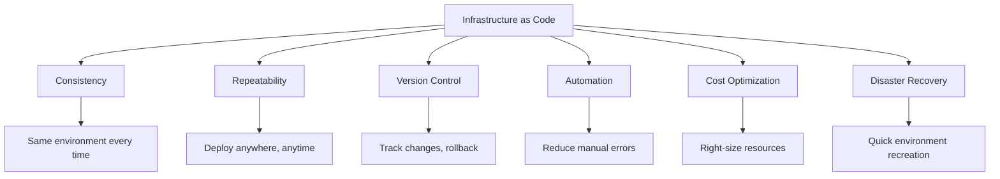

# Module 17: Infrastructure as Code (IaC)

## Learning Objectives 🎯

By the end of this module, you will be able to:
- Understand Infrastructure as Code principles and benefits
- Master Terraform for infrastructure automation
- Implement CloudFormation for AWS infrastructure
- Design infrastructure CI/CD pipelines
- Manage infrastructure state effectively
- Implement infrastructure testing and validation
- Handle multi-environment infrastructure deployments

## Prerequisites ✅

- Completed Modules 1-16
- Understanding of cloud platforms (AWS, Azure, GCP)
- Basic knowledge of networking and infrastructure concepts
- Experience with CI/CD pipelines
- Familiarity with containerization and Kubernetes

---

## 1. Infrastructure as Code Fundamentals

### What is Infrastructure as Code?

Infrastructure as Code (IaC) is the practice of managing and provisioning computing infrastructure through machine-readable definition files, rather than physical hardware configuration or interactive configuration tools.

### Key Principles

1. **Declarative Configuration**: Define what you want, not how to get it
2. **Version Control**: Infrastructure definitions stored in Git
3. **Immutable Infrastructure**: Replace rather than modify
4. **Idempotency**: Same result regardless of execution count
5. **Self-Documenting**: Code serves as documentation

### Benefits of IaC



### IaC Tools Comparison

| Tool | Type | Cloud Support | Language | State Management |
|------|------|---------------|----------|------------------|
| Terraform | Declarative | Multi-cloud | HCL | Remote state |
| CloudFormation | Declarative | AWS only | JSON/YAML | AWS managed |
| Pulumi | Imperative | Multi-cloud | Multiple | Cloud backends |
| ARM Templates | Declarative | Azure only | JSON | Azure managed |
| CDK | Imperative | Multi-cloud | Multiple | Provider managed |

---

## 2. Terraform Fundamentals

### Terraform Architecture

```hcl
# main.tf - Basic Terraform structure
terraform {
  required_version = ">= 1.0"
  required_providers {
    aws = {
      source  = "hashicorp/aws"
      version = "~> 5.0"
    }
  }
  
  backend "s3" {
    bucket = "my-terraform-state"
    key    = "infrastructure/terraform.tfstate"
    region = "us-west-2"
  }
}

provider "aws" {
  region = var.aws_region
  
  default_tags {
    tags = {
      Environment = var.environment
      Project     = var.project_name
      ManagedBy   = "Terraform"
    }
  }
}
```

### Variables and Outputs

```hcl
# variables.tf
variable "aws_region" {
  description = "AWS region for resources"
  type        = string
  default     = "us-west-2"
}

variable "environment" {
  description = "Environment name"
  type        = string
  validation {
    condition     = contains(["dev", "staging", "prod"], var.environment)
    error_message = "Environment must be dev, staging, or prod."
  }
}

variable "instance_config" {
  description = "EC2 instance configuration"
  type = object({
    instance_type = string
    min_size      = number
    max_size      = number
    desired_size  = number
  })
  default = {
    instance_type = "t3.micro"
    min_size      = 1
    max_size      = 3
    desired_size  = 2
  }
}

# outputs.tf
output "vpc_id" {
  description = "ID of the VPC"
  value       = aws_vpc.main.id
}

output "load_balancer_dns" {
  description = "DNS name of the load balancer"
  value       = aws_lb.main.dns_name
  sensitive   = false
}

output "database_endpoint" {
  description = "RDS instance endpoint"
  value       = aws_db_instance.main.endpoint
  sensitive   = true
}
```

### Terraform Modules

```hcl
# modules/vpc/main.tf
resource "aws_vpc" "main" {
  cidr_block           = var.vpc_cidr
  enable_dns_hostnames = true
  enable_dns_support   = true
  
  tags = {
    Name = "${var.name_prefix}-vpc"
  }
}

resource "aws_subnet" "public" {
  count = length(var.public_subnet_cidrs)
  
  vpc_id                  = aws_vpc.main.id
  cidr_block              = var.public_subnet_cidrs[count.index]
  availability_zone       = data.aws_availability_zones.available.names[count.index]
  map_public_ip_on_launch = true
  
  tags = {
    Name = "${var.name_prefix}-public-${count.index + 1}"
    Type = "Public"
  }
}

resource "aws_subnet" "private" {
  count = length(var.private_subnet_cidrs)
  
  vpc_id            = aws_vpc.main.id
  cidr_block        = var.private_subnet_cidrs[count.index]
  availability_zone = data.aws_availability_zones.available.names[count.index]
  
  tags = {
    Name = "${var.name_prefix}-private-${count.index + 1}"
    Type = "Private"
  }
}

# Internet Gateway
resource "aws_internet_gateway" "main" {
  vpc_id = aws_vpc.main.id
  
  tags = {
    Name = "${var.name_prefix}-igw"
  }
}

# NAT Gateway
resource "aws_eip" "nat" {
  count  = length(var.public_subnet_cidrs)
  domain = "vpc"
  
  tags = {
    Name = "${var.name_prefix}-nat-eip-${count.index + 1}"
  }
}

resource "aws_nat_gateway" "main" {
  count = length(var.public_subnet_cidrs)
  
  allocation_id = aws_eip.nat[count.index].id
  subnet_id     = aws_subnet.public[count.index].id
  
  tags = {
    Name = "${var.name_prefix}-nat-${count.index + 1}"
  }
  
  depends_on = [aws_internet_gateway.main]
}
```

### Using Modules

```hcl
# main.tf - Using the VPC module
module "vpc" {
  source = "./modules/vpc"
  
  name_prefix = "${var.project_name}-${var.environment}"
  vpc_cidr    = "10.0.0.0/16"
  
  public_subnet_cidrs  = ["10.0.1.0/24", "10.0.2.0/24"]
  private_subnet_cidrs = ["10.0.10.0/24", "10.0.20.0/24"]
  
  tags = {
    Environment = var.environment
    Project     = var.project_name
  }
}

module "eks_cluster" {
  source = "./modules/eks"
  
  cluster_name = "${var.project_name}-${var.environment}"
  vpc_id       = module.vpc.vpc_id
  subnet_ids   = module.vpc.private_subnet_ids
  
  node_groups = {
    main = {
      instance_types = ["t3.medium"]
      min_size       = 1
      max_size       = 5
      desired_size   = 3
    }
  }
}
```

---

## 3. AWS CloudFormation

### CloudFormation Template Structure

```yaml
# infrastructure.yaml
AWSTemplateFormatVersion: '2010-09-09'
Description: 'Complete web application infrastructure'

Parameters:
  Environment:
    Type: String
    Default: dev
    AllowedValues: [dev, staging, prod]
    Description: Environment name
  
  InstanceType:
    Type: String
    Default: t3.micro
    AllowedValues: [t3.micro, t3.small, t3.medium]
    Description: EC2 instance type
  
  KeyPairName:
    Type: AWS::EC2::KeyPair::KeyName
    Description: EC2 Key Pair for SSH access

Mappings:
  EnvironmentMap:
    dev:
      VpcCidr: '10.0.0.0/16'
      MinSize: 1
      MaxSize: 2
    staging:
      VpcCidr: '10.1.0.0/16'
      MinSize: 2
      MaxSize: 4
    prod:
      VpcCidr: '10.2.0.0/16'
      MinSize: 3
      MaxSize: 10

Conditions:
  IsProduction: !Equals [!Ref Environment, prod]
  CreateMultiAZ: !Not [!Equals [!Ref Environment, dev]]

Resources:
  # VPC
  VPC:
    Type: AWS::EC2::VPC
    Properties:
      CidrBlock: !FindInMap [EnvironmentMap, !Ref Environment, VpcCidr]
      EnableDnsHostnames: true
      EnableDnsSupport: true
      Tags:
        - Key: Name
          Value: !Sub '${AWS::StackName}-vpc'
        - Key: Environment
          Value: !Ref Environment
  
  # Internet Gateway
  InternetGateway:
    Type: AWS::EC2::InternetGateway
    Properties:
      Tags:
        - Key: Name
          Value: !Sub '${AWS::StackName}-igw'
  
  AttachGateway:
    Type: AWS::EC2::VPCGatewayAttachment
    Properties:
      VpcId: !Ref VPC
      InternetGatewayId: !Ref InternetGateway
  
  # Public Subnets
  PublicSubnet1:
    Type: AWS::EC2::Subnet
    Properties:
      VpcId: !Ref VPC
      CidrBlock: !Select [0, !Cidr [!GetAtt VPC.CidrBlock, 4, 8]]
      AvailabilityZone: !Select [0, !GetAZs '']
      MapPublicIpOnLaunch: true
      Tags:
        - Key: Name
          Value: !Sub '${AWS::StackName}-public-1'
  
  PublicSubnet2:
    Type: AWS::EC2::Subnet
    Condition: CreateMultiAZ
    Properties:
      VpcId: !Ref VPC
      CidrBlock: !Select [1, !Cidr [!GetAtt VPC.CidrBlock, 4, 8]]
      AvailabilityZone: !Select [1, !GetAZs '']
      MapPublicIpOnLaunch: true
      Tags:
        - Key: Name
          Value: !Sub '${AWS::StackName}-public-2'
  
  # Application Load Balancer
  ApplicationLoadBalancer:
    Type: AWS::ElasticLoadBalancingV2::LoadBalancer
    Properties:
      Name: !Sub '${AWS::StackName}-alb'
      Scheme: internet-facing
      Type: application
      Subnets:
        - !Ref PublicSubnet1
        - !If [CreateMultiAZ, !Ref PublicSubnet2, !Ref 'AWS::NoValue']
      SecurityGroups:
        - !Ref ALBSecurityGroup
      Tags:
        - Key: Name
          Value: !Sub '${AWS::StackName}-alb'
  
  # Auto Scaling Group
  AutoScalingGroup:
    Type: AWS::AutoScaling::AutoScalingGroup
    Properties:
      AutoScalingGroupName: !Sub '${AWS::StackName}-asg'
      VPCZoneIdentifier:
        - !Ref PublicSubnet1
        - !If [CreateMultiAZ, !Ref PublicSubnet2, !Ref 'AWS::NoValue']
      LaunchTemplate:
        LaunchTemplateId: !Ref LaunchTemplate
        Version: !GetAtt LaunchTemplate.LatestVersionNumber
      MinSize: !FindInMap [EnvironmentMap, !Ref Environment, MinSize]
      MaxSize: !FindInMap [EnvironmentMap, !Ref Environment, MaxSize]
      DesiredCapacity: !FindInMap [EnvironmentMap, !Ref Environment, MinSize]
      TargetGroupARNs:
        - !Ref TargetGroup
      HealthCheckType: ELB
      HealthCheckGracePeriod: 300
      Tags:
        - Key: Name
          Value: !Sub '${AWS::StackName}-instance'
          PropagateAtLaunch: true
        - Key: Environment
          Value: !Ref Environment
          PropagateAtLaunch: true
    UpdatePolicy:
      AutoScalingRollingUpdate:
        MinInstancesInService: 1
        MaxBatchSize: 2
        PauseTime: PT5M
        WaitOnResourceSignals: true

Outputs:
  VPCId:
    Description: VPC ID
    Value: !Ref VPC
    Export:
      Name: !Sub '${AWS::StackName}-VPC-ID'
  
  LoadBalancerDNS:
    Description: Load Balancer DNS Name
    Value: !GetAtt ApplicationLoadBalancer.DNSName
    Export:
      Name: !Sub '${AWS::StackName}-ALB-DNS'
  
  LoadBalancerHostedZone:
    Description: Load Balancer Hosted Zone
    Value: !GetAtt ApplicationLoadBalancer.CanonicalHostedZoneID
    Export:
      Name: !Sub '${AWS::StackName}-ALB-HostedZone'
```

### Nested Stacks

```yaml
# master-stack.yaml
AWSTemplateFormatVersion: '2010-09-09'
Description: 'Master stack for complete infrastructure'

Parameters:
  Environment:
    Type: String
    Default: dev
  
  TemplatesBucket:
    Type: String
    Description: S3 bucket containing nested templates

Resources:
  NetworkStack:
    Type: AWS::CloudFormation::Stack
    Properties:
      TemplateURL: !Sub 'https://${TemplatesBucket}.s3.amazonaws.com/network.yaml'
      Parameters:
        Environment: !Ref Environment
      Tags:
        - Key: StackType
          Value: Network
  
  SecurityStack:
    Type: AWS::CloudFormation::Stack
    DependsOn: NetworkStack
    Properties:
      TemplateURL: !Sub 'https://${TemplatesBucket}.s3.amazonaws.com/security.yaml'
      Parameters:
        Environment: !Ref Environment
        VPCId: !GetAtt NetworkStack.Outputs.VPCId
      Tags:
        - Key: StackType
          Value: Security
  
  ApplicationStack:
    Type: AWS::CloudFormation::Stack
    DependsOn: [NetworkStack, SecurityStack]
    Properties:
      TemplateURL: !Sub 'https://${TemplatesBucket}.s3.amazonaws.com/application.yaml'
      Parameters:
        Environment: !Ref Environment
        VPCId: !GetAtt NetworkStack.Outputs.VPCId
        SecurityGroupId: !GetAtt SecurityStack.Outputs.WebSecurityGroupId
      Tags:
        - Key: StackType
          Value: Application

Outputs:
  ApplicationURL:
    Description: Application URL
    Value: !GetAtt ApplicationStack.Outputs.LoadBalancerDNS
```

---

## 4. Infrastructure CI/CD Pipelines

### Terraform Pipeline with GitHub Actions

```yaml
# .github/workflows/terraform.yml
name: 'Terraform Infrastructure'

on:
  push:
    branches: [main, develop]
    paths: ['infrastructure/**']
  pull_request:
    branches: [main]
    paths: ['infrastructure/**']
  workflow_dispatch:
    inputs:
      environment:
        description: 'Environment to deploy'
        required: true
        default: 'dev'
        type: choice
        options: [dev, staging, prod]
      action:
        description: 'Terraform action'
        required: true
        default: 'plan'
        type: choice
        options: [plan, apply, destroy]

env:
  TF_VERSION: '1.6.0'
  TF_WORKING_DIR: './infrastructure'

jobs:
  terraform-check:
    name: 'Terraform Check'
    runs-on: ubuntu-latest
    
    steps:
    - name: Checkout
      uses: actions/checkout@v4
    
    - name: Setup Terraform
      uses: hashicorp/setup-terraform@v3
      with:
        terraform_version: ${{ env.TF_VERSION }}
    
    - name: Terraform Format Check
      working-directory: ${{ env.TF_WORKING_DIR }}
      run: terraform fmt -check -recursive
    
    - name: Terraform Init
      working-directory: ${{ env.TF_WORKING_DIR }}
      run: terraform init -backend=false
    
    - name: Terraform Validate
      working-directory: ${{ env.TF_WORKING_DIR }}
      run: terraform validate
    
    - name: Run TFLint
      uses: terraform-linters/setup-tflint@v4
      with:
        tflint_version: latest
    
    - name: Init TFLint
      working-directory: ${{ env.TF_WORKING_DIR }}
      run: tflint --init
    
    - name: Run TFLint
      working-directory: ${{ env.TF_WORKING_DIR }}
      run: tflint
    
    - name: Run Checkov
      uses: bridgecrewio/checkov-action@master
      with:
        directory: ${{ env.TF_WORKING_DIR }}
        framework: terraform
        output_format: sarif
        output_file_path: checkov-results.sarif
    
    - name: Upload Checkov results
      uses: github/codeql-action/upload-sarif@v3
      if: always()
      with:
        sarif_file: checkov-results.sarif

  terraform-plan:
    name: 'Terraform Plan'
    runs-on: ubuntu-latest
    needs: terraform-check
    if: github.event_name == 'pull_request' || github.event_name == 'workflow_dispatch'
    
    strategy:
      matrix:
        environment: [dev, staging]
    
    environment: ${{ matrix.environment }}
    
    steps:
    - name: Checkout
      uses: actions/checkout@v4
    
    - name: Configure AWS Credentials
      uses: aws-actions/configure-aws-credentials@v4
      with:
        aws-access-key-id: ${{ secrets.AWS_ACCESS_KEY_ID }}
        aws-secret-access-key: ${{ secrets.AWS_SECRET_ACCESS_KEY }}
        aws-region: ${{ vars.AWS_REGION }}
    
    - name: Setup Terraform
      uses: hashicorp/setup-terraform@v3
      with:
        terraform_version: ${{ env.TF_VERSION }}
    
    - name: Terraform Init
      working-directory: ${{ env.TF_WORKING_DIR }}
      run: |
        terraform init \
          -backend-config="bucket=${{ vars.TF_STATE_BUCKET }}" \
          -backend-config="key=${{ matrix.environment }}/terraform.tfstate" \
          -backend-config="region=${{ vars.AWS_REGION }}"
    
    - name: Terraform Plan
      working-directory: ${{ env.TF_WORKING_DIR }}
      run: |
        terraform plan \
          -var-file="environments/${{ matrix.environment }}.tfvars" \
          -out="${{ matrix.environment }}.tfplan" \
          -detailed-exitcode
      continue-on-error: true
      id: plan
    
    - name: Save Plan
      uses: actions/upload-artifact@v4
      with:
        name: terraform-plan-${{ matrix.environment }}
        path: ${{ env.TF_WORKING_DIR }}/${{ matrix.environment }}.tfplan
        retention-days: 5
    
    - name: Comment PR
      if: github.event_name == 'pull_request'
      uses: actions/github-script@v7
      with:
        script: |
          const output = `#### Terraform Plan for ${{ matrix.environment }} 📖
          
          **Plan Result**: ${{ steps.plan.outcome }}
          
          <details><summary>Show Plan</summary>
          
          \`\`\`terraform
          ${{ steps.plan.outputs.stdout }}
          \`\`\`
          
          </details>
          
          *Pusher: @${{ github.actor }}, Action: \`${{ github.event_name }}\`*`;
          
          github.rest.issues.createComment({
            issue_number: context.issue.number,
            owner: context.repo.owner,
            repo: context.repo.repo,
            body: output
          })

  terraform-apply:
    name: 'Terraform Apply'
    runs-on: ubuntu-latest
    needs: [terraform-check, terraform-plan]
    if: github.ref == 'refs/heads/main' && github.event_name == 'push'
    
    strategy:
      matrix:
        environment: [dev, staging]
    
    environment: ${{ matrix.environment }}
    
    steps:
    - name: Checkout
      uses: actions/checkout@v4
    
    - name: Configure AWS Credentials
      uses: aws-actions/configure-aws-credentials@v4
      with:
        aws-access-key-id: ${{ secrets.AWS_ACCESS_KEY_ID }}
        aws-secret-access-key: ${{ secrets.AWS_SECRET_ACCESS_KEY }}
        aws-region: ${{ vars.AWS_REGION }}
    
    - name: Setup Terraform
      uses: hashicorp/setup-terraform@v3
      with:
        terraform_version: ${{ env.TF_VERSION }}
    
    - name: Terraform Init
      working-directory: ${{ env.TF_WORKING_DIR }}
      run: |
        terraform init \
          -backend-config="bucket=${{ vars.TF_STATE_BUCKET }}" \
          -backend-config="key=${{ matrix.environment }}/terraform.tfstate" \
          -backend-config="region=${{ vars.AWS_REGION }}"
    
    - name: Download Plan
      uses: actions/download-artifact@v4
      with:
        name: terraform-plan-${{ matrix.environment }}
        path: ${{ env.TF_WORKING_DIR }}
    
    - name: Terraform Apply
      working-directory: ${{ env.TF_WORKING_DIR }}
      run: terraform apply -auto-approve "${{ matrix.environment }}.tfplan"
    
    - name: Update Infrastructure Inventory
      run: |
        echo "Environment: ${{ matrix.environment }}" >> infrastructure-inventory.md
        echo "Deployed: $(date)" >> infrastructure-inventory.md
        echo "Commit: ${{ github.sha }}" >> infrastructure-inventory.md
        echo "---" >> infrastructure-inventory.md

  terraform-production:
    name: 'Terraform Production'
    runs-on: ubuntu-latest
    needs: terraform-apply
    if: github.ref == 'refs/heads/main' && github.event_name == 'push'
    
    environment: 
      name: production
      url: ${{ steps.apply.outputs.application_url }}
    
    steps:
    - name: Checkout
      uses: actions/checkout@v4
    
    - name: Configure AWS Credentials
      uses: aws-actions/configure-aws-credentials@v4
      with:
        aws-access-key-id: ${{ secrets.AWS_ACCESS_KEY_ID }}
        aws-secret-access-key: ${{ secrets.AWS_SECRET_ACCESS_KEY }}
        aws-region: ${{ vars.AWS_REGION }}
    
    - name: Setup Terraform
      uses: hashicorp/setup-terraform@v3
      with:
        terraform_version: ${{ env.TF_VERSION }}
        terraform_wrapper: false
    
    - name: Terraform Init
      working-directory: ${{ env.TF_WORKING_DIR }}
      run: |
        terraform init \
          -backend-config="bucket=${{ vars.TF_STATE_BUCKET }}" \
          -backend-config="key=prod/terraform.tfstate" \
          -backend-config="region=${{ vars.AWS_REGION }}"
    
    - name: Terraform Plan
      working-directory: ${{ env.TF_WORKING_DIR }}
      run: |
        terraform plan \
          -var-file="environments/prod.tfvars" \
          -out="prod.tfplan"
    
    - name: Terraform Apply
      id: apply
      working-directory: ${{ env.TF_WORKING_DIR }}
      run: |
        terraform apply -auto-approve "prod.tfplan"
        echo "application_url=$(terraform output -raw application_url)" >> $GITHUB_OUTPUT
```

### CloudFormation Pipeline

```yaml
# .github/workflows/cloudformation.yml
name: 'CloudFormation Infrastructure'

on:
  push:
    branches: [main]
    paths: ['cloudformation/**']
  pull_request:
    branches: [main]
    paths: ['cloudformation/**']

env:
  AWS_REGION: us-west-2
  TEMPLATES_BUCKET: my-cloudformation-templates

jobs:
  validate:
    name: 'Validate Templates'
    runs-on: ubuntu-latest
    
    steps:
    - name: Checkout
      uses: actions/checkout@v4
    
    - name: Configure AWS Credentials
      uses: aws-actions/configure-aws-credentials@v4
      with:
        aws-access-key-id: ${{ secrets.AWS_ACCESS_KEY_ID }}
        aws-secret-access-key: ${{ secrets.AWS_SECRET_ACCESS_KEY }}
        aws-region: ${{ env.AWS_REGION }}
    
    - name: Validate CloudFormation Templates
      run: |
        for template in cloudformation/*.yaml; do
          echo "Validating $template"
          aws cloudformation validate-template --template-body file://$template
        done
    
    - name: Lint CloudFormation Templates
      uses: scottbrenner/cfn-lint-action@v2
      with:
        file: cloudformation/
    
    - name: Run cfn-nag
      uses: stelligent/cfn_nag@master
      with:
        input_path: cloudformation/
        extra_args: --fail-on-warnings

  upload-templates:
    name: 'Upload Templates'
    runs-on: ubuntu-latest
    needs: validate
    if: github.ref == 'refs/heads/main'
    
    steps:
    - name: Checkout
      uses: actions/checkout@v4
    
    - name: Configure AWS Credentials
      uses: aws-actions/configure-aws-credentials@v4
      with:
        aws-access-key-id: ${{ secrets.AWS_ACCESS_KEY_ID }}
        aws-secret-access-key: ${{ secrets.AWS_SECRET_ACCESS_KEY }}
        aws-region: ${{ env.AWS_REGION }}
    
    - name: Upload Templates to S3
      run: |
        aws s3 sync cloudformation/ s3://${{ env.TEMPLATES_BUCKET }}/ \
          --exclude "*" --include "*.yaml" --include "*.json"

  deploy:
    name: 'Deploy Infrastructure'
    runs-on: ubuntu-latest
    needs: upload-templates
    if: github.ref == 'refs/heads/main'
    
    strategy:
      matrix:
        environment: [dev, staging, prod]
    
    environment: ${{ matrix.environment }}
    
    steps:
    - name: Checkout
      uses: actions/checkout@v4
    
    - name: Configure AWS Credentials
      uses: aws-actions/configure-aws-credentials@v4
      with:
        aws-access-key-id: ${{ secrets.AWS_ACCESS_KEY_ID }}
        aws-secret-access-key: ${{ secrets.AWS_SECRET_ACCESS_KEY }}
        aws-region: ${{ env.AWS_REGION }}
    
    - name: Deploy CloudFormation Stack
      run: |
        STACK_NAME="my-app-${{ matrix.environment }}"
        TEMPLATE_URL="https://${{ env.TEMPLATES_BUCKET }}.s3.amazonaws.com/master-stack.yaml"
        
        # Check if stack exists
        if aws cloudformation describe-stacks --stack-name $STACK_NAME 2>/dev/null; then
          echo "Updating existing stack"
          aws cloudformation update-stack \
            --stack-name $STACK_NAME \
            --template-url $TEMPLATE_URL \
            --parameters ParameterKey=Environment,ParameterValue=${{ matrix.environment }} \
                        ParameterKey=TemplatesBucket,ParameterValue=${{ env.TEMPLATES_BUCKET }} \
            --capabilities CAPABILITY_IAM CAPABILITY_NAMED_IAM
          
          aws cloudformation wait stack-update-complete --stack-name $STACK_NAME
        else
          echo "Creating new stack"
          aws cloudformation create-stack \
            --stack-name $STACK_NAME \
            --template-url $TEMPLATE_URL \
            --parameters ParameterKey=Environment,ParameterValue=${{ matrix.environment }} \
                        ParameterKey=TemplatesBucket,ParameterValue=${{ env.TEMPLATES_BUCKET }} \
            --capabilities CAPABILITY_IAM CAPABILITY_NAMED_IAM
          
          aws cloudformation wait stack-create-complete --stack-name $STACK_NAME
        fi
    
    - name: Get Stack Outputs
      run: |
        STACK_NAME="my-app-${{ matrix.environment }}"
        aws cloudformation describe-stacks --stack-name $STACK_NAME \
          --query 'Stacks[0].Outputs' --output table
```

---

## 5. State Management

### Terraform State Management

```hcl
# backend.tf - Remote state configuration
terraform {
  backend "s3" {
    bucket         = "my-terraform-state-bucket"
    key            = "infrastructure/terraform.tfstate"
    region         = "us-west-2"
    encrypt        = true
    dynamodb_table = "terraform-state-locks"
    
    # Workspace-specific state
    workspace_key_prefix = "workspaces"
  }
}

# State bucket setup
resource "aws_s3_bucket" "terraform_state" {
  bucket = "my-terraform-state-bucket"
  
  lifecycle {
    prevent_destroy = true
  }
}

resource "aws_s3_bucket_versioning" "terraform_state" {
  bucket = aws_s3_bucket.terraform_state.id
  versioning_configuration {
    status = "Enabled"
  }
}

resource "aws_s3_bucket_encryption" "terraform_state" {
  bucket = aws_s3_bucket.terraform_state.id
  
  server_side_encryption_configuration {
    rule {
      apply_server_side_encryption_by_default {
        sse_algorithm = "AES256"
      }
    }
  }
}

resource "aws_s3_bucket_public_access_block" "terraform_state" {
  bucket = aws_s3_bucket.terraform_state.id
  
  block_public_acls       = true
  block_public_policy     = true
  ignore_public_acls      = true
  restrict_public_buckets = true
}

# DynamoDB table for state locking
resource "aws_dynamodb_table" "terraform_locks" {
  name           = "terraform-state-locks"
  billing_mode   = "PAY_PER_REQUEST"
  hash_key       = "LockID"
  
  attribute {
    name = "LockID"
    type = "S"
  }
  
  tags = {
    Name = "Terraform State Locks"
  }
}
```

### State Management Scripts

```bash
#!/bin/bash
# scripts/terraform-state-manager.sh

set -e

ENVIRONMENT=${1:-dev}
ACTION=${2:-plan}
WORKSPACE="$ENVIRONMENT"

echo "Managing Terraform state for environment: $ENVIRONMENT"

# Initialize Terraform
terraform init

# Select or create workspace
if terraform workspace list | grep -q "$WORKSPACE"; then
    echo "Switching to workspace: $WORKSPACE"
    terraform workspace select "$WORKSPACE"
else
    echo "Creating workspace: $WORKSPACE"
    terraform workspace new "$WORKSPACE"
fi

# Show current workspace
echo "Current workspace: $(terraform workspace show)"

# Execute action
case $ACTION in
    "plan")
        terraform plan -var-file="environments/$ENVIRONMENT.tfvars"
        ;;
    "apply")
        terraform apply -var-file="environments/$ENVIRONMENT.tfvars" -auto-approve
        ;;
    "destroy")
        echo "WARNING: This will destroy all resources in $ENVIRONMENT!"
        read -p "Are you sure? (yes/no): " confirm
        if [ "$confirm" = "yes" ]; then
            terraform destroy -var-file="environments/$ENVIRONMENT.tfvars" -auto-approve
        else
            echo "Destroy cancelled"
        fi
        ;;
    "import")
        RESOURCE_TYPE=$3
        RESOURCE_ID=$4
        if [ -z "$RESOURCE_TYPE" ] || [ -z "$RESOURCE_ID" ]; then
            echo "Usage: $0 $ENVIRONMENT import <resource_type> <resource_id>"
            exit 1
        fi
        terraform import "$RESOURCE_TYPE" "$RESOURCE_ID"
        ;;
    "state-list")
        terraform state list
        ;;
    "state-show")
        RESOURCE=$3
        if [ -z "$RESOURCE" ]; then
            echo "Usage: $0 $ENVIRONMENT state-show <resource>"
            exit 1
        fi
        terraform state show "$RESOURCE"
        ;;
    *)
        echo "Unknown action: $ACTION"
        echo "Available actions: plan, apply, destroy, import, state-list, state-show"
        exit 1
        ;;
esac
```

### State Migration Script

```python
#!/usr/bin/env python3
# scripts/migrate-terraform-state.py

import boto3
import json
import sys
import subprocess
from typing import Dict, List

class TerraformStateMigrator:
    def __init__(self, source_bucket: str, dest_bucket: str, aws_region: str):
        self.source_bucket = source_bucket
        self.dest_bucket = dest_bucket
        self.aws_region = aws_region
        self.s3_client = boto3.client('s3', region_name=aws_region)
    
    def list_state_files(self, bucket: str) -> List[str]:
        """List all Terraform state files in a bucket"""
        try:
            response = self.s3_client.list_objects_v2(
                Bucket=bucket,
                Prefix='',
                Delimiter='/'
            )
            
            state_files = []
            if 'Contents' in response:
                for obj in response['Contents']:
                    if obj['Key'].endswith('.tfstate'):
                        state_files.append(obj['Key'])
            
            return state_files
        except Exception as e:
            return ValidationResult(
                'AutoScalingGroup', asg_name, 'ERROR',
                f"Failed to validate Auto Scaling Group: {str(e)}"
            )
    
    def validate_security_groups(self, vpc_id: str) -> List[ValidationResult]:
        """Validate security group configuration"""
        results = []
        try:
            response = self.ec2_client.describe_security_groups(
                Filters=[{'Name': 'vpc-id', 'Values': [vpc_id]}]
            )
            
            for sg in response['SecurityGroups']:
                sg_id = sg['GroupId']
                
                # Check for overly permissive rules
                for rule in sg['IpPermissions']:
                    for ip_range in rule.get('IpRanges', []):
                        if ip_range.get('CidrIp') == '0.0.0.0/0':
                            results.append(ValidationResult(
                                'SecurityGroup', sg_id, 'WARNING',
                                f"Security group allows access from 0.0.0.0/0 on port {rule.get('FromPort', 'all')}"
                            ))
                
                results.append(ValidationResult(
                    'SecurityGroup', sg_id, 'PASSED',
                    'Security group validated',
                    {'group_name': sg['GroupName']}
                ))
        except Exception as e:
            results.append(ValidationResult(
                'SecurityGroup', 'all', 'ERROR',
                f"Failed to validate security groups: {str(e)}"
            ))
        
        return results
    
    def run_validation(self, infrastructure_config: Dict[str, str]) -> Dict[str, Any]:
        """Run complete infrastructure validation"""
        print(f"Starting infrastructure validation for {self.environment} environment...")
        
        # Validate VPC
        if 'vpc_id' in infrastructure_config:
            self.results.append(self.validate_vpc(infrastructure_config['vpc_id']))
            self.results.extend(self.validate_subnets(infrastructure_config['vpc_id']))
            self.results.extend(self.validate_security_groups(infrastructure_config['vpc_id']))
        
        # Validate Load Balancer
        if 'load_balancer_arn' in infrastructure_config:
            self.results.append(self.validate_load_balancer(infrastructure_config['load_balancer_arn']))
        
        # Validate Auto Scaling Group
        if 'asg_name' in infrastructure_config:
            self.results.append(self.validate_auto_scaling_group(infrastructure_config['asg_name']))
        
        # Generate summary
        passed = len([r for r in self.results if r.status == 'PASSED'])
        warnings = len([r for r in self.results if r.status == 'WARNING'])
        failed = len([r for r in self.results if r.status == 'FAILED'])
        errors = len([r for r in self.results if r.status == 'ERROR'])
        
        summary = {
            'total_checks': len(self.results),
            'passed': passed,
            'warnings': warnings,
            'failed': failed,
            'errors': errors,
            'success_rate': (passed / len(self.results)) * 100 if self.results else 0
        }
        
        return summary
    
    def generate_report(self, output_file: str = None):
        """Generate validation report"""
        report = {
            'environment': self.environment,
            'region': self.aws_region,
            'timestamp': time.strftime('%Y-%m-%d %H:%M:%S UTC', time.gmtime()),
            'results': [{
                'resource_type': r.resource_type,
                'resource_id': r.resource_id,
                'status': r.status,
                'message': r.message,
                'details': r.details
            } for r in self.results]
        }
        
        if output_file:
            with open(output_file, 'w') as f:
                json.dump(report, f, indent=2)
            print(f"Report saved to {output_file}")
        
        return report

def main():
    if len(sys.argv) < 4:
        print("Usage: python validate-infrastructure.py <aws_region> <environment> <config_file>")
        sys.exit(1)
    
    aws_region = sys.argv[1]
    environment = sys.argv[2]
    config_file = sys.argv[3]
    
    # Load infrastructure configuration
    with open(config_file, 'r') as f:
        infrastructure_config = json.load(f)
    
    validator = InfrastructureValidator(aws_region, environment)
    summary = validator.run_validation(infrastructure_config)
    
    # Print summary
    print("\n" + "="*50)
    print("INFRASTRUCTURE VALIDATION SUMMARY")
    print("="*50)
    print(f"Environment: {environment}")
    print(f"Region: {aws_region}")
    print(f"Total Checks: {summary['total_checks']}")
    print(f"Passed: {summary['passed']}")
    print(f"Warnings: {summary['warnings']}")
    print(f"Failed: {summary['failed']}")
    print(f"Errors: {summary['errors']}")
    print(f"Success Rate: {summary['success_rate']:.1f}%")
    
    # Print detailed results
    print("\nDETAILED RESULTS:")
    print("-" * 50)
    for result in validator.results:
        status_icon = {
            'PASSED': '✅',
            'WARNING': '⚠️',
            'FAILED': '❌',
            'ERROR': '🔥'
        }.get(result.status, '❓')
        
        print(f"{status_icon} {result.resource_type} ({result.resource_id}): {result.message}")
    
    # Generate report
    report_file = f"infrastructure-validation-{environment}-{int(time.time())}.json"
    validator.generate_report(report_file)
    
    # Exit with appropriate code
    if summary['failed'] > 0 or summary['errors'] > 0:
        sys.exit(1)
    elif summary['warnings'] > 0:
        sys.exit(2)
    else:
        sys.exit(0)

if __name__ == "__main__":
    import time
    main()
```

---

## 7. Multi-Environment Management

### Environment Configuration

```hcl
# environments/dev.tfvars
project_name = "myapp"
environment  = "dev"
aws_region   = "us-west-2"

# Network Configuration
vpc_cidr = "10.0.0.0/16"
public_subnet_cidrs  = ["10.0.1.0/24", "10.0.2.0/24"]
private_subnet_cidrs = ["10.0.10.0/24", "10.0.20.0/24"]

# Application Configuration
instance_config = {
  instance_type = "t3.micro"
  min_size      = 1
  max_size      = 2
  desired_size  = 1
}

# Database Configuration
db_config = {
  instance_class    = "db.t3.micro"
  allocated_storage = 20
  multi_az         = false
  backup_retention = 7
}

# Feature Flags
enable_monitoring = false
enable_logging   = true
enable_backup    = false
```

```hcl
# environments/prod.tfvars
project_name = "myapp"
environment  = "prod"
aws_region   = "us-west-2"

# Network Configuration
vpc_cidr = "10.2.0.0/16"
public_subnet_cidrs  = ["10.2.1.0/24", "10.2.2.0/24", "10.2.3.0/24"]
private_subnet_cidrs = ["10.2.10.0/24", "10.2.20.0/24", "10.2.30.0/24"]

# Application Configuration
instance_config = {
  instance_type = "t3.large"
  min_size      = 3
  max_size      = 10
  desired_size  = 5
}

# Database Configuration
db_config = {
  instance_class    = "db.r5.xlarge"
  allocated_storage = 100
  multi_az         = true
  backup_retention = 30
}

# Feature Flags
enable_monitoring = true
enable_logging   = true
enable_backup    = true
```

### Environment Promotion Pipeline

```yaml
# .github/workflows/environment-promotion.yml
name: 'Environment Promotion'

on:
  workflow_dispatch:
    inputs:
      source_environment:
        description: 'Source environment'
        required: true
        type: choice
        options: [dev, staging]
      target_environment:
        description: 'Target environment'
        required: true
        type: choice
        options: [staging, prod]
      promotion_type:
        description: 'Type of promotion'
        required: true
        type: choice
        options: [infrastructure, application, full]

jobs:
  validate-promotion:
    name: 'Validate Promotion'
    runs-on: ubuntu-latest
    
    steps:
    - name: Validate promotion path
      run: |
        if [[ "${{ github.event.inputs.source_environment }}" == "dev" && "${{ github.event.inputs.target_environment }}" == "prod" ]]; then
          echo "❌ Direct promotion from dev to prod is not allowed"
          exit 1
        fi
        
        if [[ "${{ github.event.inputs.source_environment }}" == "${{ github.event.inputs.target_environment }}" ]]; then
          echo "❌ Source and target environments cannot be the same"
          exit 1
        fi
        
        echo "✅ Promotion path validated"

  promote-infrastructure:
    name: 'Promote Infrastructure'
    runs-on: ubuntu-latest
    needs: validate-promotion
    if: contains(github.event.inputs.promotion_type, 'infrastructure') || github.event.inputs.promotion_type == 'full'
    
    environment: ${{ github.event.inputs.target_environment }}
    
    steps:
    - name: Checkout
      uses: actions/checkout@v4
    
    - name: Setup Terraform
      uses: hashicorp/setup-terraform@v3
      with:
        terraform_version: '1.6.0'
    
    - name: Configure AWS Credentials
      uses: aws-actions/configure-aws-credentials@v4
      with:
        aws-access-key-id: ${{ secrets.AWS_ACCESS_KEY_ID }}
        aws-secret-access-key: ${{ secrets.AWS_SECRET_ACCESS_KEY }}
        aws-region: ${{ vars.AWS_REGION }}
    
    - name: Compare Infrastructure States
      working-directory: ./infrastructure
      run: |
        # Initialize for source environment
        terraform init \
          -backend-config="bucket=${{ vars.TF_STATE_BUCKET }}" \
          -backend-config="key=${{ github.event.inputs.source_environment }}/terraform.tfstate" \
          -backend-config="region=${{ vars.AWS_REGION }}"
        
        # Get source state
        terraform show -json > source-state.json
        
        # Initialize for target environment
        terraform init -reconfigure \
          -backend-config="bucket=${{ vars.TF_STATE_BUCKET }}" \
          -backend-config="key=${{ github.event.inputs.target_environment }}/terraform.tfstate" \
          -backend-config="region=${{ vars.AWS_REGION }}"
        
        # Plan for target environment
        terraform plan \
          -var-file="environments/${{ github.event.inputs.target_environment }}.tfvars" \
          -out="promotion.tfplan"
    
    - name: Apply Infrastructure Changes
      working-directory: ./infrastructure
      run: |
        terraform apply -auto-approve "promotion.tfplan"
        
        # Save deployment info
        echo "Infrastructure promoted from ${{ github.event.inputs.source_environment }} to ${{ github.event.inputs.target_environment }}" > promotion-log.txt
        echo "Timestamp: $(date)" >> promotion-log.txt
        echo "Commit: ${{ github.sha }}" >> promotion-log.txt
    
    - name: Upload promotion log
      uses: actions/upload-artifact@v4
      with:
        name: promotion-log-${{ github.event.inputs.target_environment }}
        path: infrastructure/promotion-log.txt
```

---

## 8. Best Practices and Security

### Terraform Security Best Practices

```hcl
# security.tf - Security configurations

# KMS Key for encryption
resource "aws_kms_key" "main" {
  description             = "${var.project_name}-${var.environment} encryption key"
  deletion_window_in_days = 7
  enable_key_rotation     = true
  
  policy = jsonencode({
    Version = "2012-10-17"
    Statement = [
      {
        Sid    = "Enable IAM User Permissions"
        Effect = "Allow"
        Principal = {
          AWS = "arn:aws:iam::${data.aws_caller_identity.current.account_id}:root"
        }
        Action   = "kms:*"
        Resource = "*"
      },
      {
        Sid    = "Allow CloudWatch Logs"
        Effect = "Allow"
        Principal = {
          Service = "logs.amazonaws.com"
        }
        Action = [
          "kms:Encrypt",
          "kms:Decrypt",
          "kms:ReEncrypt*",
          "kms:GenerateDataKey*",
          "kms:DescribeKey"
        ]
        Resource = "*"
      }
    ]
  })
  
  tags = {
    Name = "${var.project_name}-${var.environment}-key"
  }
}

resource "aws_kms_alias" "main" {
  name          = "alias/${var.project_name}-${var.environment}"
  target_key_id = aws_kms_key.main.key_id
}

# S3 Bucket for secure storage
resource "aws_s3_bucket" "secure_storage" {
  bucket = "${var.project_name}-${var.environment}-secure-storage"
  
  lifecycle {
    prevent_destroy = true
  }
}

resource "aws_s3_bucket_encryption" "secure_storage" {
  bucket = aws_s3_bucket.secure_storage.id
  
  server_side_encryption_configuration {
    rule {
      apply_server_side_encryption_by_default {
        kms_master_key_id = aws_kms_key.main.arn
        sse_algorithm     = "aws:kms"
      }
      bucket_key_enabled = true
    }
  }
}

resource "aws_s3_bucket_public_access_block" "secure_storage" {
  bucket = aws_s3_bucket.secure_storage.id
  
  block_public_acls       = true
  block_public_policy     = true
  ignore_public_acls      = true
  restrict_public_buckets = true
}

resource "aws_s3_bucket_versioning" "secure_storage" {
  bucket = aws_s3_bucket.secure_storage.id
  versioning_configuration {
    status = "Enabled"
  }
}

# IAM Role with least privilege
resource "aws_iam_role" "app_role" {
  name = "${var.project_name}-${var.environment}-app-role"
  
  assume_role_policy = jsonencode({
    Version = "2012-10-17"
    Statement = [
      {
        Action = "sts:AssumeRole"
        Effect = "Allow"
        Principal = {
          Service = "ec2.amazonaws.com"
        }
      }
    ]
  })
}

resource "aws_iam_policy" "app_policy" {
  name = "${var.project_name}-${var.environment}-app-policy"
  
  policy = jsonencode({
    Version = "2012-10-17"
    Statement = [
      {
        Effect = "Allow"
        Action = [
          "s3:GetObject",
          "s3:PutObject"
        ]
        Resource = "${aws_s3_bucket.secure_storage.arn}/*"
      },
      {
        Effect = "Allow"
        Action = [
          "kms:Decrypt",
          "kms:GenerateDataKey"
        ]
        Resource = aws_kms_key.main.arn
      },
      {
        Effect = "Allow"
        Action = [
          "logs:CreateLogGroup",
          "logs:CreateLogStream",
          "logs:PutLogEvents"
        ]
        Resource = "arn:aws:logs:*:*:*"
      }
    ]
  })
}

resource "aws_iam_role_policy_attachment" "app_policy" {
  role       = aws_iam_role.app_role.name
  policy_arn = aws_iam_policy.app_policy.arn
}

# Security Group with restrictive rules
resource "aws_security_group" "app_sg" {
  name_prefix = "${var.project_name}-${var.environment}-app-"
  vpc_id      = var.vpc_id
  
  # Inbound rules
  ingress {
    description     = "HTTP from ALB"
    from_port       = 80
    to_port         = 80
    protocol        = "tcp"
    security_groups = [aws_security_group.alb_sg.id]
  }
  
  ingress {
    description     = "HTTPS from ALB"
    from_port       = 443
    to_port         = 443
    protocol        = "tcp"
    security_groups = [aws_security_group.alb_sg.id]
  }
  
  # Outbound rules
  egress {
    description = "HTTPS to internet"
    from_port   = 443
    to_port     = 443
    protocol    = "tcp"
    cidr_blocks = ["0.0.0.0/0"]
  }
  
  egress {
    description = "HTTP to internet"
    from_port   = 80
    to_port     = 80
    protocol    = "tcp"
    cidr_blocks = ["0.0.0.0/0"]
  }
  
  tags = {
    Name = "${var.project_name}-${var.environment}-app-sg"
  }
}
```

### Infrastructure Compliance Checks

```yaml
# .github/workflows/compliance-check.yml
name: 'Infrastructure Compliance'

on:
  push:
    branches: [main, develop]
    paths: ['infrastructure/**']
  pull_request:
    branches: [main]
    paths: ['infrastructure/**']
  schedule:
    - cron: '0 2 * * *'  # Daily at 2 AM

jobs:
  compliance-scan:
    name: 'Compliance Scan'
    runs-on: ubuntu-latest
    
    steps:
    - name: Checkout
      uses: actions/checkout@v4
    
    - name: Run Checkov
      uses: bridgecrewio/checkov-action@master
      with:
        directory: infrastructure/
        framework: terraform
        output_format: cli,json,sarif
        output_file_path: checkov-report.json,checkov-results.sarif
        check: CKV_AWS_20,CKV_AWS_57,CKV_AWS_61
        skip_check: CKV_AWS_79
        quiet: true
        soft_fail: false
    
    - name: Run TFSec
      uses: aquasecurity/tfsec-action@v1.0.3
      with:
        working_directory: infrastructure/
        format: json
        additional_args: --out tfsec-results.json
    
    - name: Run Terrascan
      uses: tenable/terrascan-action@main
      with:
        iac_type: 'terraform'
        iac_dir: 'infrastructure/'
        policy_type: 'aws'
        only_warn: false
        sarif_upload: true
    
    - name: Upload SARIF results
      uses: github/codeql-action/upload-sarif@v3
      if: always()
      with:
        sarif_file: checkov-results.sarif
    
    - name: Generate compliance report
      if: always()
      run: |
        echo "# Infrastructure Compliance Report" > compliance-report.md
        echo "Generated: $(date)" >> compliance-report.md
        echo "" >> compliance-report.md
        
        echo "## Checkov Results" >> compliance-report.md
        if [ -f checkov-report.json ]; then
          python3 -c "
        import json
        with open('checkov-report.json') as f:
            data = json.load(f)
        print(f'Passed: {data.get(\"summary\", {}).get(\"passed\", 0)}')
        print(f'Failed: {data.get(\"summary\", {}).get(\"failed\", 0)}')
        print(f'Skipped: {data.get(\"summary\", {}).get(\"skipped\", 0)}')
        " >> compliance-report.md
        fi
        
        echo "" >> compliance-report.md
        echo "## TFSec Results" >> compliance-report.md
        if [ -f tfsec-results.json ]; then
          python3 -c "
        import json
        with open('tfsec-results.json') as f:
            data = json.load(f)
        results = data.get('results', [])
        print(f'Total issues: {len(results)}')
        high = len([r for r in results if r.get('severity') == 'HIGH'])
        medium = len([r for r in results if r.get('severity') == 'MEDIUM'])
        low = len([r for r in results if r.get('severity') == 'LOW'])
        print(f'High: {high}, Medium: {medium}, Low: {low}')
        " >> compliance-report.md
        fi
    
    - name: Upload compliance report
      uses: actions/upload-artifact@v4
      if: always()
      with:
        name: compliance-report
        path: |
          compliance-report.md
          checkov-report.json
          tfsec-results.json
```

---

## 9. Hands-on Exercises

### Exercise 1: Basic Terraform Infrastructure

**Objective**: Create a complete web application infrastructure using Terraform.

**Requirements**:
1. VPC with public and private subnets
2. Application Load Balancer
3. Auto Scaling Group with EC2 instances
4. RDS database in private subnet
5. Security groups with proper rules

**Steps**:
1. Initialize a new Terraform project
2. Create modules for VPC, security, compute, and database
3. Implement proper variable management
4. Set up remote state storage
5. Create environment-specific configurations
6. Implement the infrastructure pipeline

### Exercise 2: CloudFormation Stack

**Objective**: Convert the Terraform infrastructure to CloudFormation.

**Requirements**:
1. Create nested CloudFormation templates
2. Implement proper parameter management
3. Use CloudFormation conditions and mappings
4. Set up stack dependencies
5. Implement rollback strategies

### Exercise 3: Infrastructure Testing

**Objective**: Implement comprehensive infrastructure testing.

**Requirements**:
1. Set up Terratest for infrastructure testing
2. Create validation scripts for resource configuration
3. Implement compliance checking
4. Set up automated testing in CI/CD pipeline
5. Create infrastructure monitoring and alerting

---

## 10. Troubleshooting Guide

### Common Terraform Issues

#### State Lock Issues
```bash
# Force unlock (use with caution)
terraform force-unlock <lock-id>

# Check state lock status
aws dynamodb get-item \
  --table-name terraform-state-locks \
  --key '{"LockID":{"S":"<state-path>"}}'
```

#### State Drift Detection
```bash
# Detect configuration drift
terraform plan -detailed-exitcode

# Refresh state
terraform refresh

# Import existing resources
terraform import aws_instance.example i-1234567890abcdef0
```

#### Module Issues
```bash
# Update modules
terraform get -update

# Validate module configuration
terraform validate

# Debug module issues
TF_LOG=DEBUG terraform plan
```

### CloudFormation Troubleshooting

#### Stack Rollback Issues
```bash
# Continue rollback
aws cloudformation continue-update-rollback --stack-name <stack-name>

# Cancel update
aws cloudformation cancel-update-stack --stack-name <stack-name>

# Get stack events
aws cloudformation describe-stack-events --stack-name <stack-name>
```

#### Template Validation
```bash
# Validate template
aws cloudformation validate-template --template-body file://template.yaml

# Estimate costs
aws cloudformation estimate-template-cost --template-body file://template.yaml
```

### Performance Optimization

#### Terraform Performance
- Use `-parallelism` flag to control concurrent operations
- Implement proper resource dependencies
- Use data sources efficiently
- Optimize provider configurations

#### State Management
- Use workspace isolation
- Implement state file organization
- Regular state cleanup
- Monitor state file size

---

## Summary

Infrastructure as Code is a fundamental practice for modern DevOps and cloud operations. This module covered:

- **IaC Fundamentals**: Understanding principles and benefits
- **Terraform Mastery**: Advanced Terraform patterns and modules
- **CloudFormation**: AWS-native infrastructure automation
- **CI/CD Integration**: Infrastructure pipelines and automation
- **State Management**: Best practices for state handling
- **Testing**: Infrastructure validation and compliance
- **Security**: Implementing security best practices
- **Multi-Environment**: Managing complex deployment scenarios

### Key Takeaways

1. **Declarative over Imperative**: Define desired state, not steps
2. **Version Everything**: Infrastructure code in Git with proper versioning
3. **Test Infrastructure**: Validate before deployment
4. **Security First**: Implement security from the start
5. **Modular Design**: Create reusable, composable modules
6. **State Management**: Proper state storage and locking
7. **Documentation**: Code as documentation principle

### Next Steps

- Practice with real-world scenarios
- Explore advanced Terraform features
- Learn cloud-specific IaC tools
- Implement infrastructure monitoring
- Study enterprise patterns and governance

---

**Continue to**: [Module 18: Advanced Security & Compliance](./02-security-compliance.md) as e:
            print(f"Error listing state files: {e}")
            return []
    
    def backup_state_file(self, state_key: str) -> bool:
        """Create a backup of the state file"""
        try:
            backup_key = f"backups/{state_key}.backup"
            
            copy_source = {
                'Bucket': self.source_bucket,
                'Key': state_key
            }
            
            self.s3_client.copy_object(
                CopySource=copy_source,
                Bucket=self.source_bucket,
                Key=backup_key
            )
            
            print(f"Backup created: {backup_key}")
            return True
        except Exception as e:
            print(f"Error creating backup for {state_key}: {e}")
            return False
    
    def migrate_state_file(self, state_key: str) -> bool:
        """Migrate a state file to the new bucket"""
        try:
            # Download state file
            response = self.s3_client.get_object(
                Bucket=self.source_bucket,
                Key=state_key
            )
            state_content = response['Body'].read()
            
            # Parse and validate state
            state_data = json.loads(state_content)
            if 'version' not in state_data:
                print(f"Invalid state file: {state_key}")
                return False
            
            # Upload to destination bucket
            self.s3_client.put_object(
                Bucket=self.dest_bucket,
                Key=state_key,
                Body=state_content,
                ServerSideEncryption='AES256'
            )
            
            print(f"Migrated: {state_key}")
            return True
        except Exception as e:
            print(f"Error migrating {state_key}: {e}")
            return False
    
    def update_backend_config(self, terraform_dir: str, new_bucket: str):
        """Update Terraform backend configuration"""
        backend_config = f"""
terraform {{
  backend "s3" {{
    bucket         = "{new_bucket}"
    key            = "infrastructure/terraform.tfstate"
    region         = "{self.aws_region}"
    encrypt        = true
    dynamodb_table = "terraform-state-locks"
  }}
}}
"""
        
        with open(f"{terraform_dir}/backend.tf", 'w') as f:
            f.write(backend_config)
        
        print(f"Updated backend configuration in {terraform_dir}/backend.tf")
    
    def migrate_all_states(self, terraform_dir: str = None) -> bool:
        """Migrate all state files"""
        state_files = self.list_state_files(self.source_bucket)
        
        if not state_files:
            print("No state files found to migrate")
            return True
        
        print(f"Found {len(state_files)} state files to migrate")
        
        success_count = 0
        for state_file in state_files:
            print(f"\nProcessing: {state_file}")
            
            # Create backup
            if not self.backup_state_file(state_file):
                continue
            
            # Migrate state
            if self.migrate_state_file(state_file):
                success_count += 1
        
        print(f"\nMigration complete: {success_count}/{len(state_files)} files migrated")
        
        # Update backend configuration if terraform directory provided
        if terraform_dir:
            self.update_backend_config(terraform_dir, self.dest_bucket)
        
        return success_count == len(state_files)

def main():
    if len(sys.argv) < 4:
        print("Usage: python migrate-terraform-state.py <source_bucket> <dest_bucket> <aws_region> [terraform_dir]")
        sys.exit(1)
    
    source_bucket = sys.argv[1]
    dest_bucket = sys.argv[2]
    aws_region = sys.argv[3]
    terraform_dir = sys.argv[4] if len(sys.argv) > 4 else None
    
    migrator = TerraformStateMigrator(source_bucket, dest_bucket, aws_region)
    
    if migrator.migrate_all_states(terraform_dir):
        print("\n✅ Migration completed successfully!")
        if terraform_dir:
            print(f"\n⚠️  Remember to run 'terraform init' in {terraform_dir} to reinitialize with the new backend")
    else:
        print("\n❌ Migration completed with errors")
        sys.exit(1)

if __name__ == "__main__":
    main()
```

---

## 6. Infrastructure Testing

### Terratest Example

```go
// test/terraform_test.go
package test

import (
	"fmt"
	"testing"
	"time"

	"github.com/gruntwork-io/terratest/modules/aws"
	"github.com/gruntwork-io/terratest/modules/http-helper"
	"github.com/gruntwork-io/terratest/modules/random"
	"github.com/gruntwork-io/terratest/modules/terraform"
	"github.com/stretchr/testify/assert"
)

func TestTerraformInfrastructure(t *testing.T) {
	t.Parallel()

	// Generate unique names for resources
	uniqueID := random.UniqueId()
	projectName := fmt.Sprintf("test-project-%s", uniqueID)
	environment := "test"
	awsRegion := "us-west-2"

	// Terraform options
	terraformOptions := &terraform.Options{
		TerraformDir: "../infrastructure",
		Vars: map[string]interface{}{
			"project_name": projectName,
			"environment":  environment,
			"aws_region":   awsRegion,
		},
		EnvVars: map[string]string{
			"AWS_DEFAULT_REGION": awsRegion,
		},
	}

	// Clean up resources after test
	defer terraform.Destroy(t, terraformOptions)

	// Deploy infrastructure
	terraform.InitAndApply(t, terraformOptions)

	// Test VPC creation
	vpcID := terraform.Output(t, terraformOptions, "vpc_id")
	assert.NotEmpty(t, vpcID)

	// Verify VPC exists in AWS
	vpc := aws.GetVpcById(t, vpcID, awsRegion)
	assert.Equal(t, vpcID, *vpc.VpcId)
	assert.Equal(t, "10.0.0.0/16", *vpc.CidrBlock)

	// Test Load Balancer
	lbDNS := terraform.Output(t, terraformOptions, "load_balancer_dns")
	assert.NotEmpty(t, lbDNS)

	// Test application endpoint
	appURL := fmt.Sprintf("http://%s", lbDNS)
	maxRetries := 30
	timeBetweenRetries := 10 * time.Second

	http_helper.HttpGetWithRetry(t, appURL, nil, 200, "Hello World", maxRetries, timeBetweenRetries)

	// Test Auto Scaling Group
	asgName := terraform.Output(t, terraformOptions, "asg_name")
	asg := aws.GetAsgByName(t, asgName, awsRegion)
	assert.Equal(t, int64(2), *asg.DesiredCapacity)
	assert.Equal(t, int64(1), *asg.MinSize)
	assert.Equal(t, int64(5), *asg.MaxSize)

	// Test Security Groups
	webSGID := terraform.Output(t, terraformOptions, "web_security_group_id")
	webSG := aws.GetSecurityGroupById(t, webSGID, awsRegion)
	assert.Equal(t, webSGID, *webSG.GroupId)

	// Verify security group rules
	hasHTTPRule := false
	hasHTTPSRule := false
	for _, rule := range webSG.IpPermissions {
		if *rule.FromPort == 80 && *rule.ToPort == 80 {
			hasHTTPRule = true
		}
		if *rule.FromPort == 443 && *rule.ToPort == 443 {
			hasHTTPSRule = true
		}
	}
	assert.True(t, hasHTTPRule, "Security group should allow HTTP traffic")
	assert.True(t, hasHTTPSRule, "Security group should allow HTTPS traffic")
}

func TestTerraformModules(t *testing.T) {
	t.Parallel()

	tests := []struct {
		name        string
		modulePath  string
		vars        map[string]interface{}
		expectedOutputs []string
	}{
		{
			name:       "VPC Module",
			modulePath: "../modules/vpc",
			vars: map[string]interface{}{
				"name_prefix": "test-vpc",
				"vpc_cidr":    "10.0.0.0/16",
				"public_subnet_cidrs":  []string{"10.0.1.0/24", "10.0.2.0/24"},
				"private_subnet_cidrs": []string{"10.0.10.0/24", "10.0.20.0/24"},
			},
			expectedOutputs: []string{"vpc_id", "public_subnet_ids", "private_subnet_ids"},
		},
		{
			name:       "Security Module",
			modulePath: "../modules/security",
			vars: map[string]interface{}{
				"name_prefix": "test-security",
				"vpc_id":      "vpc-12345678", // Mock VPC ID
			},
			expectedOutputs: []string{"web_security_group_id", "app_security_group_id"},
		},
	}

	for _, tt := range tests {
		t.Run(tt.name, func(t *testing.T) {
			terraformOptions := &terraform.Options{
				TerraformDir: tt.modulePath,
				Vars:         tt.vars,
			}

			defer terraform.Destroy(t, terraformOptions)
			terraform.InitAndApply(t, terraformOptions)

			// Verify expected outputs exist
			for _, output := range tt.expectedOutputs {
				value := terraform.Output(t, terraformOptions, output)
				assert.NotEmpty(t, value, fmt.Sprintf("Output %s should not be empty", output))
			}
		})
	}
}
```

### Infrastructure Validation Scripts

```python
#!/usr/bin/env python3
# scripts/validate-infrastructure.py

import boto3
import json
import sys
from typing import Dict, List, Any
from dataclasses import dataclass

@dataclass
class ValidationResult:
    resource_type: str
    resource_id: str
    status: str
    message: str
    details: Dict[str, Any] = None

class InfrastructureValidator:
    def __init__(self, aws_region: str, environment: str):
        self.aws_region = aws_region
        self.environment = environment
        self.ec2_client = boto3.client('ec2', region_name=aws_region)
        self.elbv2_client = boto3.client('elbv2', region_name=aws_region)
        self.autoscaling_client = boto3.client('autoscaling', region_name=aws_region)
        self.rds_client = boto3.client('rds', region_name=aws_region)
        
        self.results: List[ValidationResult] = []
    
    def validate_vpc(self, vpc_id: str) -> ValidationResult:
        """Validate VPC configuration"""
        try:
            response = self.ec2_client.describe_vpcs(VpcIds=[vpc_id])
            vpc = response['Vpcs'][0]
            
            # Check VPC state
            if vpc['State'] != 'available':
                return ValidationResult(
                    'VPC', vpc_id, 'FAILED',
                    f"VPC state is {vpc['State']}, expected 'available'"
                )
            
            # Check DNS settings
            if not vpc.get('EnableDnsHostnames', False):
                return ValidationResult(
                    'VPC', vpc_id, 'WARNING',
                    'DNS hostnames not enabled'
                )
            
            return ValidationResult(
                'VPC', vpc_id, 'PASSED',
                'VPC configuration is valid',
                {'cidr_block': vpc['CidrBlock'], 'state': vpc['State']}
            )
        except Exception as e:
            return ValidationResult(
                'VPC', vpc_id, 'ERROR',
                f"Failed to validate VPC: {str(e)}"
            )
    
    def validate_subnets(self, vpc_id: str) -> List[ValidationResult]:
        """Validate subnet configuration"""
        results = []
        try:
            response = self.ec2_client.describe_subnets(
                Filters=[{'Name': 'vpc-id', 'Values': [vpc_id]}]
            )
            
            public_subnets = []
            private_subnets = []
            
            for subnet in response['Subnets']:
                subnet_id = subnet['SubnetId']
                
                # Check subnet state
                if subnet['State'] != 'available':
                    results.append(ValidationResult(
                        'Subnet', subnet_id, 'FAILED',
                        f"Subnet state is {subnet['State']}, expected 'available'"
                    ))
                    continue
                
                # Categorize subnets
                if subnet.get('MapPublicIpOnLaunch', False):
                    public_subnets.append(subnet)
                else:
                    private_subnets.append(subnet)
                
                results.append(ValidationResult(
                    'Subnet', subnet_id, 'PASSED',
                    'Subnet configuration is valid',
                    {
                        'cidr_block': subnet['CidrBlock'],
                        'availability_zone': subnet['AvailabilityZone'],
                        'type': 'public' if subnet.get('MapPublicIpOnLaunch') else 'private'
                    }
                ))
            
            # Validate subnet distribution
            if len(public_subnets) < 2:
                results.append(ValidationResult(
                    'Subnet', 'public-subnets', 'WARNING',
                    f"Only {len(public_subnets)} public subnets found, recommend at least 2 for HA"
                ))
            
            if len(private_subnets) < 2:
                results.append(ValidationResult(
                    'Subnet', 'private-subnets', 'WARNING',
                    f"Only {len(private_subnets)} private subnets found, recommend at least 2 for HA"
                ))
            
        except Exception as e:
            results.append(ValidationResult(
                'Subnet', 'all', 'ERROR',
                f"Failed to validate subnets: {str(e)}"
            ))
        
        return results
    
    def validate_load_balancer(self, lb_arn: str) -> ValidationResult:
        """Validate load balancer configuration"""
        try:
            response = self.elbv2_client.describe_load_balancers(
                LoadBalancerArns=[lb_arn]
            )
            lb = response['LoadBalancers'][0]
            
            # Check load balancer state
            if lb['State']['Code'] != 'active':
                return ValidationResult(
                    'LoadBalancer', lb_arn, 'FAILED',
                    f"Load balancer state is {lb['State']['Code']}, expected 'active'"
                )
            
            # Check availability zones
            if len(lb['AvailabilityZones']) < 2:
                return ValidationResult(
                    'LoadBalancer', lb_arn, 'WARNING',
                    f"Load balancer only spans {len(lb['AvailabilityZones'])} AZs, recommend at least 2"
                )
            
            # Check target groups
            tg_response = self.elbv2_client.describe_target_groups(
                LoadBalancerArn=lb_arn
            )
            
            healthy_targets = 0
            for tg in tg_response['TargetGroups']:
                health_response = self.elbv2_client.describe_target_health(
                    TargetGroupArn=tg['TargetGroupArn']
                )
                healthy_targets += len([
                    t for t in health_response['TargetHealthDescriptions']
                    if t['TargetHealth']['State'] == 'healthy'
                ])
            
            if healthy_targets == 0:
                return ValidationResult(
                    'LoadBalancer', lb_arn, 'FAILED',
                    'No healthy targets found'
                )
            
            return ValidationResult(
                'LoadBalancer', lb_arn, 'PASSED',
                'Load balancer configuration is valid',
                {
                    'state': lb['State']['Code'],
                    'availability_zones': len(lb['AvailabilityZones']),
                    'healthy_targets': healthy_targets
                }
            )
        except Exception as e:
            return ValidationResult(
                'LoadBalancer', lb_arn, 'ERROR',
                f"Failed to validate load balancer: {str(e)}"
            )
    
    def validate_auto_scaling_group(self, asg_name: str) -> ValidationResult:
        """Validate Auto Scaling Group configuration"""
        try:
            response = self.autoscaling_client.describe_auto_scaling_groups(
                AutoScalingGroupNames=[asg_name]
            )
            asg = response['AutoScalingGroups'][0]
            
            # Check instance count
            desired = asg['DesiredCapacity']
            running = len([i for i in asg['Instances'] if i['LifecycleState'] == 'InService'])
            
            if running < desired:
                return ValidationResult(
                    'AutoScalingGroup', asg_name, 'WARNING',
                    f"Only {running}/{desired} instances are running"
                )
            
            # Check availability zones
            if len(asg['AvailabilityZones']) < 2:
                return ValidationResult(
                    'AutoScalingGroup', asg_name, 'WARNING',
                    f"ASG only spans {len(asg['AvailabilityZones'])} AZs, recommend at least 2"
                )
            
            # Check health check configuration
            if asg['HealthCheckType'] != 'ELB':
                return ValidationResult(
                    'AutoScalingGroup', asg_name, 'WARNING',
                    f"Health check type is {asg['HealthCheckType']}, recommend 'ELB'"
                )
            
            return ValidationResult(
                'AutoScalingGroup', asg_name, 'PASSED',
                'Auto Scaling Group configuration is valid',
                {
                    'desired_capacity': desired,
                    'running_instances': running,
                    'availability_zones': len(asg['AvailabilityZones']),
                    'health_check_type': asg['HealthCheckType']
                }
            )
        except Exception